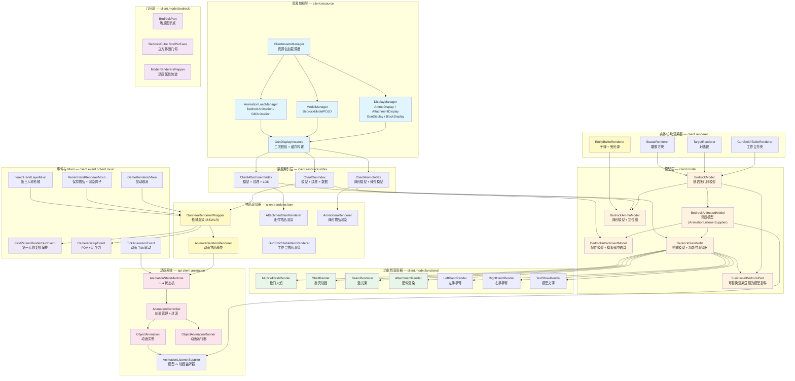

# 渲染体系总览

> 本文档作为 TaCZ 客户端渲染架构的导航索引

## 体系总图

## 体系概要

渲染体系解决的核心问题：**如何将 BlockBench 导出的基岩版模型文件，结合基岩版动画和 Lua 状态机，渲染为游戏中的第一/第三人称枪械、配件、弹药和方块实体**。

整个体系分为六个层次：

|层|包路径|职责|
|---|---|---|
|资源加载层|`client.resource`|加载资源包中的 display、model、animation JSON 文件，构建 POJO → Instance 管道|
|数据索引层|`client.resource.index`|将二次校验后的 POJO 数据组织为可查询的索引（纹理、模型、变换等）|
|模型层|`client.model`|构建基岩版几何模型的场景图，提供动画监听器接口和功能性渲染注册|
|几何层|`client.model.bedrock`|场景图节点、立方体面的顶点数据、坐标转换|
|动画系统|`api.client.animation`|解析基岩版/glTF 动画数据，通过动画控制器和 Lua 状态机驱动模型变形|
|渲染器层|`client.renderer`|对接 Minecraft BEWLR / EntityRenderer / BlockEntityRenderer，执行实际渲染|

## 关键设计特征

- 基岩版坐标转换：模型加载时将 BlockBench 的 Y-up 度和绝对坐标转换为 Minecraft 的弧度相对坐标
- 功能性渲染器模式：通过 `Function<BedrockPart, IFunctionalRenderer>` 在渲染时动态决定部件的渲染行为，支持返回 null 回退至默认几何
- 两阶段模型加载：第一趟插入空占位符，第二趟填充数据，保证父子骨骼交叉引用正确解析
- 模板缓冲瞄具：使用 OpenGL stencil buffer 在瞄具镜片范围内遮盖枪身，实现透过瞄具看世界的效果
- LOD 系统：枪支和配件模型在远距离自动切换低面数模型
- Lua 动画状态机：通过 Lua 脚本定义动画状态转移，实现高度可自定义的枪械动画

## 文档导航

|文档|内容|
|---|---|
|[基岩版模型与几何系统](./bedrock-model-geometry.md)|BedrockModel 场景图构建、BedrockPart 节点树、立方体面几何、坐标转换算法|
|[动画系统](./animation-system.md)|ObjectAnimation 动画实例、AnimationController 轨道管理、基岩版/glTF 动画解析、Lua 动画状态机|
|[渲染管线](./render-pipeline.md)|物品渲染器（BEWLR）、第一/第三人称渲染流程、方块/实体渲染器、事件与 Mixin 钩子|
|[功能性渲染器](./functional-renderers.md)|枪口火焰、抛壳、激光束、配件渲染、手臂渲染、模型文字|
|[客户端资源 POJO](./client-resource-pojos.md)|Display 数据（GunDisplay / AttachmentDisplay / AmmoDisplay）、动画数据、模型数据、GunDisplayInstance 缓存|
