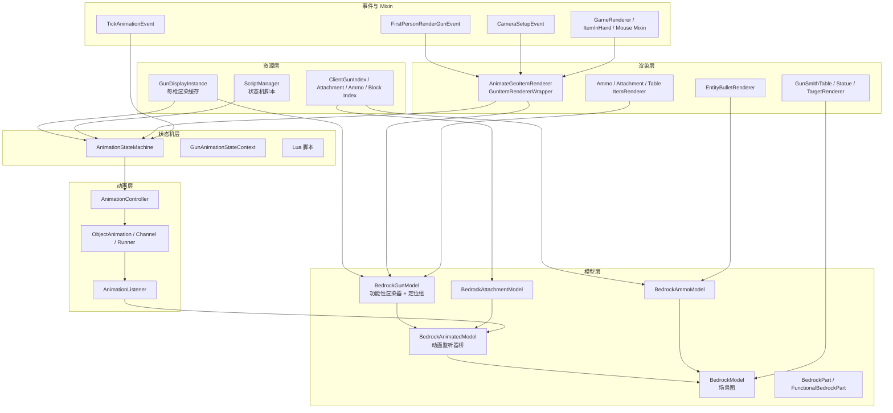

# 渲染体系总览

> TaCZ 客户端渲染架构的导航入口

TaCZ 的渲染体系解决一个核心问题：如何把 BlockBench 导出的基岩版几何模型，结合基岩版/glTF 动画与 Lua 状态机脚本，渲染成游戏中的第一/第三人称枪械、配件、弹药与方块实体。这套体系不依赖 Minecraft 原版 JSON 模型，而是构建自己的场景图与动画管线。

## 全局概览

## 分层职责

渲染体系按「资源 → 模型 → 动画 → 状态机 → 渲染器」分层，外加一组事件与 Mixin 钩子把渲染接入 Minecraft：

|层|职责|入口文档|
|---|---|---|
|资源层|加载 JSON/贴图，组装成每枪、每配件的渲染缓存|[资源读取](./resource-loading.md)|
|模型层|构建基岩版场景图，提供动画属性与功能性渲染接口|[模型与几何](./model-and-geometry.md)|
|动画层|解析动画数据，逐帧插值关键帧并写入模型|[动画系统](./animation-system.md)|
|状态机层|决定播什么动画、何时切换，可由 Lua 定义|[动画状态机](./animation-state-machine.md)|
|渲染层|对接 Minecraft 各渲染上下文，执行实际绘制|[渲染入口与主调用链](./render-entry-and-pipeline.md)|
|事件与 Mixin|第一人称变换、镜头、输入信号、晃动取消等钩子|[第一人称变换与镜头](./first-person-transforms.md)|

## 一次枪械渲染的链路

一把枪从渲染入口到最终绘制，大致经过：入口解析 `ItemStack` → 取 `GunDisplayInstance` → 更新状态机（写动画到模型）→ 施加姿态变换 → 模型渲染（功能性渲染器介入）→ 缓存枪口位置 → 清除动画残留。这条链路的模块级拆解见 [枪械渲染链路](./gun-render-pipeline.md)。

## 文档导航

|文档|内容|
|---|---|
|[渲染入口与主调用链](./render-entry-and-pipeline.md)|各渲染上下文从哪里进入、BEWLR 注册、帧内事件与 Mixin、通用渲染阶段|
|[枪械渲染链路](./gun-render-pipeline.md)|枪械渲染的模块级数据流与各模块的插入点|
|[模型与几何](./model-and-geometry.md)|基岩版场景图、坐标转换、动画属性、功能性渲染部件、定位组|
|[动画系统](./animation-system.md)|动画数据、轨道、插值器、控制器、运行器、监听器与模型写入|
|[动画状态机](./animation-state-machine.md)|并发状态机、状态生命周期、输入信号、双更新路径、Lua 集成|
|[动画状态机脚本 API](./state-machine-script-api.md)|资源包 Lua 脚本的能力、表结构、脚本如何驱动状态机与模型|
|[枪械附加渲染模块](./functional-renderers.md)|枪口火焰、抛壳、激光、配件、手臂、文字、子弹与弹匣可见性|
|[第一人称变换与镜头](./first-person-transforms.md)|后坐摇摆、跳跃摇摆、瞄准/改装定位、动画约束、FOV 与相机后坐力|
|[渲染场景](./render-scenes.md)|第一/第三人称、手臂、GUI、改装界面、tooltip、实体与方块的差异|
|[资源读取](./resource-loading.md)|资源如何加载为渲染对象、各 display POJO 对应什么美术资源、被谁消费|

## 从哪开始

- 想理解枪械「整体怎么画」：先读 [渲染入口与主调用链](./render-entry-and-pipeline.md)，再看 [枪械渲染链路](./gun-render-pipeline.md)。
- 想改某个骨骼/几何的表现：看 [模型与几何](./model-and-geometry.md)。
- 想改动画如何播放、何时切换：看 [动画状态机](./animation-state-machine.md) 与 [动画状态机脚本 API](./state-machine-script-api.md)。
- 想改动画数值如何落到模型：看 [动画系统](./animation-system.md)。
- 想改枪口火焰、抛壳、手臂、文字等附加表现：看 [枪械附加渲染模块](./functional-renderers.md)。
- 想改瞄准、后坐力、镜头 FOV：看 [第一人称变换与镜头](./first-person-transforms.md)。
- 想改第三人称、GUI、tooltip 等场景的表现：看 [渲染场景](./render-scenes.md)。
- 想改资源如何被加载、某个 display 字段的作用：看 [资源读取](./resource-loading.md)。
