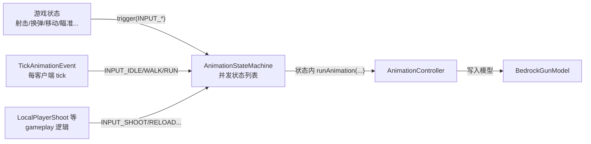

# 动画状态机

> 一个并发、可由 Lua 脚本定义的动画状态机，位于渲染链路中「动画」的上游

动画状态机决定「当前该播什么动画、什么时候切」。它是渲染链路里连接「游戏状态」与「动画系统」的一环：外部把玩家操作和枪械状态整理成输入信号推给状态机，状态机把「在轨道上播放动画」的指令下发给 `AnimationController`，最终驱动模型变形。

## 在渲染链路中的位置

状态机本身不计算关键帧、不写模型——那由 `AnimationController` 和动画系统完成。状态机的职责是「逻辑层」：维护当前状态、处理输入、决定转移、调用动画控制 API。

## 结构：一个并发状态机

`AnimationStateMachine<T>` 与常见状态机的一个关键区别是**并发**：它维护的是一个 `currentStates` 列表，可以同时有多个活跃状态，而不是单一当前状态。这让「移动层」和「武器动作层」可以各自独立地驱动动画叠加。

状态机持有三样东西：

- 上下文 `context`：承载状态更新所需的游戏数据与动画控制 API。
- 状态供应商 `statesSupplier`：提供初始状态集合。
- 动画控制器 `animationController`：状态实际操纵的对象。

## 状态与生命周期

`AnimationState<T>` 是一个接口，定义四个生命周期方法：

- `entryAction(context)`：进入状态时调用一次。
- `update(context)`：每帧渲染前调用。
- `exitAction(context)`：离开状态时调用。
- `transition(context, condition)`：收到输入时调用，返回新状态表示转移，返回 `null` 表示不转移。

状态机的 `initialize()` 从供应商取出初始状态加入列表并触发各自的 `entryAction`；`exit()` 触发所有状态的 `exitAction` 并清空列表。`setContext` 会在状态机运行前把上下文绑定好，并保证一个运行周期内上下文唯一。

## 输入与转移

`trigger(condition)` 是唯一的输入入口。它遍历所有活跃状态，逐个调用其 `transition(context, condition)`；返回新状态的会被替换（旧的 `exitAction`、新的 `entryAction`），返回 `null` 的保持不动。因为每个状态独立决策，同一条输入可以让多个状态同时转移。

输入信号用字符串标识，集中在 `GunAnimationConstant` 中：`INPUT_DRAW`（拔枪）、`INPUT_PUT_AWAY`（收枪）、`INPUT_SHOOT`、`INPUT_RELOAD`、`INPUT_CANCEL_RELOAD`、`INPUT_BOLT`、`INPUT_INSPECT`、`INPUT_FIRE_SELECT`、`INPUT_WALK`、`INPUT_RUN`、`INPUT_IDLE`，以及近战的 `INPUT_BAYONET_MUZZLE` / `INPUT_BAYONET_STOCK` / `INPUT_BAYONET_PUSH`。

这些信号由两类来源触发：`TickAnimationEvent` 每客户端 tick 根据移动状态推 `INPUT_IDLE` / `INPUT_WALK` / `INPUT_RUN`；射击、换弹、拉栓、切火模式、检视、近战等 gameplay 逻辑在对应动作发生时推对应信号。

## 两条更新路径

状态机有两条每帧更新路径，区别只在最后一步对动画控制器的调用：

- `update()`：先更新所有状态，再调用 `animationController.update()`，把动画数据**写入模型**。用于第一人称——持枪的动画模型必须实际显示。
- `visualUpdate()`：先更新所有状态，再调用 `animationController.updateSoundOnly()`，只推进状态和播放音效，**不写模型**。用于第三人称等非第一人称场景，此时状态机仍要保持计时和音效同步，但姿态输出不需要落到渲染模型上。

## 上下文：状态与脚本的接口

`AnimationStateContext` 是状态和脚本可以使用的接口，分几组能力：

- 轨道管理：`addTrackLine` / `assignNewTrack` / `findIdleTrack` 等，在 `DiscreteTrackArray` 上分配动画轨道。
- 动画控制：`runAnimation(name, track, blending, playType, transitionTime)`、`stopAnimation` / `holdAnimation` / `pauseAnimation` / `resumeAnimation`、`setAnimationProgress` 等。
- 输入转发：`trigger(input)` 允许脚本在状态内部再触发状态机输入。
- 准星控制：`shouldHideCrossHair` / `setShouldHideCrossHair`。

枪械使用 `GunAnimationStateContext`，它进一步提供游戏状态查询：弹药数、弹匣扩容等级、是否空膛、开火模式、射击冷却、瞄准进度、换弹状态、过热进度、充能进度、移动/跳跃/趴下/蹲下/滑铲等输入状态，以及给脚本用的 `getStateMachineParams`（来自 display 的 `state_machine_param`）和 NBT 访问器。`ItemAnimationStateContext` 是物品动画的基类，额外提供 `putAwayTime` 和 `partialTicks`。

## Lua 集成

状态机可以由 Lua 脚本定义，这是 TaCZ 资源包动画高度可定制的关键。相关类有三层：

- `LuaAnimationState`：把 Lua 表包装成 `AnimationState`。它在表上查找 `entry` / `update` / `exit` / `transition` 四个函数，调用时把上下文作为参数传入；`transition` 额外传入输入字符串，要求返回下一个状态的表或 `nil`。
- `LuaAnimationStateMachine`：在普通状态机之上增加 `initializeFunc` / `exitFunc` 两个钩子，对应脚本里可选的 `initialize` / `exit` 函数。
- `LuaStateMachineFactory`：构建器，从脚本表读取 `initialize` / `exit` / `states` 三个函数并组装出状态机。

脚本的 `.lua` 文件由 `ScriptManager` 加载（见[动画状态机脚本 API](./state-machine-script-api.md)），文件本身要返回一个表：顶层 `initialize` / `exit` / `states`，`states()` 返回状态表数组，每个状态表定义 `entry` / `update` / `exit` / `transition`。

## 退出与重初始化

`exitingTime` 机制用于切枪后的平滑处理：`tryExit` 时状态机记录一个「建议退出时间」——它比收枪动画稍长，避免切回同一把枪时立即重初始化、打断还没播完的收枪动画。这是「切枪后继续保留一段时间」在状态机层面的体现。
