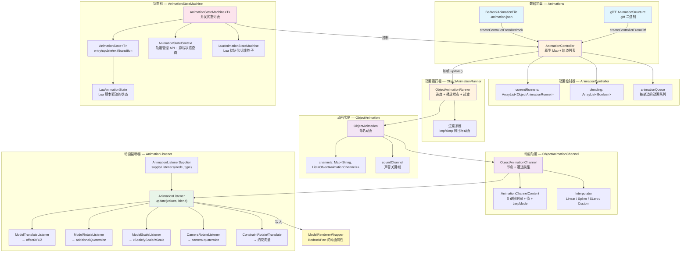

# 动画系统

> ObjectAnimation → AnimationController → AnimationStateMachine 的完整动画链路

## 体系总览



动画系统的核心工作流：**动画数据（基岩版或 glTF）→ AnimationController（原型 + 轨道）→ ObjectAnimationRunner（播放进度 + 过渡）→ ObjectAnimationChannel（关键帧插值）→ AnimationListener（写入模型）**。在此之上，**AnimationStateMachine** 通过 Lua 脚本或 Java 代码驱动动画播放和状态转移。

## ObjectAnimation — 动画实例

`ObjectAnimation` 代表一个命名的动画。核心结构是 `Map<String, List<ObjectAnimationChannel>>`：将**骨骼/节点名称**映射到作用于该节点的动画轨道列表。

关键属性：
- `name`：动画名称，用作状态机中的标识符
- `playType`：`PLAY_ONCE_HOLD`（停留在最后一帧）、`PLAY_ONCE_STOP`（播放后停止）、`LOOP`（循环）
- `maxEndTimeS`：所有通道中最晚的结束时间

动画采用**原型-拷贝**模式：加载时创建原型动画，运行时通过 `new ObjectAnimation(prototype)` 拷贝出实例，再通过 `applyAnimationListeners(supplier)` 绑定监听器。

## 动画加载：基岩版与 glTF

### 基岩版动画（Bedrock `.animation.json`）

由 `Animations.createAnimationFromBedrock()` 解析：

- 遍历 `BedrockAnimationFile` 中每个命名动画的每个骨骼
- 对每个骨骼的 position / rotation / scale 关键帧分别创建 `ObjectAnimationChannel`
- 全部使用 `CustomInterpolator`（支持每关键帧级别的 LerpMode：LINEAR、CATMULLROM、SPHERICAL_LINEAR、SPHERICAL_SQUAD）
- 位置数据除以 16（基岩版单位转换为块单位）；旋转数据从度转换为弧度
- 声音关键帧提取为 `ObjectAnimationSoundChannel`

### glTF 动画

由 `Animations.createControllerFromGltf()` 解析：

- 遍历 `AnimationStructure` 中的 `AnimationModel` 列表
- 每个 `AnimationModel.Channel` 映射到一个采样器（sampler）和节点模型+路径
- 通过 `AnimationListenerSupplier` 获取初始值，计算逆值，预先减去所有关键帧值，使其相对于模型的默认姿态
- 旋转使用四元数求逆后相乘；位移取反转换
- 插值器从 glTF 标准模式映射：STEP → `Step`、LINEAR → `Linear`（但旋转强制使用 `SLerp`）、SPLINE → `Spline`

### 基岩版与 glTF 的关键差异

|维度|基岩版|glTF|
|---|---|---|
|数据源|JSON 内联关键帧|二进制缓冲区 + 访问器|
|每关键帧插值模式|支持（CATMULLROM/LINEAR）|采样器级别固定|
|初始值处理|关键帧值就是绝对值|需要从模型获取初始值并相减|
|声音 |支持（SoundEffectKeyframes）|不支持|
|坐标系统|Y-up，度|Z-up，通过欧拉角转换处理|

## ObjectAnimationChannel — 动画轨道

一个通道定义了对特定骨骼节点的特定变换类型的关键帧轨道。

核心数据（`AnimationChannelContent`）：
- `keyframeTimeS[]`：关键帧时间戳（秒）
- `values[][]`：每帧的值（位移/旋转通常为 3 分量，带 pre/post 时可为 6 分量）
- `lerpModes[]`：每帧的插值模式

`update(timeS, blend)` 方法流程：
1. 通过 `Arrays.binarySearch` 定位时间点前后的两个关键帧
2. 计算 alpha（归一化进度）
3. 调用 `interpolator.interpolate(fromIndex, toIndex, alpha)` 得到插值结果
4. 将结果推送给所有 `AnimationListener`
5. `blend` 标志控制是覆盖还是累加到模型当前值

## Interpolator — 插值器

|插值器|用途|算法|
|---|---|---|
|Linear|glTF 位移/缩放线性过渡|分量级 `lerp`|
|Step|glTF 阶梯过渡|直接返回起始帧值|
|Spline|glTF 三次样条|需要 4 个控制点（pre + post）的三次插值|
|SLerp|glTF 四元数旋转|球面线性插值|
|CustomInterpolator|基岩版所有类型|每帧可不同模式：LINEAR / CATMULLROM / SPHERICAL_LINEAR / SPHERICAL_SQUAD|

CATMULLROM 实际使用的是三次样条而非真正的 Catmull-Rom，以匹配 BlockBench 的 `THREE.SplineCurve` 行为。SPHERICAL_SQUAD 使用中间控制点的四元数样条插值。

## ObjectAnimationRunner — 动画运行器

管理单个动画实例的播放生命周期。核心机制：

- **进度追踪**：`progressNs`（纳秒），通过 `System.nanoTime()` 的帧间增量更新
- **播放模式**：
  - `PLAY_ONCE_HOLD`：超时后调用 `hold()`，进度冻结在结束帧稍后的位置
  - `PLAY_ONCE_STOP`：超时后调用 `stop()`
  - `LOOP`：进度取模循环
- **过渡系统**：从一个动画平滑过渡到另一个动画

### 过渡机制

当 `transition(targetRunner, transitionTimeNs)` 被调用时：

1. 匹配两个动画间共享的**节点名称 + 通道类型**对
2. 对匹配的通道执行 `lerp`（平移/缩放）或 `slerp`（旋转），时间由缓出三次函数控制
3. 仅在源动画中存在而目标中不存在的通道过渡到恒等值
4. 如果过渡期间再有新过渡请求，当前过渡的插值结果作为新的起始值（链式过渡）
5. 过渡完成后，目标 runner 替换到 `AnimationController.currentRunners`

## AnimationController — 轨道编排器

管理并行的**轨道**（track）列表，每个轨道可运行一个 `ObjectAnimationRunner`：

- **原型注册表**：`Map<String, ObjectAnimation>` 存储命名动画模板
- **轨道索引**：0 = 最底层（如 idle），高编号 = 叠加层（如 shoot、reload）
- **混合标志**：控制每轨道的动画是覆盖还是累加
- **更新顺序**：按 `DiscreteTrackArray` 指定的顺序更新

`runAnimation(track, name, playType, transitionTime)` 流程：
1. 从原型注册表查找命名动画
2. 拷贝原型 → 绑定监听器 → 创建 `ObjectAnimationRunner`
3. 若同轨道有旧动画且 transitionTime > 0，启动过渡；否则直接替换

每帧 `update()` 流程：遍历轨道 → 更新 runner → 处理过渡目标 → 处理动画队列（当前动画结束且队列非空时取出下一个）

## AnimationListener — 动画到模型的桥梁

`AnimationListenerSupplier` 是函数式接口：`supplyListeners(nodeName, channelType)` 返回 `AnimationListener` 或 null。

`BedrockAnimatedModel` 是实现该接口的关键类，分发逻辑：
- `"camera"` 节点 → `CameraRotateListener`（写入 `rotationQuaternion`）
- `"constraint"` 节点 → `ConstraintRotateListener` + `ConstraintTranslateListener`（写入约束向量，取 max 确保单向增长）
- 其他节点 → `ModelTranslateListener`（写入 `offsetX/Y/Z`，Y 轴取反）/ `ModelRotateListener`（写入 `additionalQuaternion`）/ `ModelScaleListener`（写入 `scaleX/Y/Z`）

各监听器通过 `ModelRendererWrapper` 间接操作 `BedrockPart` 的动画属性。

## AnimationStateMachine — Lua 状态机

`AnimationStateMachine<T>` 是一个**并发**状态机——可以同时拥有多个活跃状态（`currentStates` 是 List 而非单引用），允许独立的动画层面（如移动层 + 武器动作层）并发运行。

### 状态生命周期

```
initialize() → entryAction()
    ↓
trigger("condition") → transition() 返回新状态
    → exitAction(旧) + entryAction(新)
    ↓
每帧: update() 或 visualUpdate()
    ↓
exit() → exitAction(所有状态)
```

### 双路径更新

- `update()`：第一人称渲染调用，更新状态逻辑 → 完整调用 `AnimationController.update()`，将动画写入模型
- `visualUpdate()`：第三人称/非第一人称实体渲染调用，仍更新状态逻辑（保持计时同步），但调用 `AnimationController.updateSoundOnly()` 仅播放声音

### Lua 集成

`LuaAnimationStateMachine` 扩展了基础状态机，提供 `initializeFunc` / `exitFunc`（`Consumer<T>`），在 `initialize()` / `exit()` 时与 Lua 脚本钩子一起执行。`LuaAnimationState` 通过 LuaJ `LuaTable` 实现 `AnimationState` 的四个方法（update、entry、exit、transition），每个方法在 Lua 表上查找对应命名函数并调用。

### AnimationStateContext

为状态机脚本提供游戏状态查询和动画控制 API：

- **轨道管理**：`addTrackLine()`、`assignNewTrack()`、`findIdleTrack()` 等
- **动画控制**：`runAnimation(name, track, blending, playType, transitionTime)`、`stopAnimation()`、`holdAnimation()`、`pauseAnimation()`、`setAnimationProgress()` 等
- **游戏状态查询**：`GunAnimationStateContext` 子类提供弹药数、开火模式、瞄准进度、装弹状态、移动状态、过热状态等
- **其他**：`shouldHideCrossHair()`、`getStateMachineParams()`（Lua 表参数）

## 触发条件

`GunAnimationConstant` 定义了标准的动画状态机输入信号：

|信号|含义|
|---|---|
|`INPUT_DRAW`|拔枪|
|`INPUT_PUT_AWAY`|收枪|
|`INPUT_SHOOT`|射击|
|`INPUT_RELOAD`|开始换弹|
|`INPUT_CANCEL_RELOAD`|中断换弹|
|`INPUT_BOLT`|拉栓|
|`INPUT_INSPECT`|检视|
|`INPUT_FIRE_SELECT`|切换开火模式|
|`INPUT_WALK`|行走|
|`INPUT_RUN`|跑步|
|`INPUT_IDLE`|空闲|

这些信号由 `TickAnimationEvent` 基于玩家状态自动触发，或由射击/换弹等游戏逻辑手动触发。`AnimationStateMachine.trigger(condition)` 遍历所有活跃状态，调用 `transition(context, condition)` 决定是否转移。
