# 动画系统

> 动画数据如何经过「控制器 → 运行器 → 轨道 → 监听器」最终写入模型

TaCZ 的动画系统是一个独立的、与状态机解耦的底层。它负责把资源包里的动画数据（基岩版 `.animation.json` 或 glTF）组织成可播放的动画，逐帧计算出每个骨骼的变换，再通过监听器写入模型。动画状态机（见[动画状态机](./animation-state-machine.md)）只是这个系统的上层调用者，通过「在某个轨道上播放某个动画」来驱动它。

## 概览

```mermaid
flowchart LR
    DATA["动画资源<br/>Bedrock .animation.json / glTF"] -->|"加载"| CTRL["AnimationController<br/>原型注册表 + 轨道列表"]

    CTRL -->|"runAnimation(track, name, ...)"| RUNNER["ObjectAnimationRunner<br/>进度 + 播放状态 + 过渡"]
    RUNNER --> OA["ObjectAnimation<br/>命名动画实例"]
    OA --> CH["ObjectAnimationChannel<br/>节点 + 通道类型 + 关键帧"]
    CH -->|"interpolator.interpolate"| VAL["插值结果"]
    VAL -->|"listener.update(result, blend)"| LS["AnimationListener<br/>写入模型属性"]

    LS --> MRW["ModelRendererWrapper"] --> BP["BedrockPart"]
```

核心工作流：加载时把动画文件解析成若干**原型动画**（`ObjectAnimation`），运行时通过**控制器**在某个**轨道**上启动一份**拷贝**，由一个**运行器**追踪进度并处理过渡，逐帧把关键帧插值结果推给**监听器**写入模型。

## 动画数据与原型拷贝

`ObjectAnimation` 代表一个命名动画。它的核心结构是 `Map<String, List<ObjectAnimationChannel>>`——把**骨骼节点名称**映射到作用于该节点的轨道列表。此外它还记录 `playType`（播放模式）和 `maxEndTimeS`（所有轨道中最晚的结束时间）。

系统采用「原型—拷贝」模式：加载时构建的原型动画不绑定任何监听器；运行时控制器拷贝出实例，再调用 `applyAnimationListeners` 把监听器绑到每条轨道上。这样同一个原型可以被多次同时播放而互不干扰，监听器则在最后一刻才决定「把结果写到哪个模型」。

播放模式有三种：`PLAY_ONCE_HOLD`（播完停在最后一帧）、`PLAY_ONCE_STOP`（播完停止）、`LOOP`（循环）。

## 动画轨道与关键帧

`ObjectAnimationChannel` 是一条「作用于某节点、某种变换类型」的关键帧轨道。变换类型分 `TRANSLATION`、`ROTATION`、`SCALE` 三种。关键帧数据放在 `AnimationChannelContent` 中：

- `keyframeTimeS`：各关键帧的时间戳。
- `values`：每个关键帧的值。四元数通道用 4（或 8，带 pre/post）个分量，三轴通道用 3（或 6）个分量。
- `lerpModes`：每个关键帧的插值模式（仅对 `CustomInterpolator` 有意义）。

每帧 `update(timeS, blend)` 用二分查找定位当前时间落在哪两个关键帧之间，算出归一化进度 `alpha`，交给插值器算出结果，再推给该轨道的所有监听器。`blend` 标志决定监听器是「累加」还是「覆盖」到模型当前值。

## 插值器

插值器决定两个关键帧之间如何过渡。基岩版与 glTF 使用不同的插值器集合：

- `Linear`：分量级线性插值，glTF 位移/缩放用。
- `Step`：阶梯，直接取起始帧值。
- `SLerp`：四元数球面线性插值，glTF 旋转用。
- `Spline`：三次样条，实际为未实现的占位。
- `CustomInterpolator`：基岩版专用，支持逐关键帧选择 `LINEAR` / `CATMULLROM` / `SPHERICAL_LINEAR` / `SPHERICAL_SQUAD`。

其中 `CATMULLROM` 实际用的是张力 0.5 的三次样条，以匹配 BlockBench 中 `THREE.SplineCurve` 的行为；`SPHERICAL_SQUAD` 用四元数样条，适合平滑的旋转轨道。

## 动画控制器与轨道

`AnimationController` 是动画编排的入口，也是状态机唯一直接交互的动画层对象。它维护：

- 原型注册表：按名称存所有可用动画模板。
- 轨道列表：并行轨道，每条轨道可同时运行一个动画。轨道编号小的在下层（如 idle），编号大的叠加在上层（如 shoot、reload）。
- 混合标志：每条轨道是「覆盖」还是「累加」到模型。
- 动画队列：每条轨道在当前动画播完后自动接着播的后续动画。

`runAnimation(track, name, playType, transitionTime)` 从原型注册表取出动画，拷贝实例并绑定监听器，创建运行器；若该轨道已有旧动画且给了过渡时间，则启动过渡，否则直接替换。

每帧 `update()` 按轨道顺序更新各运行器。轨道顺序可用 `DiscreteTrackArray` 自定义——它把轨道组织成「轨道行」，按行顺序扁平化出一个更新次序，让脚本能控制不同动画层面的叠加顺序。

## 动画运行器与过渡

`ObjectAnimationRunner` 管理单条轨道上一个动画实例的播放生命周期：追踪纳秒级进度，按 `playType` 决定播完后的行为（保持/停止/循环）。

过渡是它的关键机制。当需要从旧动画平滑切到新动画时，`transition(target, transitionTime)` 会：

1. 按「节点名 + 变换类型」匹配两个动画间共有的轨道。
2. 对匹配的轨道做 `lerp`（位移/缩放）或 `slerp`（旋转），过渡进度用缓出三次函数控制。
3. 只存在于旧动画而不存在于新动画的轨道，过渡到恒等值（位移归零、旋转归单位、缩放归 1）。
4. 过渡期间若有新过渡请求，用当前插值结果作为新的起点（链式过渡）。

过渡期间，结果通过**源**轨道的监听器输出，目标轨道被标记为 `transitioning` 暂停自我更新。过渡完成后目标运行器替换进轨道。

## 监听器与模型写入

`AnimationListenerSupplier` 是动画系统与模型的桥梁。它按「节点名 + 变换类型」返回一个 `AnimationListener`。`BedrockAnimatedModel` 实现了这个接口，把不同节点路由到不同监听器：

- `camera` 节点 → 写入相机动画对象的旋转四元数，供第一人称相机动画消费。
- `constraint` 节点 → 写入约束向量，供第一人称动画约束反解。
- 其他节点 → `ModelTranslateListener`（写 `offsetX/Y/Z`）、`ModelRotateListener`（写 `additionalQuaternion`）、`ModelScaleListener`（写 `xScale/yScale/zScale`）。

所有监听器都通过 `ModelRendererWrapper` 间接操作 `BedrockPart` 的动画属性。`blend` 为真时累加、为假时覆盖，使同一节点上多层动画可以叠加。

## 动画加载

基岩版与 glTF 两条加载路径都产出一组 `ObjectAnimation` 原型：

- 基岩版：遍历每个动画的每个骨骼的 position / rotation / scale 关键帧，各生成一条 `ObjectAnimationChannel`，位移除以 16、旋转由度转弧度，全部使用 `CustomInterpolator`；声音关键帧提取为独立的音效轨道。
- glTF：遍历采样器与访问器，映射插值器（旋转强制 `SLerp`）；因为 glTF 关键帧是相对默认姿态的，加载时先读取监听器的初始值并做逆运算，把关键帧预减到相对值。

两者在使用时机上有一处差异：基岩版在运行时才通过 `applyAnimationListeners` 绑定监听器，而 glTF 在加载时就需要监听器提供初始值来烘焙逆值。这套动画系统是纯「数据 → 变换」的，它不关心动画何时该播、为什么播——那些由动画状态机决定。
