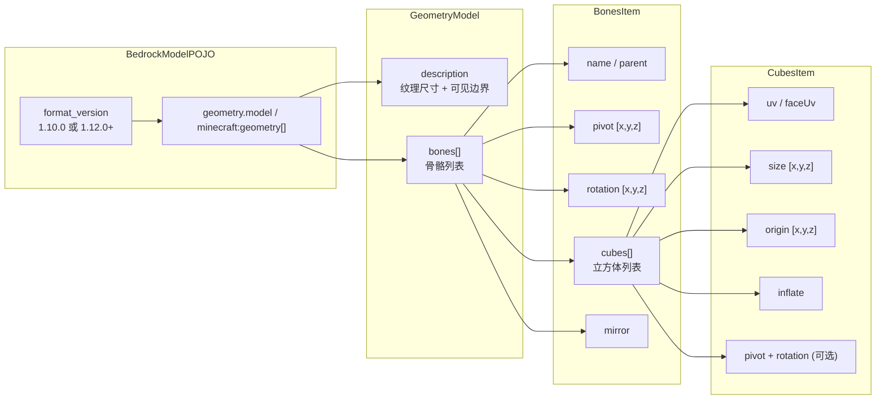
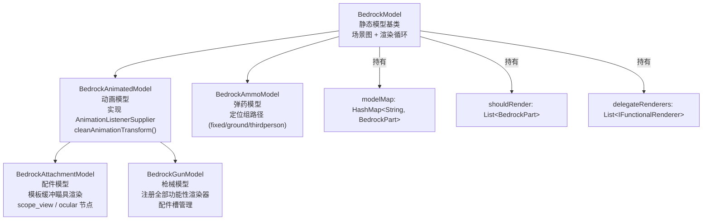

# 基岩版模型与几何系统

> 基岩版几何模型（BlockBench 导出）从 JSON 到 Minecraft 渲染场景图的完整链路

## JSON 数据格式

基岩版模型文件以 `.geo.json` 格式存储，顶层结构：

旧版格式（`format_version: "1.10.0"`）将纹理尺寸和可见边界直接放在根对象，新版格式（`"1.12.0"` 及以上）通过 `description` 子对象嵌套。模型加载时通过 `BedrockVersion` 枚举分派 `loadLegacyModel` / `loadNewModel`。

## 场景图构建

### BedrockPart — 场景图节点

`BedrockPart` 是几何系统的核心数据结构，构成一棵场景树：

- `name`：节点名称，对应 BlockBench 中的 group/bone 名称
- `cubes`：该节点直接持有的立方体面几何列表
- `children`：子节点列表
- `x, y, z`：pivot（旋转中心点），单位已转换为 Minecraft 坐标
- `xRot, yRot, zRot`：初始旋转角（弧度），来源于骨骼的 `rotation` 字段
- `offsetX, offsetY, offsetZ`：动画驱动的额外平移偏移
- `additionalQuaternion`：动画驱动的额外旋转四元数
- `xScale, yScale, zScale`：动画驱动的缩放
- `visible`：可见性开关
- `illuminated`：是否使用最高亮度（名称以 `_illuminated` 结尾的节点自动启用）

### 两阶段加载

基岩版模型使用两阶段加载策略确保父子骨骼交叉引用正确：

1. **第一趟**：扫描所有骨骼，将名称和原始数据注入 `indexBones`，同时在 `modelMap` 中为每个骨骼名称创建空的 `BedrockPart` 占位符
2. **第二趟**：填充每个占位符的详细数据，通过 `parent` 字段建立父子关系，将立方体注入对应节点

只有 `parent` 为空的根级节点会加入 `shouldRender` 列表，作为渲染入口。渲染时间接遍历子节点。

### 坐标转换

基岩版（BlockBench）和 Minecraft Java 版使用不同的坐标系，模型加载时需要转换：

|维度|基岩版|Java 版|转换方式|
|---|---|---|---|
|Y 轴方向|朝上|朝下（相对）|`24 - pivotY`（无父骨骼），或 `parentY - pivotY`（有父骨骼）|
|X / Z 方向|绝对坐标|相对坐标|`pivotX - parentPivotX`（有父骨骼）|
|旋转单位|度|弧度|`degree × π / 180`|
|方块原点 Y|方块顶部|方块底部|额外减去方块 Y 长度|
|比例|基岩单位 (1/16 块)|块单位|渲染时除以 16|

转换逻辑由 `BedrockModel.convertPivot()`、`convertOrigin()`、`convertRotation()` 三个方法完成。

### 立方体面几何

立方体几何由 `BedrockCube` 接口表示，有两个实现：

- **BedrockCubeBox**：统一 UV 映射，六面共享一个 UV 偏移量，按标准 Minecraft 布局自动计算各面 UV
- **BedrockCubePerFace**：每面独立 UV 映射，通过 `FaceUVsItem` 为六个方向分别指定 UV 原点和大小。面可以标记为 `EMPTY` 以生成退化多边形（不渲染该面）

每个面是一个 `BedrockPolygon`，持有四个 `BedrockVertex`（3D 位置 + UV 坐标）和一个法向量。如果立方体标记为镜像，顶点顺序反转且法线 X 分量取反。

### ModelRendererWrapper

`ModelRendererWrapper` 是一个兼容性包装层，将 `BedrockPart` 的动画相关属性（偏移、旋转四元数、缩放）暴露为 getter/setter bean 属性。动画系统通过这个包装器读写模型变换，而不是直接操作 `BedrockPart`。它的存在源于 Minecraft 旧版 `ModelRenderer` API。

## 模型类型层次

### BedrockModel — 静态模型基类

提供核心渲染循环：遍历 `shouldRender` 中的根节点，递归调用 `BedrockPart.render()`。渲染完成后执行 `delegateRenderers` 中的延迟渲染器，然后清空列表。

提供 `getPath(ModelRendererWrapper)` 方法，从叶子节点沿 parent 链追溯至根节点再反转，返回从根到叶的路径列表。所有子类用它缓存特殊节点的变换路径（瞄具位置、枪口位置等）。

### BedrockAnimatedModel — 动画模型

引入动画支持：

- 实现 `AnimationListenerSupplier`，通过 `supplyListeners(nodeName, type)` 为指定节点和通道类型返回动画监听器
- 在加载模型前预插入 `FunctionalBedrockPart` 占位符，确保子类能通过 `setFunctionalRenderer()` 注册渲染逻辑
- 管理 `cameraAnimationObject`（相机动画四元数）和 `constraintObject`（动画约束）
- 提供 `cleanAnimationTransform()` 清除所有动画驱动的偏移、四元数和缩放

动画监听器分配规则：
- `"camera"` 节点：返回 `CameraRotateListener`
- `"constraint"` 节点：返回 `ConstraintRotateListener` + `ConstraintTranslateListener`
- 其他节点：按通道类型返回 `ModelTranslateListener` / `ModelRotateListener` / `ModelScaleListener`

### BedrockAttachmentModel — 配件模型

在 `BedrockAnimatedModel` 基础上增加模板缓冲（stencil buffer）瞄具渲染：

- 识别 `scope_view` / `scope_view_N` 节点路径（瞄具视野定位组）
- 识别 `ocular` / `ocular_N`（接目镜）和 `ocular_scope` / `ocular_scope_N`（瞄准镜接目镜）
- 识别 `scope_body`（镜身）和 `ocular_ring`（接目镜外圈）
- 识别 `division` / `division_N`（分划线/准星图案）
- 识别 `laser_beam` / `laser_beam_N`（激光束发射点）

渲染时按配件类型选择路径：
- 纯瞄准镜（`isScope=true`）：渲染接目镜模板 → 镜身（被模板遮挡）→ 分划线
- 纯瞄准具（`isSight=true`）：接目镜模板 → 分划线 → 镜身始终可见
- 复合型（同时是瞄准镜和瞄准具）：多个接目镜分别写模板，实现多级变倍

### BedrockGunModel — 枪械模型

在 `BedrockAnimatedModel` 基础上注册大量功能性渲染器，涵盖枪械的所有视觉元素：

- 手臂渲染：左/右手第一人称手臂（通过 `lefthand_pos` / `righthand_pos` 节点）
- 枪口火焰：`muzzle_flash` 节点的 `MuzzleFlashRender`
- 抛壳：`shell` / `shell_N` 节点的 `ShellRender`
- 弹膛子弹可见性：`bullet_in_barrel`（闭膛待击枪械有子弹时显示）、`bullet_in_mag`（有弹药时显示）、`bullet_chain`（弹链，有弹药时显示）
- 瞄具可见性切换：`mount`（安装瞄具时显示）、`carry`（无瞄具时显示）、`sight`（无瞄具时显示）、`sight_folded`（有瞄具时显示折叠准星）
- 弹匣等级：`mag_standard` / `mag_extended_1/2/3`
- 护木：`handguard_default` / `handguard_tactical`
- 附加弹匣：`additional_magazine`（双弹匣换弹动画）
- 配件槽：每种 `AttachmentType` 的 `_pos` 节点注册 `AttachmentRender`，`_default` 节点切换可见性
- 激光束：`laser_beam` / `laser_beam_N`
- 文字覆盖：模型节点上的 3D 文本显示

渲染时按特定顺序执行：激光束 → 瞄具预渲染（写模板缓冲）→ 枪身渲染（被模板遮挡）→ 禁用模板测试并清除缓冲。

### FunctionalBedrockPart

继承 `BedrockPart`，是可替换渲染逻辑的模型部件。持有 `Function<BedrockPart, IFunctionalRenderer>` 函数引用。

渲染时：调用该函数。若返回非 null 的 `IFunctionalRenderer`，则完全委托给该渲染器（不编译立方体几何、不渲染子节点）；若返回 null，则回退至标准的立方体几何渲染。可见性规则：即使 `visible=false`，如果函数返回了渲染器，仍会执行渲染。

## 枪械模型常量

`GunModelConstant` 定义了模型中约定命名的关键节点：

**弹药可视化**：`bullet_in_barrel`（膛内子弹）、`bullet_in_mag`（弹匣内子弹）、`bullet_chain`（弹链）

**弹匣状态**：`mag_standard`、`mag_extended_1`、`mag_extended_2`、`mag_extended_3`

**瞄具状态**：`sight`（机械瞄具）、`sight_folded`（折叠准星）、`carry`（提把）、`mount`（瞄具导轨）

**相机定位组**：`iron_view`（机瞄视线）、`idle_view`（非瞄准视线）、`refit_view`（改装界面视线）、`thirdperson_hand`（第三人称手持）、`fixed`（物品展示框）、`ground`（掉落物）

**特效定位组**：`shell` / `shell_N`（抛壳起点）、`muzzle_flash`（枪口火焰）、`lefthand_pos` / `righthand_pos`（第一人称手部定位）

**配件相关**：`attachment_adapter`（配件转接口）、`magazine`（弹匣）、`additional_magazine`（第二弹匣）、`_pos` 后缀（配件定位）、`_default` 后缀（默认配件）、`handguard_default` / `handguard_tactical`

**其他**：`root`（根节点）
