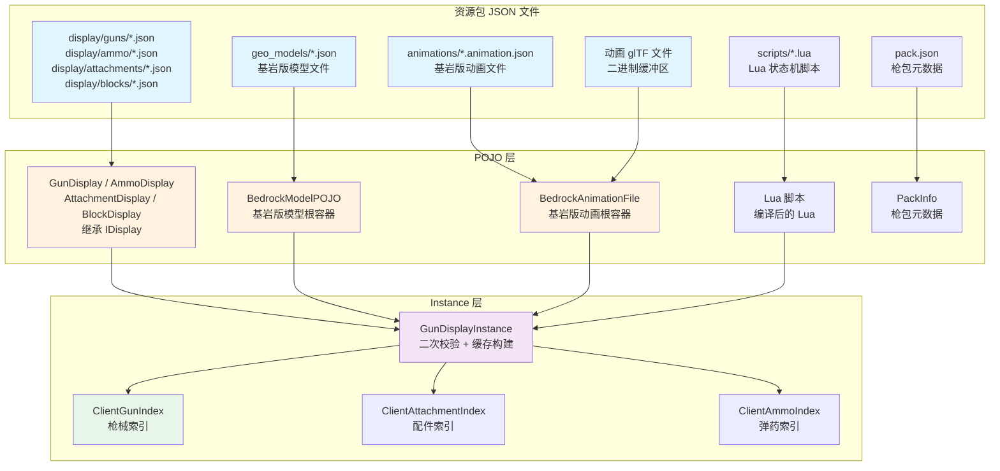

# 客户端资源 POJO

> Display 数据、模型 POJO、动画 POJO 和 GunDisplayInstance 缓存的结构与生命周期

## 资源加载管道

`ClientAssetsManager` 注册多个 `DisplayManager` / `LazyJsonDataManager` 实现作为 Minecraft 资源重载监听器。所有 POJO 加载完成后，`ClientIndexManager.reload()` 构建 Instance 对象（二次校验的运行时缓存）。

## Display 数据

### IDisplay — 基类

`IDisplay` 是所有 Display 数据 POJO 的公共接口。每个 Display 实现持有：

- `modelLocation`：基岩版模型的 `ResourceLocation`
- `modelTexture`：模型纹理（通过 `init()` 方法补全完整路径 `textures/path.png`）
- `transform`：`TransformScale` 或 `CommonTransformObject`（可选，含三种场景的缩放）
- `slotTextureLocation`：物品栏槽位图标

### GunDisplay — 枪械显示

除基类字段外还包含：

|类别|字段|说明|
|---|---|---|
|材质|`hudTextureLocation` / `hudEmptyTextureLocation`|HUD 覆盖层纹理|
|模型|`modelType` / `gunLod` / `enableTransparency`|模型类型（default）、LOD 配置、半透明渲染开关|
|显示|`ironZoom` / `zoomModelFov`|机瞄缩放倍率和 FOV|
|显示|`showCrosshair`|是否显示原版准星|
|显示|`muzzleFlash`|枪口火焰纹理和缩放|
|显示|`textShows`|3D 文字覆盖（Map<节点名, TextShow>）|
|显示|`laserConfig`|激光瞄准器配置|
|显示|`offhandShow` / `hotbarShow`|副手/热键栏物品包围显示|
|显示|`damageStyle` / `ammoCountStyle`|伤害显示样式和弹药计数样式|
|显示|`gunAmmo`|曳光弹颜色和弹药粒子覆盖|
|动画|`animationLocation`|Bedrock 动画文件路径|
|动画|`stateMachineLocation` / `stateMachineParam`|Lua 状态机脚本及参数|
|动画|`thirdPersonAnimation` / `playerAnimator3rd`|第三人称动画配置|
|动画|`shell`|抛壳物理参数|
|声音|`sounds` / `preloadSounds`|声音映射和预加载列表|
|操控|`controllableData`|手柄震动数据|

### AttachmentDisplay — 配件显示

|类别|字段|说明|
|---|---|---|
|模型|`attachmentLod` / `adapter`|LOD 配置和挂载节点名称|
|瞄具|`sight` / `scope`|是否为瞄准具/瞄准镜|
|瞄具|`zoom` / `views` / `viewsFov`|缩放倍率/视图索引/各档 FOV|
|显示|`showMuzzle` / `showMount`|是否显示枪口和导轨|
|显示|`textShows`|3D 文字覆盖|
|显示|`laserConfig`|激光瞄准器配置|
|声音|`sounds`|配件特定声音映射|

### AmmoDisplay — 弹药显示

|字段|说明|
|---|---|
|`ammoEntity`|世界中子弹实体的模型和纹理|
|`shellDisplay`|抛壳模型和纹理|
|`particle`|击中/飞行粒子效果（粒子位置、计数、存活时间）|
|`tracerColor`|曳光弹颜色（十六进制字符串）|

### TransformScale

为三种 Minecraft 渲染上下文分别定义缩放因子：

|缩放字段|对应上下文|默认值（枪械 / 弹药）|
|---|---|---|
|`thirdPerson`|第三人称手持|`(0.6, 0.6, 0.6)` / `(0.75, 0.75, 0.75)`|
|`ground`|地面掉落物|同第三人称|
|`fixed`|物品展示框|`(1.2, 1.2, 1.2)` / `(1.5, 1.5, 1.5)`|

### 可配置显示组件

系统中还有多个小型内嵌 POJO 类：

- `GunLod` / `AttachmentLod`：LOD 模型的 `modelLocation` 和 `textureLocation`
- `MuzzleFlash`：枪口火焰的 `texture` 和 `scale`
- `LaserConfig`：激光的 `color`、`canEdit`、`length`、`width`、`thirdPersonLength`、`thirdPersonWidth`
- `TextShow`：3D 文字的 `scale`、`align`、`shadow`、`color`、`light`、`textKey`
- `ShellEjection`：抛壳的 `initialVelocity`、`randomVelocity`、`acceleration`、`angularVelocity`、`livingTime`
- `GunAmmo`：覆盖弹药显示的 `tracerColor` 和弹药 `particle`
- `AmmoEntityDisplay`：子弹实体的 `modelLocation`、`textureLocation` 和 `transform`
- `ShellDisplay`：弹壳的 `modelLocation` 和 `textureLocation`
- `AmmoParticle`：击中/飞行粒子的 `particleLocation`、`count`、`lifetimeTicks`、`speed`
- `LayerGunShow`：热键栏/副手物品的包围显示变换
- `ControllableData`：手柄震动的 `lowFrequency`、`highFrequency`、`timeInMs`

## 模型 POJO

### BedrockModelPOJO — 基岩版模型根容器

- `formatVersion`：`"1.10.0"`（旧版）或 `"1.12.0"` 及以上
- `geometryModelLegacy`：旧版几何容器（`GeometryModelLegacy`）
- `geometryModelNew`：新版几何容器（`GeometryModelNew`，从 `List` 中取第一个元素）

### GeometryModelLegacy / GeometryModelNew — 模型几何体

直接内联骨骼列表、纹理尺寸（`textureHeight` / `textureWidth`）和可见边界（`visibleBounds*` 字段）。`deco()` 方法将父骨骼的 `mirror` 属性向下传播到没有显式镜像设置的立方体。

### BonesItem — 骨骼

- `name` / `parent`：名称和父骨骼名称，`parent` 为空的骨骼作为根节点加入 `shouldRender` 列表
- `pivot`：旋转支点 `List<Float>` `[x, y, z]`
- `rotation`：初始旋转 `List<Float>` `[x, y, z]`（度，加载时转为弧度）
- `cubes`：`List<CubesItem>`，该骨骼上的立方体
- `mirror`：镜像标志

### CubesItem — 立方体

- `origin`：立方体原点 `List<Float>` `[x, y, z]`
- `size`：立方体尺寸 `List<Float>` `[x, y, z]`
- `inflate`：膨胀因子
- `pivot` / `rotation`：立方体自身的旋转支点和旋转角（可选，有则为该立方体创建子 `BedrockPart`）
- `uv`：多态字段（JSON 数组时为 `List<Float>` `[u, v]`，JSON 对象时为 `FaceUVsItem` 逐面 UV）
- `faceUv`：`FaceUVsItem` 对象（与 `uv` 互斥）
- `mirror`：三态镜像（可为布尔值或未设置）

## 动画 POJO

### BedrockAnimationFile — 基岩版动画根容器

- `version`：格式版本
- `animations`：`Map<String, BedrockAnimation>`，动画名称到动画数据的映射

### BedrockAnimation — 单个动画

- `loop`：是否循环
- `animationLength`：动画总时长（秒）
- `bones`：`Map<String, AnimationBone>`（动画骨骼名称到动画骨骼数据）
- `soundEffects`：`SoundEffectKeyframes`，声音关键帧

### AnimationBone

每个动画骨骼包含三个 `Double2ObjectRBTreeMap<AnimationKeyframes.Keyframe>`（时间戳 → 关键帧）：

- `position`：位移关键帧（通过 `AnimationKeyframes` 包装）
- `rotation`：旋转关键帧
- `scale`：缩放关键帧

### AnimationKeyframes.Keyframe — 关键帧

- `pre` / `post`：贝塞尔手柄 `Vector3f`（可选，用于三次插值）
- `data`：关键帧值 `Vector3f`（`[x, y, z]`）
- `lerpMode`：插值模式字符串（`"linear"`、`"catmullrom"` 等）

解析时通过自定义 `AnimationKeyframesSerializer` 处理三种 JSON 形态（标量/简写数组/带 lerp_mode 的对象），支持 Molang 表达式容错（静默忽略）。

### SoundEffectKeyframes — 声音关键帧

`Double2ObjectRBTreeMap<ResourceLocation>`：时间戳 → 声音效果资源位置。

解析格式：`{"0.0": {"effect": "tacz:xxx"}, "0.5": {"effect": "tacz:yyy"}}`，其中每个值对象通过 `effect` 字段表示声音文件路径。由 `SoundEffectKeyframesSerializer` 处理。

### glTF 动画

指令数据通过 `RawAnimationStructure`（反序列化 JSON）→ `AnimationStructure`（运行时对象）的管道处理，包含 `accessors`、`animations`、`buffers`、`bufferViews`、`nodes` 等 glTF 标准结构。实际解析和播放由 `api.client.animation.gltf` 体系处理。

## GunDisplayInstance — 运行时缓存

`GunDisplayInstance` 是 `GunDisplay` POJO 的二次校验和缓存包装器。它在 `ClientIndexManager.reload()` 时构建，将 POJO 的纯数据字段转换为可直接供渲染器使用的对象引用。

### 缓存构建

加载并校验以下对象：

|缓存字段|来源|说明|
|---|---|---|
|枪械模型 / LOD 模型|`BedrockModelPOJO` → `BedrockGunModel`|枪械模型对象（标准 + LOD）|
|热键栏包围显示|`GunDisplay.hotbarShow`|解析 hotbar 索引字符串为 int 的 map|
|曳光弹颜色 / 弹药粒子|`GunDisplay.gunAmmo`|覆盖曳光弹颜色和粒子|
|粒子选项|`ammoParticle.particleLocation`|通过 `ParticleArgument.readParticle()` 解析|
|声音缓存|`GunDisplay.sounds`|声音类型 → 声音资源位置映射|
|Lua 脚本|`GunDisplay.stateMachineLocation` → 已编译 Lua|Lua 脚本编译后的 LuaTable|

加载使用三级延迟策略（同步基础数据 → 异步模型预热 → 异步动画预热），通过 volatile 标志和 `CompletableFuture` 控制并发。

### 校验规则

除 POJO 自身有效性外还校验：
- `Transform.scale` 不能为 null
- 弹药粒子的 `count` 和 `lifetimeTicks` 必须 ≥ 1
- `ironZoom` 必须 ≥ 1
- `zoomModelFov` 必须 ≤ 70

### 资源重载时的刷新

`ClientIndexManager.reload()` 完成后，若玩家在线且手持枪械：触发 `AttachmentPropertyManager.postChangeEvent()` 刷新属性缓存，并自动执行一次切枪以强制状态机重新初始化。
