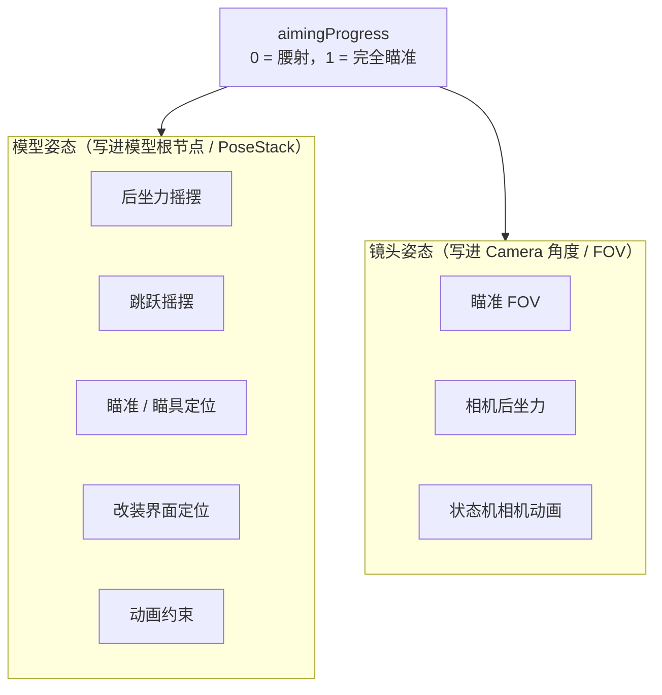

# 第一人称变换与镜头

> 第一人称下，除了动画系统写入的骨骼姿态，还有一套在渲染前后施加的姿态变换与镜头效果

第一人称枪械渲染不只是「播动画 + 画模型」。在模型渲染之前，会施加一层姿态变换把枪「摆到」正确的位置（瞄准、改装、后坐力、跳跃、约束）；同时镜头侧会做 FOV、后坐力、相机动画的处理。这两条线由 `FirstPersonRenderGunEvent` 和 `CameraSetupEvent` 分别负责。

## 两条线：模型姿态 vs 镜头姿态

两者由一个共同的 `aimingProgress`（瞄准进度，0 到 1）贯穿：瞄准越深，模型姿态越贴近瞄具视角，镜头 FOV 越小，同时后坐力与相机动画被压缩。

## 模型姿态变换

`FirstPersonRenderGunEvent.applyFirstPersonGunTransform` 是入口，按固定顺序执行：

1. 平滑改装界面打开进度与瞄准进度。
2. 应用模型动态（后坐力 + 跳跃摇摆）。
3. 应用第一人称定位变换（空闲 / 机瞄 / 瞄具 / 改装视角）。
4. 应用动画约束变换。

### 后坐力摇摆

开火记录时间戳，之后约 0.3 秒内，在模型根节点上施加一个用 `PerlinNoise` 生成的随机位移与旋转，幅度随 `(1 - aimingProgress)` 衰减——瞄准时后坐摇摆完全消失。位移方向考虑基岩版模型上下颠倒，Y 轴取反。

### 跳跃摇摆

根据玩家垂直速度判断起跳与落地，用 `SecondOrderDynamics` 平滑后，在根节点 Y 方向施加摇摆，同样随落地/起跳状态衰减。

### 瞄准与瞄具定位

这是第一人称变换的核心。它根据是否安装瞄具，选择一条「视线定位路径」：

- 未装瞄具 → 机瞄定位（`iron_view`）。
- 安装瞄具 → 瞄具位置路径 + 配件模型的 `scope_view` 路径，支持变倍瞄具在多个视野索引之间插值。

最终把「空闲视线」和「瞄准视线」两条路径的反向矩阵按 `aimingProgress × (1 - refitOpenProgress)` 混合，再施加到 PoseStack。这样从腰射到完全瞄准的过渡是连续的。

### 改装界面定位

改装界面打开时，镜头聚焦到枪械的某个配件槽。它从 `refit_view_<type>` 定位路径之间插值：随界面打开进度淡入，随界面内的槽位切换进度在旧/新槽位视角之间交叉过渡。此时手臂渲染会被关闭。

### 动画约束

枪械模型的 `constraint` 节点在动画中可能移动，这会让枪看起来「不稳」。动画约束计算该节点在默认姿态与动画后姿态之间的位移/旋转差，把反向补偿施加回 PoseStack，权重随 `aimingProgress` 变化，抵消过度的动画位移。

## 镜头效果

`CameraSetupEvent` 是镜头效果的编排点。

### 瞄准 FOV

世界 FOV 与手部物品 FOV 被**解耦**，用两个独立的平滑器处理：世界 FOV 按 `1 + (zoom - 1) × aimingProgress` 的倍率缩小；手部物品 FOV 则按瞄具/枪械配置的 `views_fov` / `zoom_model_fov` 单独插值。两者分开的原因是世界渲染和手部渲染走不同的 FOV 通道，且变倍瞄具的视野只应作用于手部模型。

### 相机后坐力

开火时从枪械 `recoil` 数据生成俯仰/偏航两条样条曲线，之后每帧按经过时间读取曲线值，把差值施加到玩家视角，形成平滑的抬头后坐。后坐幅度受瞄准进度、变倍、趴下倍率等因子调制。

### 状态机相机动画

枪械动画状态机可以输出相机旋转（`camera` 节点）。渲染时把它的四元数换算成欧拉角叠加到相机俯仰/偏航/翻滚，或直接施加到手部 PoseStack。幅度同样随瞄准进度衰减。

## 两个 FOV 的汇合点

枪口世界位置缓存是唯一需要同时用到两个 FOV 的地方。渲染第一人称枪械后，代码沿枪口节点路径累积矩阵得到枪口偏移，再用「手部 FOV 与世界 FOV 的正切比」修正 Z 分量，使第一人称曳光弹的起点与瞄具的准星在屏幕上对齐。
