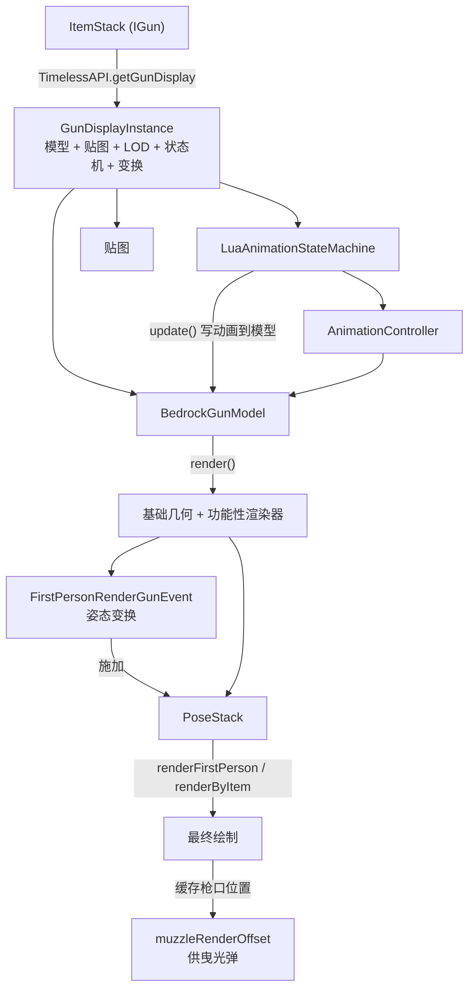

# 枪械渲染链路

> 一把枪从渲染入口到最终绘制的模块级数据流

枪械是 TaCZ 渲染体系里最复杂、模块最多的一条链路。它把「资源缓存、模型、动画、状态机、姿态变换、附加渲染」串成一条流水线。本章按模块拆解这条链路，说明每个模块负责什么、拿什么数据、如何衔接。

## 模块级数据流

数据入口是一个 `ItemStack`（实现 `IGun`）。渲染器用 `TimelessAPI.getGunDisplay` 把它解析成 `GunDisplayInstance`——这是每把枪的渲染缓存，聚合了模型、贴图、LOD、动画状态机和各类显示配置。后续所有模块都从它取数据。

## 获取枪械数据

`GunDisplayInstance` 在资源加载阶段构建完成（见[资源读取](./resource-loading.md)），渲染时按需触发懒加载。枪械的「索引」（`ClientGunIndex`）只是指向 data/display 的轻量指针，真正的渲染对象都在 `GunDisplayInstance` 里。渲染器取三样核心数据：`getGunModel()`（`BedrockGunModel`）、`getModelTexture()`（贴图）、`getAnimationStateMachine()`（状态机），以及可选 `getLodModel()`（低模）。

## 确定当前枪械状态

当前枪械状态不直接由渲染器计算，而是分散在两处：

- 状态机上下文 `GunAnimationStateContext` 在每帧更新前被刷新，注入当前物品与 partialTick，供脚本查询弹药数、开火模式、换弹状态、瞄准进度、过热等。
- `BedrockGunModel.render` 在渲染时重新读取当前配件物品与弹药状态，据此更新功能性渲染器的可见性。

因此「当前状态」是两条线并行推进的：状态机上下文服务于动画决策，模型渲染时的状态读取服务于可见性控制。

## 更新动画

第一人称渲染前，渲染器调用状态机的 `update()`。它先让所有活跃状态跑一遍 `update`（脚本在这里根据上下文决定播什么动画），再调用 `AnimationController.update()` 把关键帧结果写入模型。第三人称则用 `visualUpdate()`，只推进状态和音效、不写模型。

## 获得模型并施加变换

模型是 `BedrockGunModel`，构造时已注册好功能性渲染器并缓存好各类定位组路径。渲染时的变换分两层：

- 基础变换：逆转原版视角晃动、平移到模型原点 `(0, 24, 0)`、绕 Z 翻转 180°，这是所有基岩版模型共用的标准化步骤。
- 第一人称姿态变换：`FirstPersonRenderGunEvent.applyFirstPersonGunTransform` 依次施加后坐摇摆、跳跃摇摆、瞄准/瞄具定位、改装定位、动画约束（见[第一人称变换与镜头](./first-person-transforms.md)）。

## 进入最终渲染

变换完成后调用 `BedrockGunModel.render`。它先按 display 配置选择渲染类型（透明 `entityTranslucent` 或 `entityCutout`），然后：

1. 若安装了瞄具，先在瞄具位置画瞄具、写入模板缓冲。
2. 渲染枪体基础几何（模板测试下被镜片遮挡）。
3. 遍历场景图时，功能性渲染器在各节点按需替换/叠加绘制（枪口火焰、抛壳、手臂、配件、文字、子弹可见性）。
4. 渲染激光束。

## 渲染后的收尾

渲染结束后有两个关键收尾：

- 缓存枪口世界位置（`cacheMuzzlePosition`）：沿枪口节点路径累积矩阵得到枪口偏移，用 FOV 正切比修正 Z，供第一人称曳光弹起点使用。
- 清除动画残留（`cleanAnimationTransform`）：把全部节点的动画属性归零，避免第一人称的姿态污染第三人称或 GUI 等后续渲染。

## 各场景的差异

同一套核心在不同场景有不同侧重：第一人称走完整链路（状态机写模型 + 姿态变换 + 附加渲染）；第三人称走 `renderByItem`，只做定位/缩放变换、不跑姿态变换、用 `visualUpdate` 同步状态；GUI 只画平面图标；实体/方块渲染器直接操作模型、完全不经过状态机。这些差异的完整对比见[渲染场景](./render-scenes.md)。

## 链路中插入逻辑的模块

枪械渲染链路并非单一函数，而是多个模块在固定节点插入自己的逻辑：状态机在「更新动画」阶段插入决策；`FirstPersonRenderGunEvent` 在「施加变换」阶段插入姿态处理；功能性渲染器在「模型渲染」阶段插入附加绘制；曳光弹通过「缓存枪口位置」读取渲染结果。理解这条链路的正确姿势是把握这些插入点，而不是逐方法追踪。
