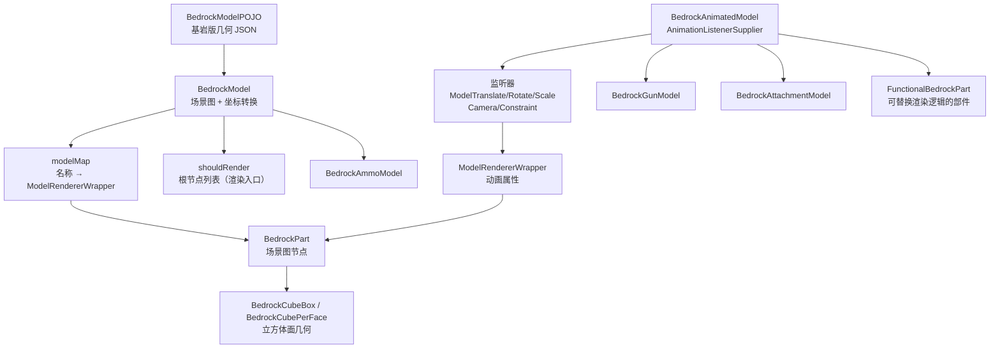

# 模型与几何

> 如何将 BlockBench 导出的基岩版几何模型构建为可渲染、可被动画驱动的场景图

TaCZ 不使用 Minecraft 原版的 JSON 模型系统，而是直接解析 BlockBench 的基岩版几何格式（`*.geo.json`），在内存中构建一套自己的场景图。这套场景图既是渲染时的遍历对象，也是动画系统写入变换的落点。

## 概览

模型层解决两个问题：一是把基岩版坐标体系转换成 Minecraft 渲染可用的坐标；二是提供一个稳定的「节点名称 → 变换属性」映射，让动画系统无需了解几何细节就能驱动模型。

## 场景图构建与坐标转换

`BedrockModel` 从 `BedrockModelPOJO` 构建场景图。它维护三个关键结构：

- `modelMap`：骨骼名称到 `ModelRendererWrapper` 的映射，是后续动画、功能性渲染、定位组查询的统一入口。
- `indexBones`：骨骼名称到原始 `BonesItem` 的映射，仅用于构建阶段查找父骨骼坐标。
- `shouldRender`：没有父骨骼的根节点列表，渲染时从这里开始递归遍历。

构建采用两趟遍历：第一趟把所有骨骼以空 `BedrockPart` 实例注入 `modelMap`（因为绑定父子关系需要引用已经存在的对象）；第二趟才填充旋转点、旋转角度、立方体并建立父子链接。只有没有父骨骼的节点会进入 `shouldRender`。

基岩版与 Minecraft 的坐标约定不同，加载时需要三处转换：

- 旋转点（pivot）：有父骨骼时取父子旋转点之差，且 Y 轴方向相反；无父骨骼时 Y 轴用 `24 - pivot`。这是基岩版模型上下颠倒的根源，渲染前需要再翻转一次。
- 立方体原点（origin）：Y 轴为「旋转点 - 原点 - 长度」，X/Z 轴为「原点 - 旋转点」。
- 旋转角度：基岩版用度，转成弧度。

## 场景图节点 BedrockPart

`BedrockPart` 是场景图的基本节点，对应一个骨骼或一个带旋转的立方体。它的变换字段分为两组：

- 静态变换（来自模型文件）：`x/y/z`（旋转点）、`xRot/yRot/zRot`（初始旋转）。
- 动画变换（由动画系统写入）：`offsetX/Y/Z`（平移偏移）、`additionalQuaternion`（附加四元数旋转）、`xScale/yScale/zScale`（缩放）。

此外还有 `parent`、`children`、`cubes`（该节点的立方体列表）、`visible`、`illuminated`（自发光，用满亮度渲染）、`mirror` 等状态。

渲染时每个节点先调用 `translateAndRotateAndScale` 把自身变换压入 `PoseStack`，再编译自身立方体，最后递归渲染子节点。变换应用顺序为：动画偏移 → 旋转点平移 → 初始旋转 → 附加四元数 → 缩放。正是这个顺序让「初始姿态」与「动画姿态」叠加生效。

## 动画属性访问 ModelRendererWrapper

`ModelRendererWrapper` 是对 `BedrockPart` 的薄封装，把动画系统需要读写的字段（`offsetX/Y/Z`、`additionalQuaternion`、`xScale/yScale/zScale` 以及初始旋转、旋转点、可见性）暴露为明确的 getter/setter。动画监听器通过它间接操作 `BedrockPart`，而 `cleanAnimationTransform` 也是通过它把动画残留清零。

## 立方体几何

每个 `BedrockPart` 持有一组 `BedrockCube`。TaCZ 区分两种 UV 方式：

- `BedrockCubeBox`：整块立方体共用一套盒式 UV，几何较简单。
- `BedrockCubePerFace`：每个面独立的 UV，对应 BlockBench 中的 per-face UV。

两者都向下细分为 `BedrockPolygon` 与 `BedrockVertex`，最终写入顶点缓冲。`illuminated` 节点在编译时把光照替换为满亮度，用于发光件。

## 可动画模型 BedrockAnimatedModel

`BedrockAnimatedModel` 是「模型」与「动画」之间的桥梁，它实现了 `AnimationListenerSupplier`。`supplyListeners(nodeName, type)` 按节点名称决定把动画数据写到哪里：

- `camera` 节点 → 写入相机动画对象的旋转四元数，供第一人称相机动画消费。
- `constraint` 节点 → 写入约束对象，供第一人称的动画约束变换反解。
- 其他节点 → 分别写入 `ModelTranslateListener`（`offsetX/Y/Z`）、`ModelRotateListener`（`additionalQuaternion`）、`ModelScaleListener`（`xScale/yScale/zScale`）。

它还承担两个职责：一是加载时为每个骨骼预注册一个 `FunctionalBedrockPart`（`setFunctionalRenderer` 依赖这些占位节点）；二是提供 `cleanAnimationTransform`，在每帧渲染结束后把全部节点的动画属性归零，避免第一人称与第三人称等不同视角之间互相污染。

## 专用模型

几个子类在 `BedrockAnimatedModel` 基础上叠加各自的职责：

- `BedrockGunModel`：枪械模型。它在构造时注册大量功能性渲染器（手臂、枪口火焰、抛壳、子弹可见性、瞄具/机瞄/折叠瞄具、扩容弹匣、护木、配件转接口），并缓存各类定位组路径（机瞄、空闲、第三人称手部、展示框、地面、枪口、瞄具、改装视角、激光束）。渲染时还负责瞄具的模板缓冲（stencil buffer）逻辑。
- `BedrockAttachmentModel`：配件模型。为瞄具配件实现镜内视差渲染，通过 `scope_view`、`ocular`、`division` 等约定节点与模板缓冲在镜片范围内裁剪枪身；非瞄具配件则渲染激光束。
- `BedrockAmmoModel`：弹药模型，仅缓存 `fixed`、`ground`、`thirdperson_hand` 三个定位组路径，供物品渲染时反向对齐。

`FunctionalBedrockPart` 是「可替换渲染逻辑」的载体：它为某节点保存一个 `Function<BedrockPart, IFunctionalRenderer>`，渲染时调用该函数得到实际的渲染器；函数返回 `null` 时回退到默认几何。这是枪械模型能动态插入手臂、枪口火焰等逻辑的机制基础。`SlotModel` 则是 GUI 物品槽里渲染平面图标用的固定小模型。

## 定位组与渲染原点

枪械模型里有一批「约定命名」的节点，它们本身可能不含几何，只是标记模型上某个有意义的位置。TaCZ 用「节点路径」表示从根到该节点的完整链条，供第一人称变换与物品渲染反向求矩阵：

- `idle_view`、`iron_view`：第一人称空闲视线与机瞄视线定位。
- `scope_view`（配件模型内）：瞄具视野定位。
- `refit_view_<type>`：改装界面下各配件槽的特写视角。
- `thirdperson_hand`、`fixed`、`ground`：第三人称手部、展示框、地面实体的渲染原点。
- `muzzle_flash_origin`：枪口位置，用于枪口火焰与曳光弹起点。
- `constraint`：动画约束点，用于抵消过度动画位移。

这些节点的命名约定集中在 `GunModelConstant` 中。它们不直接决定「画什么」，而是决定「从哪个位置、以什么姿态画」。
