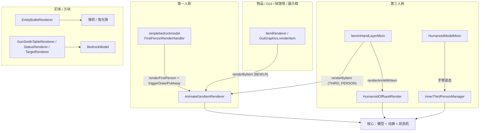

# 渲染入口与主调用链

> 一个渲染请求进入 TaCZ 后，会经过哪些入口、被路由到哪个渲染器、遵循怎样的通用阶段

TaCZ 的渲染覆盖多种 Minecraft 渲染上下文，但共享一套核心——基岩版模型 + 动画系统 + 状态机。本章说明不同上下文分别从哪里进入这套核心，以及它们共用的渲染阶段。

## 渲染上下文与入口

第一人称由随模组打包的 `simplebedrockmodel` 库驱动，其余上下文走 Minecraft 原版渲染路由（`ItemInHandLayer`、`ItemRenderer`、实体/方块渲染器）。

## 物品渲染器的注册

枪械、配件、弹药、合成台物品都通过 `IClientItemExtensions` 注册一个 `BlockEntityWithoutLevelRenderer`（BEWLR）作为自定义渲染器。枪械在 `AbstractGunItem.initializeClient` 里注册，返回 `GunItemRendererWrapper`——它继承 `AnimateGeoItemRenderer`，后者是所有动画物品渲染器的基类，实现了 `IFPGeoItemRenderer`（来自 simplebedrockmodel）。

## 第一人称入口

第一人称的进入点不是 TaCZ 自己的事件处理器——`FirstPersonRenderEvent` 里原来的 `RenderHandEvent` 处理器已被注释掉。实际驱动者是 simplebedrockmodel 库的 `FirstPersonRenderHandler`：

- 它监听客户端 tick，检测选中栏位变化或同栏位物品变化。
- 物品切换时，它创建新的 `IFPAnimationInstance`（由 `AnimateGeoItemRenderer.createAnimationInstance` 返回），调用旧实例的 `triggerPutAway`、计算收枪时长、在过渡完成后再触发新实例的 `triggerDraw`。
- 渲染帧里它调用渲染器的 `renderFirstPerson`，并取消原版手部渲染。

`triggerDraw` / `triggerPutAway` 最终落到 TaCZ 的 `tryInit`（触发 `INPUT_DRAW`）/ `tryExit`（触发 `INPUT_PUT_AWAY`），并伴随拔枪/收枪音效。

## 第三人称与手臂

第三人称枪械走原版 `ItemInHandLayer`，由 `ItemInHandLayerMixin` 介入：

- 主手第三人称枪械经 `renderByItem` 的 `THIRD_PERSON_RIGHT_HAND` 分支渲染。
- 持枪时取消原版左臂渲染，避免副手重复绘制。
- 渲染结束后委托 `HumanoidOffhandRender` 处理副手枪械和背上枪械。

手臂姿态由 `HumanoidModelMixin` 在 `setupAnim` 末尾委托 `InnerThirdPersonManager` 处理（见[渲染场景](./render-scenes.md)）。

## GUI、掉落物与展示框

这些上下文都通过 BEWLR 的 `renderByItem` 进入。`renderByItem` 根据 `ItemDisplayContext` 区分：

- `GUI`：渲染 `SlotModel` 平面图标。
- `FIRST_PERSON_*` 与 `THIRD_PERSON_LEFT_HAND`：直接返回（交给别处）。
- 其余（`FIXED` 展示框、`GROUND` 掉落物、`THIRD_PERSON_RIGHT_HAND`）：平移到模型原点、翻转、应用定位组与缩放变换后渲染 3D 模型，并按距离切换 LOD。

tooltip 图片、改装界面槽位图标、合成台结果图标都经 `GuiGraphics.renderItem` 复用这条 BEWLR 路径；雕像方块与合成台预览则通过 `ItemRenderer.renderStatic` 直接调用。

## 实体与方块渲染

实体/方块渲染器在 `ModEntitiesRender` 注册，各自独立实现：

- `EntityBulletRenderer` 渲染子弹实体与曳光弹（见[渲染场景](./render-scenes.md)）。
- `GunSmithTableRenderer`、`StatueRenderer`、`TargetRenderer` 渲染对应方块实体，直接操作 `BedrockModel`，其中雕像会渲染一柄展示用的枪械物品。

## 帧内的事件与 Mixin

除渲染器本身，还有若干事件与 Mixin 在一帧的不同阶段介入：

- `GameRendererMixin`：取消受伤/视角晃动，用 `getFov` 的 `pUseFovSetting` 区分「世界渲染」与「手部渲染」。
- `ItemInHandRendererMixin`：在手部渲染前投递 `BeforeRenderHandEvent`，并提供 `KeepingItemRenderer`（`getCurrentItem`）供各组件取当前渲染的物品。
- `MouseHandlerMixin`：开镜时按缩放倍率降低鼠标灵敏度。
- `PlayerModelMixin`：第一人称时重置手臂旋转。
- `CameraSetupEvent`：处理 FOV、相机后坐力、相机动画。
- `TickAnimationEvent`：每 tick 推送移动类输入信号。

## 通用渲染阶段

尽管入口不同，核心渲染遵循相近的阶段：

1. 获取渲染所需数据（模型、贴图、状态机），通常经 `TimelessAPI.getGunDisplay` 拿到 `GunDisplayInstance`。
2. 更新动画状态机，把动画数据写入模型（第一人称 `update`，第三人称 `visualUpdate`）。
3. 施加场景变换（第一人称的姿态定位、物品渲染的定位组/缩放）。
4. 调用模型 `render`，其中功能性渲染器按需介入。
5. 渲染结束后清除动画残留（`cleanAnimationTransform`），避免污染其他视角。

枪械这条最复杂的链路的模块级拆解见[枪械渲染链路](./gun-render-pipeline.md)。
