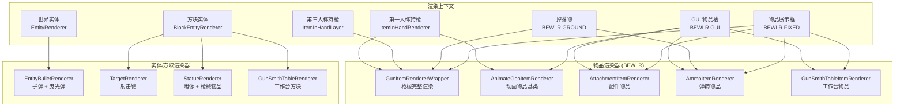
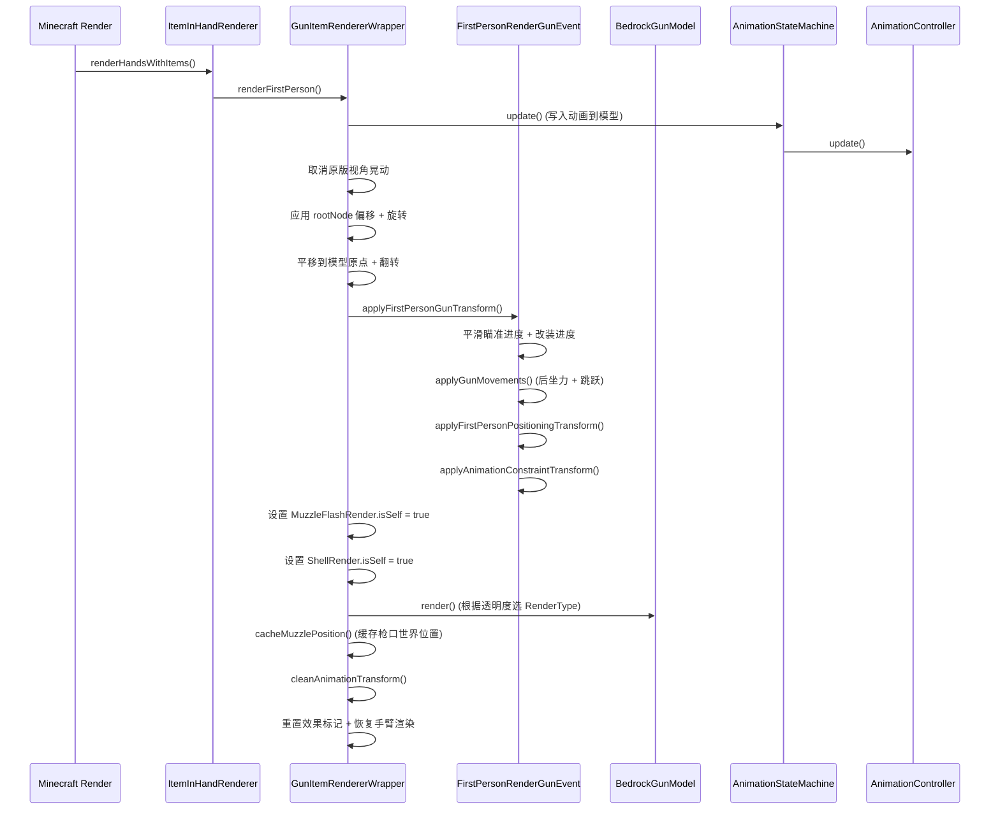

# 渲染管线

> 从物品渲染器（BEWLR）到 Minecraft 渲染管线的完整流程

## 渲染上下文总览

TaCZ 的渲染覆盖了多种 Minecraft 渲染上下文，每种由不同的渲染器类处理：

物品渲染全部通过 `BlockEntityWithoutLevelRenderer`（BEWLR）体系实现，绕过 MC 原版的 JSON 模型系统，直接操作 Bedrock 模型。

## AnimateGeoItemRenderer — 动画物品基类

`AnimateGeoItemRenderer<M extends BedrockAnimatedModel, CTX extends ItemAnimationStateContext>` 是所有动画物品（枪械）渲染器的基类。

### 动画生命周期管理

- `tryInit(stack, player, partialTick)`：初始化动画状态机，创建上下文，触发 `INPUT_DRAW`
- `tryExit(stack, putAwayTime)`：触发 `INPUT_PUT_AWAY`，退出状态机，设置退出宽限期以避免立即重初始化
- `triggerAnimation(stack, input)`：向状态机发送命名输入信号

### 第一人称渲染流程

`renderFirstPerson()` 的执行顺序：

1. 获取模型、纹理、状态机
2. 调用 `stateMachine.update()` → 将动画数据写入模型
3. 取消原版视角晃动（撤销 `xBob` / `yBob`），将其作为根节点偏移和旋转重新应用到基岩版模型
4. 平移到模型原点 `(0, 24, 0)`，翻转 180 度
5. 应用第一人称定位变换（`applyFirstPersonPositioningTransform()`）
6. 渲染模型
7. 调用 `model.cleanAnimationTransform()` 清除动画残留

### 非第一人称渲染（GUI / 第三人称 / 掉落物）

`renderByItem()` 跳过第一人称上下文，应用标准变换后通过 `BedrockModel.render()` 渲染。

### 相机动画

- `applyLevelCameraAnimation(event, stack, player)`：从相机动画对象中提取四元数 → 转为欧拉角 → 叠加到相机偏航/俯仰/翻滚
- `applyItemInHandCameraAnimation(event, stack, player)`：对 `BeforeRenderHandEvent` 给出的 PoseStack 直接应用四元数矩阵

## GunItemRendererWrapper — 枪械渲染器

继承 `AnimateGeoItemRenderer<BedrockGunModel, GunAnimationStateContext>`，是枪械物品的完整渲染器。

### 第一人称渲染完整流水线

### 第三人称渲染

`renderByItem()` 内部逻辑：
- GUI 上下文：渲染 `SlotModel` 平面槽位图标
- 其他上下文：获取模型 + LOD（距离判断），应用定位变换和缩放变换，使用 `entityCutout` 渲染

### 枪口位置缓存

`cacheMuzzlePosition(poseStack, gunModel)` 遍历枪口定位节点路径，累积所有变换矩阵，计算最终枪口世界位置。该位置被 `EntityBulletRenderer` 用于第一人称曳光弹的起始偏移。

## FirstPersonRenderGunEvent — 第一人称变换编排

该类不是事件处理器，而是从 `GunItemRendererWrapper` 命令式调用的工具类。负责编排第一人称视角的所有变换。

### 瞄准变换

1. 获取空闲视线路径（`idle_view` 节点 → 根）
2. 获取瞄准节点路径：若安装了瞄具配件则组合瞄具位置路径 + 瞄具视野路径，否则使用机械瞄具路径（`iron_view`）
3. 在多个视野索引之间插值（支持可变变倍瞄具），使用 `SecondOrderDynamics` 平滑过渡
4. 在空闲 → 瞄准之间按 `aimingProgress × (1 - refitOpenProgress)` 插值
5. 改装界面打开时：在配件视图之间按 `easeOutCubic` 插值

### 程序化动画变换

通过修改 Bedrock 模型的根节点偏移和旋转实现：
- 后坐力：使用 `PerlinNoise` 生成随机摇摆，开火时记录时间戳
- 跳跃摇摆：基于玩家垂直速度的正弦波
- 上述平滑由 `SecondOrderDynamics` 实例处理

### 动画约束

计算动画约束节点（`constraint` 骨骼）在其默认姿态与动画后姿态之间的位置/旋转差值，反向应用到 PoseStack，抵消过度的动画位移。

## 物品渲染器

### AttachmentItemRenderer

- GUI 上下文：渲染 `SlotModel` 平面槽位
- 3D 上下文：平移到 `(0.5, 2, 0.5)`，缩放 `(-1, -1, 1)`，检查 LOD 模型（距离判断 + 第一人称绕过），渲染 `BedrockAttachmentModel`
- 缺失模型时回退到 `SlotModel` + 缺失纹理

### AmmoItemRenderer

- GUI 上下文：渲染 `SlotModel` 平面槽位
- 3D 上下文：平移到 `(0.5, 2, 0.5)`，缩放 `(-1, -1, 1)`，根据 `ItemDisplayContext` 选择定位节点（FIXED→fixed、GROUND→ground、THIRD_PERSON→thirdperson_hand），反向应用节点路径变换使定位组位于渲染中心，应用缩放变换，渲染 `BedrockAmmoModel`

### GunSmithTableItemRenderer

- 通过 `GunSmithTableRenderer.getIndex(stack)` 查找 `ClientBlockIndex`
- 应用索引中的 `ItemTransforms`，平移到原点并翻转，使用 `entityTranslucent` 渲染 `BedrockModel`
- 后备方案：`SlotModel` + 缺失纹理

## 实体渲染器

### EntityBulletRenderer — 子弹和曳光弹

**子弹模型渲染**：
1. 获取弹药索引的 `BedrockAmmoModel` 和纹理
2. 旋转到子弹轨迹方向
3. 平移到 `(0, 1.5, 0)`，缩放 `(-1, -1, 1)`
4. 使用 `entityTranslucentCull` 渲染

**曳光弹渲染**：
1. 计算轨迹长度（基于速度的 85%，距离限制）
2. 第一人称：应用来自 `GunItemRendererWrapper.muzzleRenderOffset` 的相机偏移
3. 按距离缩放宽度
4. 前 5 tick 且距离 < 2 格时跳过（避免在玩家面前渲染）
5. 使用 `energySwirl` 渲染类型（发光/加性混合），应用曳光弹颜色

子弹始终以最高亮度（15）渲染，即 `getBlockLightLevel()` 返回 15。

## 方块实体渲染器

### GunSmithTableRenderer

- 从方块实体获取 `ClientBlockIndex`
- 判断是否为多方块结构的根方块
- 平移到中心 `(0.5, 1.5, 0.5)`，绕 Z 轴翻转 180 度
- 按照方块朝向旋转
- 使用 `entityCutout` 或 `entityTranslucent`（取决于配置）渲染

### StatueRenderer

- 加载雕像 `BedrockModel`（内置资源）
- 按方块朝向旋转，平移 + 翻转渲染雕像
- 缩放至 0.5 倍渲染枪械物品：平移到展示位置，应用正弦波浮动动画（`sin(millis/500) × 0.1`），通过 `Minecraft.getItemRenderer().renderStatic()` 渲染枪械物品堆
- 光照固定为 15

### TargetRenderer

- 加载靶子 `BedrockModel`
- 根据 `oRot` / `rot`（插值后的倒下角度）驱动 `target_upper` 节点的 `xRot`
- 若靶子有主人，从 Mojang 皮肤服务器获取头颅纹理并渲染在头部节点位置

## Mixin 钩子

### 渲染管线钩子

|Mixin|目标类|作用|
|---|---|---|
|`GameRendererMixin`|`GameRenderer`|取消原版受伤晃动和视角晃动（通过 `RenderItemInHandBobEvent` / `RenderLevelBobEvent`）|
|`ItemInHandRendererMixin`|`ItemInHandRenderer`|在渲染手部前触发 `BeforeRenderHandEvent`；提供保持物品机制（延长拔/收枪动画可见性）|
|`ItemInHandLayerMixin`|`ItemInHandLayer`|设置第三人称枪口火焰/弹壳标记；阻止左臂渲染（枪械替换左臂）；委托给 `HumanoidOffhandRender`|
|`HumanoidModelMixin`|`HumanoidModel`|`setupAnim` 后委托给 `InnerThirdPersonManager` 处理第三人称持枪动画|
|`PlayerModelMixin`|`PlayerModel`|第一人称时重置手臂旋转，防止原版动画干扰自定义枪位|
|`MouseHandlerMixin`|`MouseHandler`|开镜时按缩放级别降低鼠标灵敏度|

### 保持物品机制

`KeepingItemRenderer` 接口用于在物品切换动画后延长物品可见性。由 `ItemInHandRendererMixin` 实现：`keep(itemStack, timeMs)` 在指定时间内用保持的物品覆盖主手物品，确保拔枪/收枪动画播放完成后物品不会立即消失。

## 渲染顺序

第一人称枪械渲染的完整事件顺序：

1. `MouseHandlerMixin` — 降低鼠标灵敏度（若开镜中）
2. `PlayerModelMixin` — 重置手臂旋转
3. `ItemInHandLayerMixin` — 阻止原版左臂渲染
4. `CameraSetupEvent` — 计算瞄准 FOV + 相机后坐力
5. `ItemInHandRendererMixin` — 触发 `BeforeRenderHandEvent` → 相机动画应用
6. `AnimateGeoItemRenderer.renderFirstPerson()` — 状态机更新 + 渲染枪械模型
7. `FirstPersonRenderGunEvent.applyFirstPersonGunTransform()` — 所有第一人称变换
8. `BedrockGunModel.render()` — 功能性渲染器（枪口火焰、抛壳、配件等）
9. `RenderCrosshairEvent` — 若持有枪械则替换原版准星
