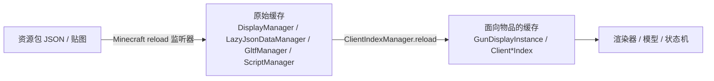

# 资源读取

> 渲染系统从哪里获得资源、拿到什么对象、这些资源如何进入渲染并影响最终结果

渲染系统的输入是资源包里的 JSON 与贴图。本章只回答一个问题：这些文件如何被加载成渲染可用的对象，以及每个对象对应什么美术资源、被哪个渲染模块消费。底层资源管理器的内部维护不是重点。

## 两阶段加载

加载分两阶段。第一阶段是 Minecraft 资源重载监听器把各类 JSON 解析成原始 POJO 缓存；第二阶段 `ClientIndexManager.reload` 在游戏线程上把这些原始数据组装成每把枪、每个配件的渲染对象。枪械模型、动画等重资源采用懒加载，配合后台线程预热，由 `ResourceConfig.ENABLE_LAZY_CLIENT_ASSET_LOAD` 控制。

## 资源管理器

客户端资源管理器把资源包目录映射到数据对象：

- `DisplayManager`：加载 `display/` 下的显示配置 JSON（枪/弹药/配件/方块四类）。
- `LazyJsonDataManager`：懒加载 `geo_models/` 下的 `BedrockModelPOJO`（基岩版几何模型）。
- `GltfManager`：加载 `animations/*.gltf` 的 glTF 动画。
- `ScriptManager`：编译 `scripts/*.lua` 的动画状态机脚本。
- `PackInfoManager`：读取枪包元信息。
- `InternalAssetLoader`：加载代码直接引用的内置资源（默认子弹模型、靶子、雕像、合成台模型、默认动画）。

## GunDisplayInstance——每把枪的渲染缓存

`GunDisplayInstance` 是枪械渲染的中央对象。它把一份 `GunDisplay` POJO 解析、校验、聚合为渲染可直接消费的对象：`BedrockGunModel`（模型）、贴图、可选 LOD 模型、`LuaAnimationStateMachine`（由动画 + 状态机脚本构建）、以及 `GunTransform`、枪口火焰、抛壳、曳光弹颜色、粒子、铁瞄倍率、准星显隐等运行时数据。

渲染器通过 `TimelessAPI.getGunDisplay(stack)` 拿到它，再取模型/贴图/状态机。枪械的 `ClientGunIndex` 只是指向 data/display 的轻量指针，真正的渲染对象都在这里。

## 配件、弹药与方块索引

配件、弹药、方块的索引比枪械索引更「重」，因为它们直接缓存解析后的模型：

- `ClientAttachmentIndex`：缓存 `BedrockAttachmentModel`、贴图、LOD、以及瞄具的 fov/zoom/views 等。
- `ClientAmmoIndex`：缓存三套模型——弹药物品模型、子弹实体模型、弹壳模型，以及曳光弹颜色、粒子。
- `ClientBlockIndex`：缓存 `BedrockModel`、贴图与物品变换。

## Display POJO 与美术资源的对应

每类 display JSON 描述一个渲染对象，其字段指向美术资源并影响渲染：

- `GunDisplay`（`display/guns/*.json`）：枪械主记录，指向模型、贴图、HUD、槽位图标、LOD、动画、状态机脚本、声音、变换、枪口火焰、抛壳、曳光弹、激光等，是 `GunDisplayInstance` 的输入。
- `AttachmentDisplay`（`display/attachments/*.json`）：配件的模型、贴图、LOD、转接口节点、瞄具参数（zoom/views/fov/views_fov）。瞄具参数直接决定第一人称瞄准视野与镜片裁剪。
- `AmmoDisplay`（`display/ammo/*.json`）：弹药物品模型、子弹实体模型、弹壳模型、粒子、曳光弹颜色。
- `BlockDisplay`（`display/blocks/*.json`）：方块的模型、贴图与物品变换。

其中 `MuzzleFlash`（枪口火焰贴图与缩放）被 `MuzzleFlashRender` 消费，`ShellEjection`（抛壳的初速度/加速度/角速度/存活时间）被 `ShellRender` 消费，`TextShow`（节点上的浮空文字）被 `TextShowRender` 消费，`GunTransform` 的缩放被物品渲染消费。这些配置最终都通过 `GunDisplayInstance` 或各索引落到具体渲染模块，成为画面的一部分。

## 模型与动画的数据流

模型 POJO（`BedrockModelPOJO`）解析自基岩版几何 JSON，传给模型构造函数（`BedrockGunModel` / `BedrockAttachmentModel` / `BedrockAmmoModel` 等）构建场景图。动画资源有基岩版 `.animation.json` 与 glTF 两种格式，由 `Animations` 转换成 `ObjectAnimation` 原型集合，再交给 `AnimationController`；状态机脚本由 `ScriptManager` 编译，与动画控制器一起被 `LuaStateMachineFactory` 组装成 `LuaAnimationStateMachine`。这条「模型 + 动画 + 脚本」的组装全部发生在 `GunDisplayInstance` 的 `checkAnimation` 里，是资源进入渲染体系的最后一环。
