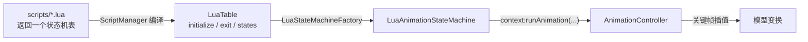

# 动画状态机脚本 API

> 资源包中的 Lua 动画脚本如何使用代码提供的 API，以及脚本结果如何进入渲染

TaCZ 的枪械动画不是写死在代码里的，而是由资源包中的 Lua 脚本定义。脚本定义动画状态机，代码负责把它装载、驱动，并在每一帧把脚本的决策落实为模型变换。本章说明脚本能做什么、它拿到的是什么、以及它的计算结果如何一路变成最终的模型姿态。

## 完整链路

脚本运行在受限的 LuaJ 沙箱中，常量以全局变量注入；脚本每个状态回调都会收到一个上下文对象（`GunAnimationStateContext`），这是脚本真正「做事」的入口。

## 脚本能拿到什么

### 全局常量

代码通过 `LuaLibrary` 反射机制，把常量注入为脚本全局变量。脚本可直接使用：

- 输入信号：`INPUT_DRAW`、`INPUT_PUT_AWAY`、`INPUT_SHOOT`、`INPUT_RELOAD`、`INPUT_CANCEL_RELOAD`、`INPUT_BOLT`、`INPUT_FIRE_SELECT`、`INPUT_INSPECT`、`INPUT_WALK`、`INPUT_RUN`、`INPUT_IDLE` 以及近战的 `INPUT_BAYONET_*`。这些对应 `GunAnimationConstant` 的字符串值。
- 播放模式：`PLAY_ONCE_HOLD`、`PLAY_ONCE_STOP`、`LOOP`，作为 `runAnimation` 的 `playType` 参数。
- 枚举序数：`ReloadState.StateType`（`NOT_RELOADING` 等）和 `FireMode`（`AUTO` / `SEMI` / `BURST` / `UNKNOWN`），用于与 `context:getReloadStateType()` / `context:getFireMode()` 的返回值比较。

### 上下文对象

每个脚本回调（`entry` / `update` / `exit` / `transition`）的第一个参数是上下文。它分几组能力：

- 动画控制：`runAnimation(name, track, blending, playType, transitionTime)` 在指定轨道播放动画；`stopAnimation` / `holdAnimation` / `pauseAnimation` / `resumeAnimation` 控制播放；`setAnimationProgress` / `adjustAnimationProgress` 跳转到指定进度。
- 轨道分配：`addTrackLine` / `assignNewTrack` / `findIdleTrack` / `getTrack` 管理并行轨道。
- 输入转发：`trigger(input)` 在脚本内部再触发一次状态机输入。
- 游戏状态查询：`getAmmoCount`、`getFireMode`、`getAimingProgress`、`getReloadStateType`、`isOverHeat`、`getHeatProgress`、`getChargeProgress`、`isCrawl`、`isOnGround`、`shouldSlide`、`getWalkDist` 等，让脚本根据玩家/枪械状态决定动画。
- 脚本参数：`getStateMachineParams()` 返回 display 里 `state_machine_param` 字段对应的 Lua 表。

脚本里动画名称必须与动画文件里的名字精确一致（它们是 `AnimationController` 原型注册表的键），轨道索引由轨道分配 API 返回，二者都不是常量。

## 脚本的表结构

脚本文件需要返回一个表，作为状态机定义：

- 顶层 `initialize(context)`、`exit(context)`、`states()`。
- `states()` 返回状态表数组（1 起始），每个状态表定义 `entry(context)`、`update(context)`、`exit(context)`、`transition(context, condition)`。
- `transition` 返回下一个状态表（转移）或 `nil`（不转移）。

状态的身份由 `states()` 返回的表决定，代码不关心状态叫什么，只把表包装成 `LuaAnimationState` 并按其回调运行。

## 脚本如何被装载

脚本存放在资源包的 `assets/<命名空间>/scripts/` 目录，`.lua` 文件。`ScriptManager` 编译它们并缓存为 `LuaTable`。枪械 display 里的 `state_machine` 字段指向某个脚本，`GunDisplayInstance` 据此构建 `LuaAnimationStateMachine`；未指定时回退到内置的 `tacz:default_state_machine`。

脚本运行在受限沙箱中：只有基础、包、bit32、表、字符串、数学库，没有文件、系统、协程和 Java 绑定，避免脚本越过边界访问宿主环境。

## 从脚本决策到模型变换

每一帧渲染时，渲染器调用状态机的 `update()`。状态机先遍历所有活跃状态，调用各自的 `update(context)`——脚本在这里根据 `context:getAimingProgress()` 之类的查询结果，决定调用 `context:runAnimation(...)` 之类的方法。这些调用落到 `AnimationController`，后者在对应轨道上启动动画。随后 `AnimationController.update()` 逐帧插值关键帧，把结果经监听器写入 `BedrockGunModel` 的节点。最终模型渲染时应用这些变换，渲染结束后由 `cleanAnimationTransform` 清除。

因此脚本处于「决策层」：它不直接计算关键帧，而是通过 `runAnimation` 等 API 指定「在哪条轨道、以什么方式、播哪段动画」，再由动画系统完成数值计算与模型写入。
