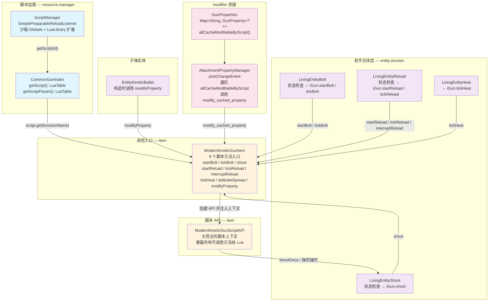
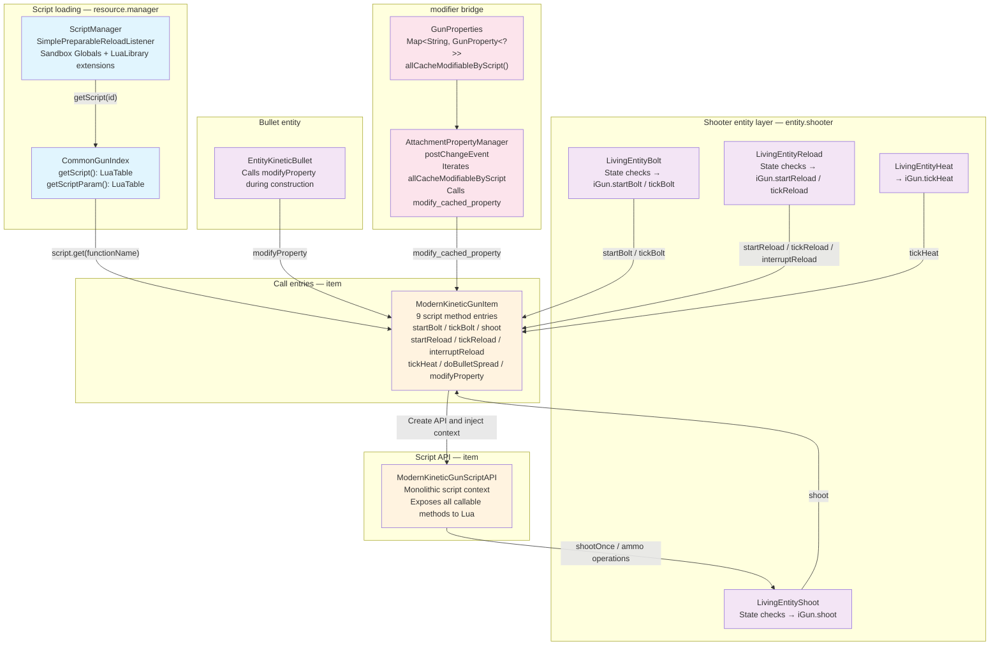

[English](#English)

# 枪械脚本框架

> TaCZ 原版枪械脚本体系：`ScriptManager`加载`.lua`文件 → `CommonGunIndex`缓存 → `ModernKineticGunItem`调用 → `ModernKineticGunScriptAPI`上下文 → 脚本方法执行与 fallback。

## 体系总览

## 架构要点

`ModernKineticGunItem`既是`IGun`的实现者也是脚本调度中心。9 个脚本方法入口遵循统一模式：创建`ModernKineticGunScriptAPI`实例、注入上下文（shooter/dataHolder/itemStack/pitchSupplier/yawSupplier）、从`CommonGunIndex.getScript()`查找 Lua 函数、函数存在则调用否则执行 Java 侧默认实现。

脚本 API 暴露给 Lua 的方法涵盖射击流程、弹药管理、过热、属性修改、循环任务、NBT 访问、实体工具。这些方法与射手实体层（`LivingEntityShoot`/`LivingEntityBolt`/`LivingEntityReload`/`LivingEntityHeat`）存在大量逻辑重叠——`shootOnce`中的散热计算、配件缓存读取、不准确度、弹丸数量、伤害倍率、连发循环等逻辑，与`LivingEntityShoot.shoot`中的前置状态检查（冷却/网络时间窗口/换弹/切枪/拉栓/冲刺/膛内弹药）形成互相引用而非复用。当 Lua 脚本调用`shootOnce`时，它绕过了`LivingEntityShoot`的所有状态检查。

## 三层职责划分

|层|包路径|职责|关键类|
|---|---|---|---|
|**脚本加载层**|`resource.manager`|`.lua`文件编译、沙箱执行、脚本表缓存|`ScriptManager`|
|**调用调度层**|`item`|脚本方法入口、Lua 函数查找与调用、Java 侧 default fallback|`ModernKineticGunItem`, `ModernKineticGunScriptAPI`|
|**射手实体层**|`entity.shooter`|玩家状态管理、射击/拉栓/换弹/过热的前置状态检查与触发|`LivingEntityShoot`, `LivingEntityBolt`, `LivingEntityReload`, `LivingEntityHeat`|

## 文档导航

|文档|内容|
|---|---|
|[脚本方法入口](/docs-tacz/architecture/item/script/script-method-entry.md)|9 个脚本方法的调用模式、Lua 函数名、返回值与默认行为|
|[射击与弹药](/docs-tacz/architecture/item/script/script-shoot-and-ammo.md)|`shootOnce`射击流程分解、bolt 三种类型的弹药扣除逻辑、换弹时序与补弹|
|[过热系统](/docs-tacz/architecture/item/script/script-heat.md)|热量读写 API、locked/normal 两种散热状态、过热锁机制|
|[modifier 桥接与值类型](/docs-tacz/architecture/item/script/modifier-bridge-and-type-safety.md)|`GunProperties`属性注册体系、`modifyProperty`调用链、`AttachmentPropertyManager`与脚本的协作|

# English

> The original TaCZ gun script system: `ScriptManager` loads `.lua` files → `CommonGunIndex` caches → `ModernKineticGunItem` calls → `ModernKineticGunScriptAPI` context → script method execution and fallback.

## Architecture Overview

## Architecture Points

`ModernKineticGunItem` is both the `IGun` implementor and the script dispatch center. The 9 script method entries follow a uniform pattern: create a `ModernKineticGunScriptAPI` instance, inject context (shooter/dataHolder/itemStack/pitchSupplier/yawSupplier), look up the Lua function from `CommonGunIndex.getScript()`, call it if present or execute the Java-side default implementation.

The script API exposes methods to Lua covering the shoot pipeline, ammo management, heat, property modification, loop tasks, NBT access, and entity utilities. These methods heavily overlap with the shooter entity layer (`LivingEntityShoot`/`LivingEntityBolt`/`LivingEntityReload`/`LivingEntityHeat`) — for example, the heat calculation, attachment cache reads, inaccuracy propagation, bullet count, damage multiplier, and burst loop logic inside `shootOnce` cross-reference rather than reuse the state checks in `LivingEntityShoot.shoot` (cooldown/network timing window/reload/draw/bolt/sprint/barrel ammo). When a Lua script calls `shootOnce`, it bypasses all of `LivingEntityShoot`'s state checks.

## Three-Layer Responsibility Division

|Layer|Package path|Responsibility|Key types|
|---|---|---|---|
|**Script loading**|`resource.manager`|`.lua` file compilation, sandbox execution, script table caching|`ScriptManager`|
|**Call dispatch**|`item`|Script method entries, Lua function lookup and invocation, Java-side default fallback|`ModernKineticGunItem`, `ModernKineticGunScriptAPI`|
|**Shooter entity**|`entity.shooter`|Player state management, state checks and triggers for shoot/bolt/reload/heat|`LivingEntityShoot`, `LivingEntityBolt`, `LivingEntityReload`, `LivingEntityHeat`|

## Document Navigation

|Document|Content|
|---|---|
|[Script Method Entries](/docs-tacz/architecture/item/script/script-method-entry.md)|Call patterns, Lua function names, return values, and default behaviors for the 9 script methods|
|[Shoot and Ammo](/docs-tacz/architecture/item/script/script-shoot-and-ammo.md)|`shootOnce` shoot flow breakdown, three bolt type ammo deduction logic, reload timing and ammo refill|
|[Heat System](/docs-tacz/architecture/item/script/script-heat.md)|Heat read/write API, locked/normal cooling states, overheat lock mechanism|
|[modifier Bridge and Type Safety](/docs-tacz/architecture/item/script/modifier-bridge-and-type-safety.md)|`GunProperties` property registration system, `modifyProperty` call chain, `AttachmentPropertyManager` coordination with scripts|