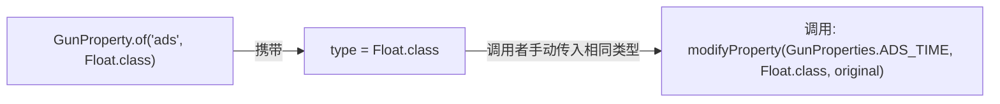
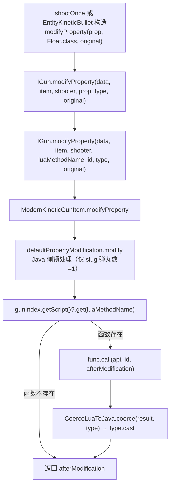
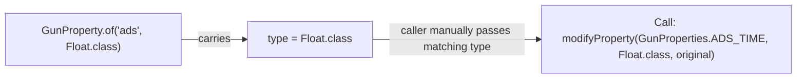
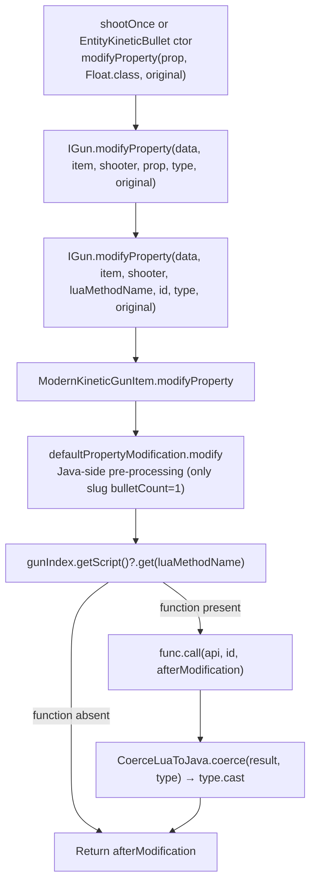

[English](#English)

# modifier 桥接与值类型

> `GunProperties`属性注册体系、`modifyProperty`调用链、`AttachmentPropertyManager`与枪械行为脚本的协作方式。

## GunProperties：属性注册中心

`GunProperties`是 TaCZ 的枪械属性类型注册中心。每个属性定义为`GunProperty<?>`常量，携带`type`字段（`Class<?>`）记录期望的 Java 类型：

所有属性存储在`ConcurrentHashMap<String, GunProperty<?>>`，通过`all()`返回只读视图。

### 属性分类

按能否被脚本修改，属性分为两类：

**缓存可修改属性**（被`@CacheModifiableByScript`标记）：

|常量名|类型|含义|
|---|---|---|
|`AMMO_SPEED`|`Float`|子弹初速|
|`ARMOR_IGNORE`|`Float`|穿甲百分比|
|`EFFECTIVE_RANGE`|`Float`|有效射程|
|`HEADSHOT_MULTIPLIER`|`Float`|爆头倍率|
|`KNOCKBACK`|`Float`|击退|
|`PIERCE`|`Integer`|穿透数|
|`WEIGHT`|`Float`|重量|

**仅运行时修改属性**（`GunProperties.RuntimeOnly`中的字符串常量）：

|常量名|类型|调用位置|
|---|---|---|
|`MAX_HEAT`|`Float`|`shootOnce`—热量上限|
|`BULLET_AMOUNT`|`Integer`|`shootOnce`—弹丸数量|
|`BURST_COUNT`|`Integer`|`shootOnce`—连发数量|
|`BURST_SHOOT_INTERVAL`|`Long`|`shootOnce`—连发间隔（毫秒）|
|`BULLET_LIFE`|`Float`|`EntityKineticBullet`构造—子弹寿命（秒）|
|`BULLET_GRAVITY`|`Float`|`EntityKineticBullet`构造—子弹重力|
|`BULLET_FRICTION`|`Float`|`EntityKineticBullet`构造—子弹空气阻力|
|`SOUND_DISTANCE`|`Integer`|`shootOnce`—枪声传播距离|
|`IGNITE_ENTITY`|`Boolean`|`EntityKineticBullet`构造—点燃实体|
|`IGNITE_ENTITY_TIME`|`Integer`|`EntityKineticBullet`构造—点燃时长（tick）|
|`IGNITE_BLOCK`|`Boolean`|`EntityKineticBullet`构造—点燃方块|
|`EXPLODE_ENABLED`|`Boolean`|`EntityKineticBullet`构造—子弹爆炸|
|`EXPLOSION_DAMAGE`|`Float`|`EntityKineticBullet`构造—爆炸伤害|
|`EXPLOSION_RADIUS`|`Float`|`EntityKineticBullet`构造—爆炸半径|
|`EXPLOSION_KNOCKBACK`|`Boolean`|`EntityKineticBullet`构造—爆炸击退|
|`EXPLOSION_DESTROYS_BLOCK`|`Boolean`|`EntityKineticBullet`构造—爆炸破坏方块|
|`EXPLOSION_DELAY`|`Float`|`EntityKineticBullet`构造—爆炸延迟（秒）|

## modifyProperty 调用链

调用方需保证传入的`Class<T>`与`GunProperty<?>`的`type`字段一致——无编译期约束，错误推迟到运行时`ClassCastException`。

## AttachmentPropertyManager 与脚本协作

`AttachmentPropertyManager`维护 16 个`IAttachmentModifier`实例（在`registerModifier()`中注册），其`postChangeEvent`在 modifier 缓存更新时协调配件 modifier 与枪械行为脚本的交互：
1. 创建空`AttachmentCacheProperty`
2. `ChangeGunPropertyEvent.internalOnAttachmentPropertyEvent`让各`IAttachmentModifier.initCache`从`GunData`填充各属性的 base 值
3. 发布`AttachmentPropertyEvent`（→ KubeJS → Forge）让外部监听器修改缓存
4. 对`allCacheModifiableByScript()`的每个属性，调用`iGun.modifyProperty(..., "modify_cached_property", ...)`让脚本修改
5. `IGunOperator.updateCacheProperty(cacheProperty)`将最终缓存写入实体

第 4 步传入 Lua 函数名 `modify_cached_property`，参数为 `(api, 属性ID, 当前缓存值)`。脚本返回的值覆盖该属性的缓存。

## 两条独立的 Lua 执行上下文

|用途|执行引擎|线程模型|上下文变量|
|---|---|---|---|
|枪械行为脚本（`.lua`文件）|`ScriptManager`的`Globals`沙箱|单例共享|`GunScriptApi`上下文 + 脚本参数|
|modifier `scriptFunction`（内联表达式）|`AttachmentPropertyManager`的`ScriptEngine`|静态单例（全局共享）|`x`=当前值, `r`=原始值, `y`=结果|

modifier 的数值计算固定公式：`value = (addends之和) × (percents之积) × (multipliers之积)`，再逐 modifier 执行可选的`function`表达式。表达式通过`AttachmentPropertyManager`的全局`ScriptEngine`执行，与`ScriptManager`的沙箱 Lua VM 是完全独立的两个引擎。

# English

> The `GunProperties` property registration system, `modifyProperty` call chain, and how `AttachmentPropertyManager` coordinates with gun behavior scripts.

## GunProperties: Property Registry

`GunProperties` is TaCZ's gun property type registry. Each property is defined as a `GunProperty<?>` constant carrying a `type` field (`Class<?>`) recording the expected Java type:

All properties are stored in a `ConcurrentHashMap<String, GunProperty<?>>`, accessible as a read-only view via `all()`.

### Property Categories

Properties are divided into two categories by whether they can be modified by script:

**Cache-modifiable properties** (annotated with `@CacheModifiableByScript`):

|Constant|Type|Meaning|
|---|---|---|
|`AMMO_SPEED`|`Float`|Bullet initial speed|
|`ARMOR_IGNORE`|`Float`|Armor ignore percentage|
|`EFFECTIVE_RANGE`|`Float`|Effective range|
|`HEADSHOT_MULTIPLIER`|`Float`|Headshot multiplier|
|`KNOCKBACK`|`Float`|Knockback|
|`PIERCE`|`Integer`|Pierce count|
|`WEIGHT`|`Float`|Weight|

**Runtime-only properties** (string constants inside `GunProperties.RuntimeOnly`):

|Constant|Type|Call site|
|---|---|---|
|`MAX_HEAT`|`Float`|`shootOnce`—heat cap|
|`BULLET_AMOUNT`|`Integer`|`shootOnce`—bullet count|
|`BURST_COUNT`|`Integer`|`shootOnce`—burst count|
|`BURST_SHOOT_INTERVAL`|`Long`|`shootOnce`—burst interval (ms)|
|`BULLET_LIFE`|`Float`|`EntityKineticBullet` ctor—bullet lifetime (seconds)|
|`BULLET_GRAVITY`|`Float`|`EntityKineticBullet` ctor—bullet gravity|
|`BULLET_FRICTION`|`Float`|`EntityKineticBullet` ctor—bullet air friction|
|`SOUND_DISTANCE`|`Integer`|`shootOnce`—gun sound propagation distance|
|`IGNITE_ENTITY`|`Boolean`|`EntityKineticBullet` ctor—ignite entity|
|`IGNITE_ENTITY_TIME`|`Integer`|`EntityKineticBullet` ctor—ignite duration (ticks)|
|`IGNITE_BLOCK`|`Boolean`|`EntityKineticBullet` ctor—ignite block|
|`EXPLODE_ENABLED`|`Boolean`|`EntityKineticBullet` ctor—bullet explosion|
|`EXPLOSION_DAMAGE`|`Float`|`EntityKineticBullet` ctor—explosion damage|
|`EXPLOSION_RADIUS`|`Float`|`EntityKineticBullet` ctor—explosion radius|
|`EXPLOSION_KNOCKBACK`|`Boolean`|`EntityKineticBullet` ctor—explosion knockback|
|`EXPLOSION_DESTROYS_BLOCK`|`Boolean`|`EntityKineticBullet` ctor—explosion destroys blocks|
|`EXPLOSION_DELAY`|`Float`|`EntityKineticBullet` ctor—explosion delay (seconds)|

## modifyProperty Call Chain

The caller must ensure the passed `Class<T>` matches the `type` field of the `GunProperty<?>` — there is no compile-time constraint; errors are deferred to runtime `ClassCastException`.

## AttachmentPropertyManager and Script Coordination

`AttachmentPropertyManager` maintains 16 `IAttachmentModifier` instances (registered in `registerModifier()`). Its `postChangeEvent` coordinates attachment modifiers with gun behavior scripts during modifier cache updates:
1. Create an empty `AttachmentCacheProperty`
2. `ChangeGunPropertyEvent.internalOnAttachmentPropertyEvent` lets each `IAttachmentModifier.initCache` populate base values for each property from `GunData`
3. Fire `AttachmentPropertyEvent` (→ KubeJS → Forge) to allow external listeners to modify the cache
4. For each property in `allCacheModifiableByScript()`, call `iGun.modifyProperty(..., "modify_cached_property", ...)` to let the script modify
5. `IGunOperator.updateCacheProperty(cacheProperty)` writes the final cache to the entity

In step 4, the Lua function name passed is `modify_cached_property`, with parameters `(api, propertyID, currentCachedValue)`. The value returned by the script overwrites that property's cache.

## Two Independent Lua Execution Contexts

|Purpose|Execution engine|Thread model|Context variables|
|---|---|---|---|
|Gun behavior scripts (`.lua` files)|`ScriptManager`'s `Globals` sandbox|Singleton shared|`GunScriptApi` context + script params|
|modifier `scriptFunction` (inline expressions)|`AttachmentPropertyManager`'s `ScriptEngine`|Static singleton (globally shared)|`x`=current value, `r`=original value, `y`=result|

The modifier's numeric computation uses a fixed formula: `value = (sum of addends) × (product of percents) × (product of multipliers)`, followed by executing an optional `function` expression per modifier. The expression is executed through `AttachmentPropertyManager`'s global `ScriptEngine`, which is a completely independent engine from `ScriptManager`'s sandboxed Lua VM.
