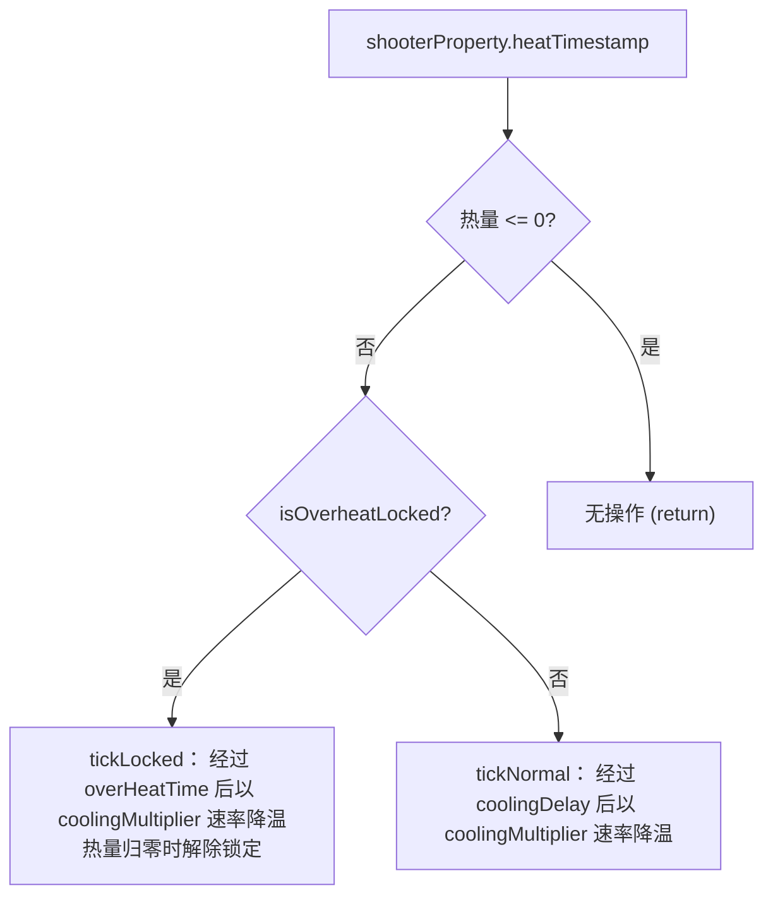
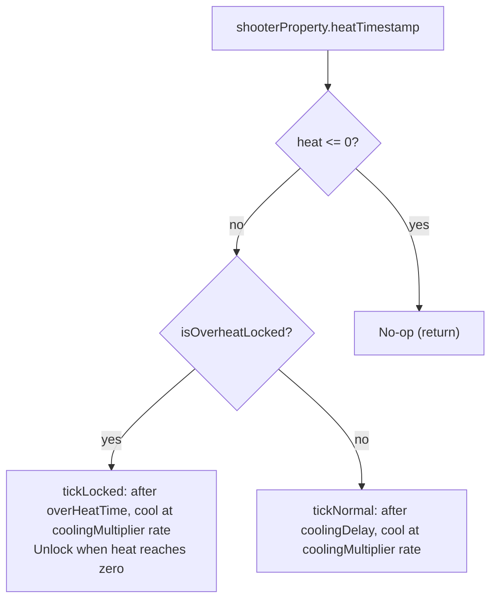

[English](#English)

# 过热系统

> `GunHeatData`驱动的枪械过热机制，以及`ModernKineticGunScriptAPI`暴露的热量读写 API、locked/normal 两种散热状态。

## 热量数据结构

`GunHeatData`（来自`GunData` JSON）定义所有过热参数：

|字段|含义|
|---|---|
|`heatPerShot`|每次射击增加的热量|
|`heatMax`|热量上限（超过后锁定）|
|`minInaccuracy`|最小热量时的不准确度系数|
|`maxInaccuracy`|最大热量时的不准确度系数|
|`minRpmMod`|最小热量时的 RPM 修正|
|`maxRpmMod`|最大热量时的 RPM 修正|
|`coolingDelay`|射击后到开始散热前的冷却延迟（毫秒）|
|`coolingMultiplier`|散热速率系数|
|`overHeatTime`|过热锁的最短持续时长（毫秒）|

## 脚本 API：热量读写

`ModernKineticGunScriptAPI`暴露完整的热量访问方法给 Lua：

|方法|功能|
|---|---|
|`getHeatAmount`|当前热量值|
|`setHeatAmount(amount)`|直接设置热量|
|`hasHeatData`|该枪械是否配置了过热数据|
|`getHeatMinRpm` / `getHeatMaxRpm`|RPM 修正范围|
|`getHeatMinInaccuracy` / `getHeatMaxInaccuracy`|不准确度系数范围|
|`getHeatMax`|热量上限|
|`getHeatPerShot`|单次射击热量增量|
|`isOverheatLocked`|是否处于过热锁状态|
|`setOverheatLocked(locked)`|直接设置锁状态|
|`getOverheatTime`|过热锁持续时长（毫秒）|
|`getCoolingDelay`|冷却延迟（毫秒）|
|`calcHeatReduction(heatTimestamp)`|根据时间戳和`coolingMultiplier`计算应减热量|

## 散热逻辑

`ModernKineticGunItem.defaultTickHeat`在两个私有方法中实现，由`tickHeat`（未被脚本接管时）调用：

散热速率公式（两种状态共用）：`降温量 = (currentTime - heatTimestamp) / 10000f × coolingMultiplier`

两种状态的差异仅在散热启动条件：
- locked：无需等待`coolingDelay`，经过`overHeatTime`后立即开始降温
- normal：需等待`coolingDelay`毫秒后才开始降温

`heatTimestamp`在每次射击时更新为`System.currentTimeMillis()`。

## 射击时的热量处理

`shootOnce`和脚本定义的`handle_shoot_heat`函数负责射击时的热量增长：

默认实现（`handleShootHeat`）：
1. 取`heatPerShot`，加上当前热量
2. 若达到`heatMax`，设置`setOverheatLocked(true)`
3. 更新`heatAmount`

热量影响射击的两个方面：
- 不准确度（`shootOnce`步骤 2）：`heatInaccuracy = lerp(heatPercentage, minInaccuracy, maxInaccuracy)`，叠加到基础不准确度上
- RPM（`LivingEntityShoot._getShootInterval`中）：`rpm = rpm * iGun.lerpRPM(gunItem)`，根据当前热量百分比在`minRpmMod`和`maxRpmMod`之间插值

`LivingEntityShoot.shootInternal`的前置检查中：`iGun.hasHeat(gunItem) && iGun.hasOverheatLock(gunItem)` 时返回`ShootResult.OVERHEATED`，阻止过热锁期间的射击。

## Lua 脚本介入点

两个脚本方法可接管或扩展过热行为：
- `tick_heat`：每个 tick 调用，替代默认散热逻辑。接收`(api, heatTimestamp)`
- `handle_shoot_heat`：每次射击时调用，替代默认热量增长逻辑。接收`(api)`

脚本可通过 API 的 getter/setter 完全控制热量状态——例如自定义散热曲线（修改`coolingMultiplier`的行为）、不同射击模式的不同热量增量、或者完全取消过热锁而改用其他惩罚机制。

# English

> The `GunHeatData`-driven gun overheat mechanism, the heat read/write API exposed by `ModernKineticGunScriptAPI`, and the locked/normal cooling states.

## Heat Data Structure

`GunHeatData` (from `GunData` JSON) defines all overheat parameters:

|Field|Meaning|
|---|---|
|`heatPerShot`|Heat added per shot|
|`heatMax`|Heat cap (locks when exceeded)|
|`minInaccuracy`|Inaccuracy coefficient at minimum heat|
|`maxInaccuracy`|Inaccuracy coefficient at maximum heat|
|`minRpmMod`|RPM modifier at minimum heat|
|`maxRpmMod`|RPM modifier at maximum heat|
|`coolingDelay`|Cooldown delay before cooling starts after shooting (milliseconds)|
|`coolingMultiplier`|Cooling rate coefficient|
|`overHeatTime`|Minimum overheat lock duration (milliseconds)|

## Script API: Heat Read/Write

`ModernKineticGunScriptAPI` exposes a full set of heat access methods to Lua:

|Method|Purpose|
|---|---|
|`getHeatAmount`|Current heat value|
|`setHeatAmount(amount)`|Directly set heat|
|`hasHeatData`|Whether the gun has overheat data configured|
|`getHeatMinRpm` / `getHeatMaxRpm`|RPM modifier range|
|`getHeatMinInaccuracy` / `getHeatMaxInaccuracy`|Inaccuracy coefficient range|
|`getHeatMax`|Heat cap|
|`getHeatPerShot`|Heat increment per shot|
|`isOverheatLocked`|Whether currently in overheat lock|
|`setOverheatLocked(locked)`|Directly set lock state|
|`getOverheatTime`|Overheat lock duration (milliseconds)|
|`getCoolingDelay`|Cooling delay (milliseconds)|
|`calcHeatReduction(heatTimestamp)`|Compute heat to subtract based on timestamp and `coolingMultiplier`|

## Cooling Logic

`ModernKineticGunItem.defaultTickHeat` is implemented in two private methods, called by `tickHeat` (when not taken over by script):

Cooling rate formula (shared by both states): `cooling = (currentTime - heatTimestamp) / 10000f × coolingMultiplier`

The difference between the two states is only in cooling start conditions:
- locked: No need to wait for `coolingDelay`; cooling starts immediately after `overHeatTime` elapses
- normal: Must wait `coolingDelay` milliseconds before cooling begins

`heatTimestamp` is updated to `System.currentTimeMillis()` on each shot.

## Heat Processing During Shooting

`shootOnce` and the script-defined `handle_shoot_heat` function handle heat growth at shot time:

Default implementation (`handleShootHeat`):
1. Take `heatPerShot`, add to current heat
2. If `heatMax` is reached, call `setOverheatLocked(true)`
3. Update `heatAmount`

Heat affects shooting in two ways:
- Inaccuracy (`shootOnce` step 2): `heatInaccuracy = lerp(heatPercentage, minInaccuracy, maxInaccuracy)`, layered onto base inaccuracy
- RPM (inside `LivingEntityShoot._getShootInterval`): `rpm = rpm * iGun.lerpRPM(gunItem)`, interpolating between `minRpmMod` and `maxRpmMod` based on current heat percentage

In `LivingEntityShoot.shootInternal`'s state checks: `iGun.hasHeat(gunItem) && iGun.hasOverheatLock(gunItem)` returns `ShootResult.OVERHEATED`, preventing shooting during overheat lock.

## Lua Script Intervention Points

Two script methods can take over or extend overheat behavior:
- `tick_heat`: Called every tick, replacing the default cooling logic. Receives `(api, heatTimestamp)`
- `handle_shoot_heat`: Called at each shot, replacing the default heat growth logic. Receives `(api)`

Scripts can fully control heat state through the API's getters and setters — for example, custom cooling curves (modifying `coolingMultiplier` behavior), different heat increments for different fire modes, or removing the overheat lock entirely in favor of alternative penalty mechanisms.
