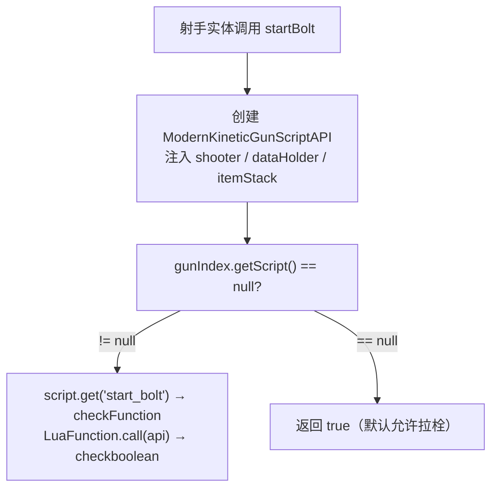
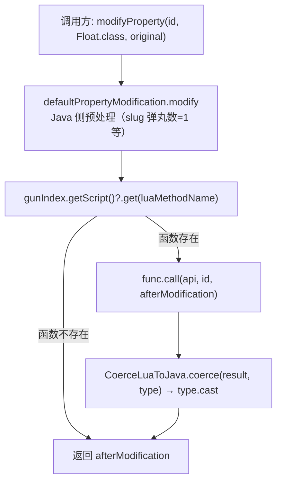
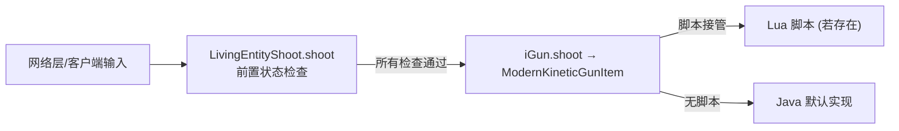
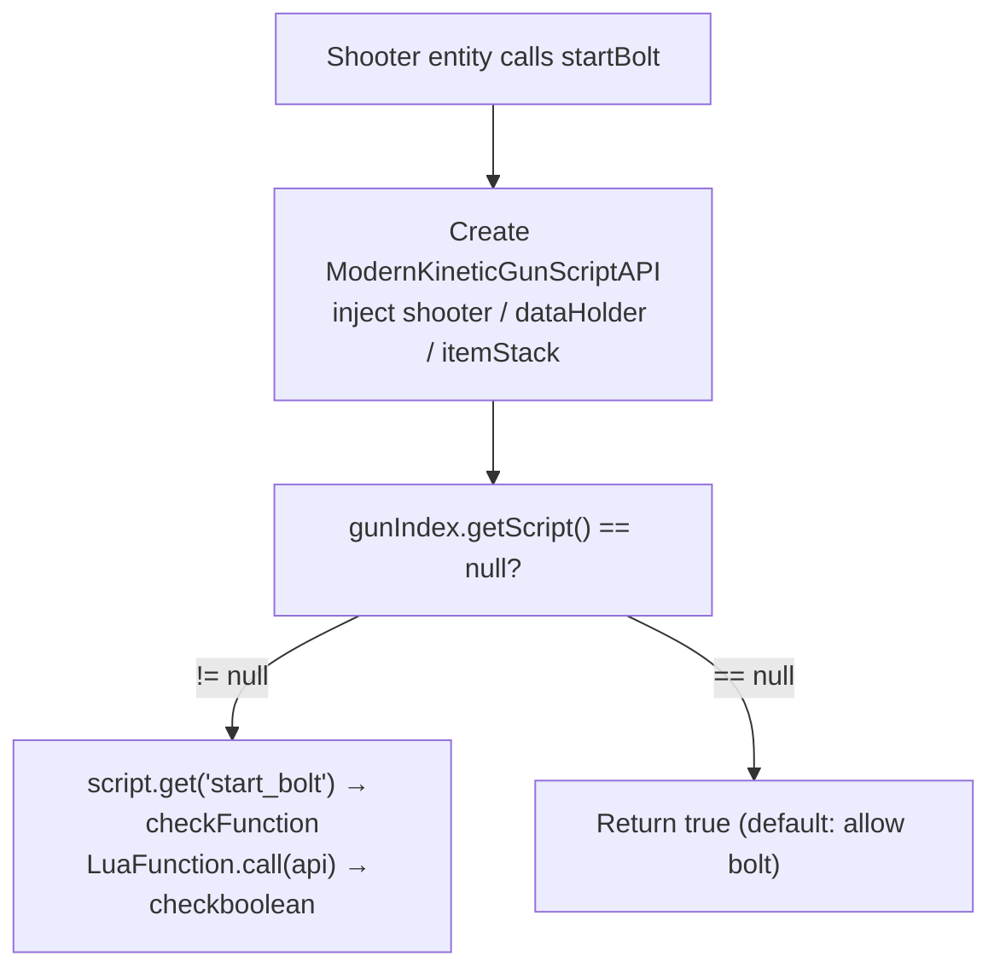
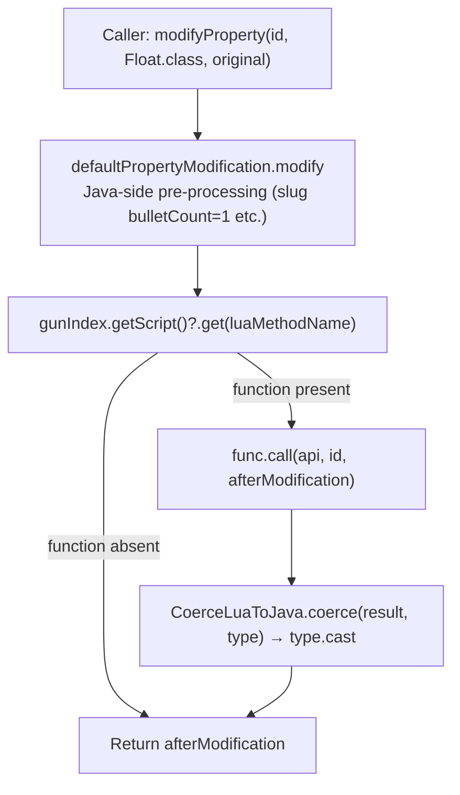
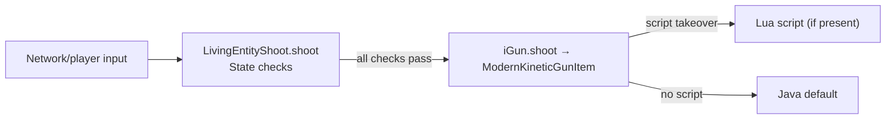

[English](#English)

# 脚本方法入口

> `ModernKineticGunItem`中 9 个脚本方法的调用模式、Lua 函数名、返回值与默认行为。

## 调用模式

9 个方法均遵循统一的"查询脚本 → 有则调 Lua → 无则执行 default"模式。以`startBolt`为例：

不同方法在**返回值处理**和**默认行为复杂度**上有差异：

|方法|Lua 函数名|返回值|默认行为|
|---|---|---|---|
|`startBolt`|`start_bolt`|`boolean`|返回`true`|
|`tickBolt`|`tick_bolt`|`boolean`|`defaultTickBolt`：计算拉栓时间、装填膛内弹药|
|`shoot`|`shoot`|void|`api.shootOnce(consumeAmmo)`|
|`startReload`|`start_reload`|`boolean`|返回`true`|
|`tickReload`|`tick_reload`|`(stateType, countDown)`|`defaultTickReload`：根据换弹类型和时序计算阶段与倒计时|
|`interruptReload`|`interrupt_reload`|void|无操作|
|`tickHeat`|`tick_heat`|void|`defaultTickHeat`：标准散热/过热锁逻辑|
|`doBulletSpread`|`calcSpread`|`{pitch, yaw}`|默认散布计算|
|`modifyProperty`|（参数指定）|修改后的值|`defaultPropertyModification.modify`|

## 方法详解

### startBolt / tickBolt

由`LivingEntityBolt.bolt()`触发。`startBolt`返回`boolean`，`false`表示无法开始拉栓。`tickBolt`返回`boolean`，`true`表示仍在拉栓过程中，`false`表示拉栓完成。

`tickBolt`默认逻辑（`defaultTickBolt`）：
- 从`GunData`取`boltActionTime`和`boltFeedTime`（秒转毫秒）
- 在`boltFeedTime`之前：持续返回`true`
- 到达`boltFeedTime`后：若膛内无弹药，则消耗弹匣/背包的一发弹药推入膛内
- 在`boltActionTime`之前：持续返回`true`，之后返回`false`

### shoot

由`LivingEntityShoot.shoot()`在通过所有前置检查后调用（冷却/网络/换弹/切枪/拉栓/冲刺/过热/膛内弹药等）。若枪械有脚本且定义了`shoot`函数，脚本完全接管射击逻辑；否则执行`api.shootOnce(api.isShootingNeedConsumeAmmo())`。

### startReload / tickReload / interruptReload

由`LivingEntityReload`触发。`startReload`返回`boolean`控制是否开始换弹。`tickReload`返回`ReloadState(stateType, countDown)`驱动换弹阶段机。`interruptReload`在换弹被打断时调用。

### tickHeat

由`LivingEntityHeat.tickHeat()`每个 tick 调用。接收额外参数`heatTimestamp`（上次射击时的系统时间）。详细过热逻辑见[过热系统](/docs-tacz/architecture/item/script/script-heat.md)。

### doBulletSpread

由`ModernKineticGunItem`在`shootOnce`的循环发射中调用，而非射手实体层直接触发。接收`(api, bulletCnt, inaccuracy)`参数，返回`{pitchOffset, yawOffset}`表作为该弹丸的散布偏移。默认行为使用传入的`inaccuracy`作为散布范围。

### modifyProperty

`modifyProperty`的特殊之处在于它是**开放类型的方法**——Lua 函数名由调用方指定（最常见是`modify_property`），而非固定为某个脚本方法。被两处调用：
- `ModernKineticGunScriptAPI`内部（射击流程各步骤）
- `EntityKineticBullet`构造函数（初始化子弹属性）

经过`ModernKineticGunItem.modifyProperty`的完整链路：

Lua 脚本通过此方法可实现属性值的任意运行时修改——脚本内按`id`字符串判断修改哪个属性，做对应的数值处理。

## 脚本与射手实体的执行顺序

一个关键点：射手实体层（`LivingEntityShoot`等）是脚本调用的**触发者**，但脚本内部的方法（如`shootOnce`）会绕过射手实体的状态检查。执行关系：

# English

> Call patterns, Lua function names, return values, and default behaviors for the 9 script methods in `ModernKineticGunItem`.

## Call Pattern

All 9 methods follow the same "query script → call Lua if present → execute default otherwise" pattern. Using `startBolt` as an example:

Methods differ in **return value handling** and **default behavior complexity**:

|Method|Lua function name|Returns|Default behavior|
|---|---|---|---|
|`startBolt`|`start_bolt`|`boolean`|Returns `true`|
|`tickBolt`|`tick_bolt`|`boolean`|`defaultTickBolt`: compute bolt timing, load barrel ammo|
|`shoot`|`shoot`|void|`api.shootOnce(consumeAmmo)`|
|`startReload`|`start_reload`|`boolean`|Returns `true`|
|`tickReload`|`tick_reload`|`(stateType, countDown)`|`defaultTickReload`: compute stage and countdown from reload type and timing|
|`interruptReload`|`interrupt_reload`|void|No-op|
|`tickHeat`|`tick_heat`|void|`defaultTickHeat`: standard cooling/overheat lock logic|
|`doBulletSpread`|`calcSpread`|`{pitch, yaw}`|Default spread calculation|
|`modifyProperty`|(caller-specified)|Modified value|`defaultPropertyModification.modify`|

## Method Details

### startBolt / tickBolt

Triggered by `LivingEntityBolt.bolt()`. `startBolt` returns `boolean`; `false` means bolt cannot start. `tickBolt` returns `boolean`; `true` means still bolting, `false` means bolting complete.

`tickBolt` default logic (`defaultTickBolt`):
- Get `boltActionTime` and `boltFeedTime` from `GunData` (seconds converted to milliseconds)
- Before `boltFeedTime`: keep returning `true`
- At `boltFeedTime`: if barrel has no ammo, consume one round from magazine/inventory and push into barrel
- Before `boltActionTime`: keep returning `true`, afterwards return `false`

### shoot

Called by `LivingEntityShoot.shoot()` after all state checks pass (cooldown/network/reload/draw/bolt/sprint/heat/barrel ammo etc.). If the gun has a script defining the `shoot` function, the script fully takes over shooting logic; otherwise `api.shootOnce(api.isShootingNeedConsumeAmmo())` is executed.

### startReload / tickReload / interruptReload

Triggered by `LivingEntityReload`. `startReload` returns `boolean` to control whether reload begins. `tickReload` returns `ReloadState(stateType, countDown)` to drive the reload state machine. `interruptReload` is called when reload is cancelled.

### tickHeat

Called every tick by `LivingEntityHeat.tickHeat()`. Receives an additional `heatTimestamp` parameter (system time at last shoot). See [Heat System](/docs-tacz/architecture/item/script/script-heat.md) for detailed overheat logic.

### doBulletSpread

Called by `ModernKineticGunItem` inside `shootOnce`'s burst loop, not triggered directly by the shooter entity layer. Receives `(api, bulletCnt, inaccuracy)` parameters and returns a `{pitchOffset, yawOffset}` table as the spread offset for that projectile. The default behavior uses the passed `inaccuracy` as the spread range.

### modifyProperty

`modifyProperty` is unique in being an **open-typed method** — the Lua function name is specified by the caller (most commonly `modify_property`), rather than being a fixed script method. Called from two places:
- Inside `ModernKineticGunScriptAPI` (various steps of the shoot flow)
- `EntityKineticBullet` constructor (initializing bullet properties)

Full path through `ModernKineticGunItem.modifyProperty`:

Through this method, Lua scripts can perform arbitrary runtime modifications of property values — inside the script, the `id` string is used to identify which property to modify and apply the corresponding numeric processing.

## Script vs. Shooter Entity Execution Order

A key point: the shooter entity layer (`LivingEntityShoot` etc.) **triggers** script calls, but methods inside the script (like `shootOnce`) bypass the shooter entity's state checks. Execution relationship:

