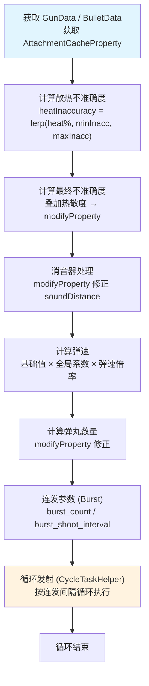
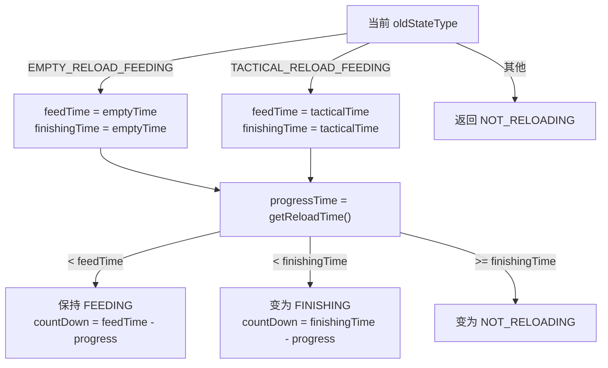
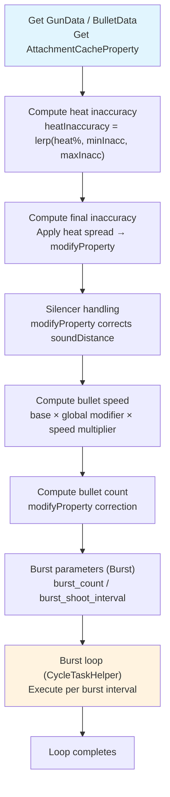
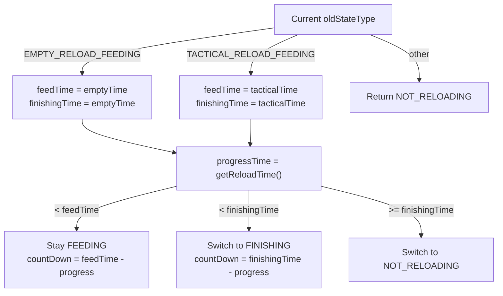

[English](#English)

# 射击与弹药

> `ModernKineticGunScriptAPI.shootOnce`的完整射击流程分解，以及 bolt 三种类型的弹药扣除逻辑、换弹时序与补弹。

## shootOnce 射击流程

`shoot`未被 Lua 脚本接管时，Java 侧执行`ModernKineticGunScriptAPI.shootOnce(consumeAmmo)`。流程分 9 步：



### 循环发射内的每次执行

```
检查射手是否死亡 ──→ true ──→ 取消循环
       │
     false
       ↓
检查武器是否更换 ──→ true ──→ 取消循环
       │
     false
       ↓
触发 GunFireEvent ──→ canceled ──→ 跳过本次
       │
      fire
       ↓
[consumeAmmo?] → reduceAmmoOnce (见下文)
       ↓
执行 handle_shoot_heat (若脚本定义)
  └──→ 默认: handleShootHeat (累加热量、检查过热锁)
       ↓
创建 EntityKineticBullet
  ├── 设置霰弹伤害分配系数 (bulletCount > 1 → damageModifier = 1/bulletCount)
  ├── setShotDamageMultiplier
  └── doBulletSpread (设置散布角度)
       ↓
播放枪声 (soundDistance > 0)
```

### 各步骤的 modifyProperty 调用

射击流程中大量使用`modifyProperty`，调用方手动传入匹配的`Class`类型：

|属性|类型|来源|
|---|---|---|
|`MAX_HEAT`|`Float`|`heatData.getHeatMax()`|
|`INACCURACY`|`Float`|`cacheProperty.getCache(INACCURACY)` × `heatInaccuracy`|
|`SOUND_DISTANCE`|`Integer`|`cacheProperty.getCache(SILENCE).left()`|
|`AMMO_SPEED`|`Float`|`cacheProperty.getCache(AMMO_SPEED)`|
|`BULLET_AMOUNT`|`Integer`|`bulletData.getBulletAmount()`|
|`BURST_COUNT`|`Integer`|`gunData.getBurstData().getCount()`|
|`BURST_SHOOT_INTERVAL`|`Long`|`gunData.getBurstShootInterval()`|

## 弹药扣除：reduceAmmoOnce

`reduceAmmoOnce`根据枪械的 bolt 类型以不同逻辑扣除弹药：

|Bolt 类型|逻辑|
|---|---|
|`MANUAL_ACTION`|膛内须有弹药才能射击 → 消耗膛内弹药，返回`true`|
|`CLOSED_BOLT`|优先消耗弹匣/背包 → 弹匣空时消耗膛内弹药 → 两者皆空返回`false`|
|`OPEN_BOLT`|直接消耗弹匣/背包 → 为空返回`false`|

"消耗弹匣/背包"由`useInventoryAmmo()`决定路径：
- 背包直读：`consumeAmmoFromPlayer(1)`从玩家背包或虚拟备弹扣除
- 非背包直读：`reduceCurrentAmmoCount`减少弹匣计数

## 弹药操作 API

`ModernKineticGunScriptAPI`暴露的弹药方法：

|方法|功能|
|---|---|
|`getAmmoAmount`|弹匣当前弹药数|
|`getMaxAmmoCount`|`AttachmentDataUtils.getAmmoCountWithAttachment`含扩容弹匣计算|
|`getNeededAmmoAmount`|`maxAmmoCount - currentAmmoCount`|
|`getMagExtentLevel`|扩容等级 0~3|
|`putAmmoInMagazine(amount)`|推入弹药，返回溢出数（超过弹匣容量的部分）|
|`removeAmmoFromMagazine(amount)`|取出弹药，返回实际取出数（不足时取尽可能多）|
|`consumeAmmoFromPlayer(neededAmount)`|从玩家背包或虚拟备弹扣除，返回实际扣除数|
|`hasAmmoToConsume`|检查玩家背包/虚拟备弹是否有可用的同类型弹药|
|`hasAmmoInBarrel`|膛内是否有弹药（开膛待击固定返回`false`）|
|`setAmmoInBarrel`|设置膛内弹药|

**创造模式**下`isReloadingNeedConsumeAmmo()`返回`false`，此时`consumeAmmoFromPlayer`直接返回`neededAmount`而不实际扣除。

## 换弹时序

### defaultTickReload

Java 侧默认换弹时序根据`GunReloadData`的阶段时长计算当前状态和倒计时：



### defaultReloadFinishing

装填阶段进入收尾阶段时补弹：

|`ReloadType`|战术换弹|补弹逻辑|
|---|---|---|
|`MAGAZINE`|否|`consumeAmmoFromPlayer(needed) → putAmmoInMagazine(consumed)`；装填后额外`removeAmmoFromMagazine(1) → setAmmoInBarrel(true)`|
|`MAGAZINE`|是|同上，但跳过膛内装填|
|`FUEL`|否|`consumeAmmoFromPlayer(1) → putAmmoInMagazine(needed * consumed)`；加膛内装填|
|`FUEL`|是|同上，跳过膛内装填|

`isReloadingNeedConsumeAmmo()`为`false`或弹链无限（`infinite=true`）时，不消耗玩家弹药直接补满。

## 倍率系统

`ModernKineticGunScriptAPI`有两个仅在射击上下文有效的临时倍率：
- `shotDamageMultiplier`：伤害倍率，范围`[0, 256]`，在该次射击创建子弹时通过`EntityKineticBullet.setShotDamageMultiplier`传递
- `projectileSpeedMultiplier`：弹速倍率，范围`[0, 256]`，在计算最终弹速时直接相乘

二者仅在`shootOnce`执行期间设置，非射击上下文调用无意义。

# English

> The complete `ModernKineticGunScriptAPI.shootOnce` shoot flow breakdown, the three bolt type ammo deduction logic, reload timing and ammo refill.

## shootOnce Shoot Flow

When `shoot` is not taken over by a Lua script, the Java side executes `ModernKineticGunScriptAPI.shootOnce(consumeAmmo)`. The flow has 9 steps:



### Per-Iteration Execution Inside the Burst Loop

```
Shooter dead? ──→ true ──→ cancel loop
       │
     false
       ↓
Weapon changed? ──→ true ──→ cancel loop
       │
     false
       ↓
Fire GunFireEvent ──→ canceled ──→ skip this iteration
       │
      fire
       ↓
[consumeAmmo?] → reduceAmmoOnce (see below)
       ↓
Execute handle_shoot_heat (if script defines it)
  └──→ default: handleShootHeat (accumulate heat, check overheat lock)
       ↓
Create EntityKineticBullet
  ├── Set shotgun damage distribution (bulletCount > 1 → damageModifier = 1/bulletCount)
  ├── setShotDamageMultiplier
  └── doBulletSpread (set spread angle)
       ↓
Play gun sound (soundDistance > 0)
```

### modifyProperty Calls Per Step

The shoot flow heavily uses `modifyProperty`, with the caller manually passing matching `Class` types:

|Property|Type|Source|
|---|---|---|
|`MAX_HEAT`|`Float`|`heatData.getHeatMax()`|
|`INACCURACY`|`Float`|`cacheProperty.getCache(INACCURACY)` × `heatInaccuracy`|
|`SOUND_DISTANCE`|`Integer`|`cacheProperty.getCache(SILENCE).left()`|
|`AMMO_SPEED`|`Float`|`cacheProperty.getCache(AMMO_SPEED)`|
|`BULLET_AMOUNT`|`Integer`|`bulletData.getBulletAmount()`|
|`BURST_COUNT`|`Integer`|`gunData.getBurstData().getCount()`|
|`BURST_SHOOT_INTERVAL`|`Long`|`gunData.getBurstShootInterval()`|

## Ammo Deduction: reduceAmmoOnce

`reduceAmmoOnce` deducts ammo differently based on the gun's bolt type:

|Bolt type|Logic|
|---|---|
|`MANUAL_ACTION`|Barrel must have ammo to shoot → consume barrel ammo, return `true`|
|`CLOSED_BOLT`|Prioritize magazine/inventory → consume barrel ammo when magazine empty → both empty returns `false`|
|`OPEN_BOLT`|Directly consume magazine/inventory → empty returns `false`|

"Consume magazine/inventory" is routed by `useInventoryAmmo()`:
- Inventory feed: `consumeAmmoFromPlayer(1)` deducts from player inventory or dummy ammo
- Non-inventory feed: `reduceCurrentAmmoCount` decrements magazine count

## Ammo Operation API

Ammo methods exposed by `ModernKineticGunScriptAPI`:

|Method|Purpose|
|---|---|
|`getAmmoAmount`|Current ammo in magazine|
|`getMaxAmmoCount`|`AttachmentDataUtils.getAmmoCountWithAttachment` including extended mag calculation|
|`getNeededAmmoAmount`|`maxAmmoCount - currentAmmoCount`|
|`getMagExtentLevel`|Extended mag level 0~3|
|`putAmmoInMagazine(amount)`|Push ammo in, return overflow (amount exceeding magazine capacity)|
|`removeAmmoFromMagazine(amount)`|Pull ammo out, return actual number removed (as many as possible if insufficient)|
|`consumeAmmoFromPlayer(neededAmount)`|Deduct from player inventory or dummy ammo, return actual count deducted|
|`hasAmmoToConsume`|Check if player inventory/dummy ammo has usable matching ammo|
|`hasAmmoInBarrel`|Whether barrel has ammo (open bolt always returns `false`)|
|`setAmmoInBarrel`|Set barrel ammo|

In **creative mode**, `isReloadingNeedConsumeAmmo()` returns `false`, at which point `consumeAmmoFromPlayer` returns `neededAmount` directly without actual deduction.

## Reload Timing

### defaultTickReload

The Java-side default reload timing computes current state and countdown based on `GunReloadData` stage durations:



### defaultReloadFinishing

Refills ammo when the feeding stage transitions to finishing:

|`ReloadType`|Tactical|Refill logic|
|---|---|---|
|`MAGAZINE`|No|`consumeAmmoFromPlayer(needed) → putAmmoInMagazine(consumed)`; then additional `removeAmmoFromMagazine(1) → setAmmoInBarrel(true)`|
|`MAGAZINE`|Yes|Same as above, but skip barrel loading|
|`FUEL`|No|`consumeAmmoFromPlayer(1) → putAmmoInMagazine(needed * consumed)`; plus barrel loading|
|`FUEL`|Yes|Same as above, skip barrel loading|

When `isReloadingNeedConsumeAmmo()` is `false` or the belt is infinite (`infinite=true`), player ammo is not consumed — the magazine is filled directly.

## Multiplier System

`ModernKineticGunScriptAPI` has two temporary multipliers valid only within the shoot context:
- `shotDamageMultiplier`: Damage multiplier, range `[0, 256]`, passed to the bullet at creation time via `EntityKineticBullet.setShotDamageMultiplier`
- `projectileSpeedMultiplier`: Bullet speed multiplier, range `[0, 256]`, directly multiplied into the final bullet speed

Both are set only during `shootOnce` execution and are meaningless outside the shoot context.
