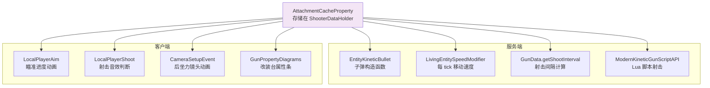

# 消费方汇总

> 所有从 `AttachmentCacheProperty` 读取缓存值、消费计算结果的位置。

## 消费方总览



## 服务端消费方

### 1. EntityKineticBullet 构造函数（主要入口）

`com.tacz.guns.entity.EntityKineticBullet`

这是最大的缓存消费者。每次创建子弹时，从缓存读取大量属性：

| Modifier ID | 写入字段 | 类型 | 额外处理 |
|---|---|---|---|
| `ArmorIgnoreModifier.ID` | `this.armorIgnore` | float | clamp 到 [0, 1] |
| `HeadShotModifier.ID` | `this.headShot` | float | max(0, value) |
| `KnockbackModifier.ID` | `this.knockback` | float | max(0, value) |
| `IgniteModifier.ID` | `igniteEntity`, `igniteBlock` | boolean | OR with bulletData |
| `DamageModifier.ID` | `this.damageAmount` | `LinkedList<DistanceDamagePair>` | 深拷贝 |
| `EffectiveRangeModifier.ID` | `this.distanceAmount` | float | 经 `modifyProperty` 允许脚本覆盖 |
| `PierceModifier.ID` | `this.pierce` | int | clamp 到 >= 1 |
| `ExplosionModifier.ID` | 爆炸相关字段 | 混合 | 拆分为多个子字段 |

每个读取都经过 `modifyProperty()` 包装，如果枪械有活动脚本，允许 Lua 脚本覆盖值。

### 2. LivingEntitySpeedModifier（每 tick）

`com.tacz.guns.entity.shooter.LivingEntitySpeedModifier`

每 tick 执行 `updateSpeedModifier()`：

- **WeightModifier**：读取 `cacheProperty.getCache(WeightModifier.ID)` → `float`，乘以 `-SyncConfig.WEIGHT_SPEED_MULTIPLIER` 作为 `MULTIPLY_BASE` 属性修饰符应用
- **ExtraMovementModifier**：读取 `cacheProperty.getCache(ExtraMovementModifier.ID)` → `MoveSpeed`，根据当前状态选择对应乘数（换弹→`reloadMultiplier`，瞄准→`aimMultiplier`，否则→`baseMultiplier`），作为 `MULTIPLY_TOTAL` 属性修饰符应用

如果主手物品不是枪，两个修饰符都会被移除。

### 3. GunData.getShootInterval（射击时）

`com.tacz.guns.resource.pojo.data.gun.GunData`

```java
public long getShootInterval(LivingEntity shooter, FireMode fireMode, ItemStack gunStack) {
    AttachmentCacheProperty cacheProperty = IGunOperator.fromLivingEntity(shooter).getCacheProperty();
    int rpm = getRoundsPerMinute(fireMode);  // 已包含射火模式调整
    if (cacheProperty != null) {
        int modified = cacheProperty.<Integer>getCache(RpmModifier.ID);
        rpm = Mth.clamp(modified, 1, 1200);
    }
    // 如果枪有热量数据，应用 lerpRPM
    if (hasHeatData()) rpm = (int)(rpm * iGun.lerpRPM(gunStack));
    return 60_000L / rpm;
}
```

### 4. ModernKineticGunScriptAPI.shootOnce（Lua 脚本调用）

`com.tacz.guns.item.ModernKineticGunScriptAPI`

射击函数中读取：

| Modifier ID | 用途 |
|---|---|
| `InaccuracyModifier.ID` / `GunProperties.INACCURACY` | 读取当前射击状态的散布值 |
| `SilenceModifier.ID` | 读取声音距离和静音音效标志 |
| `GunProperties.AMMO_SPEED` | 读取子弹飞行速度 |

同时通过 `getCachedProperty(String id)` 方法暴露给 Lua 脚本任意属性的读取能力。

## 客户端消费方

### 5. LocalPlayerAim（每客户端 tick）

`com.tacz.guns.client.gameplay.LocalPlayerAim`

```java
private float getAlphaProgress(GunData gunData) {
    float aimTime = gunData.getAimTime();
    IGunOperator operator = IGunOperator.fromLivingEntity(this.player);
    if (operator.getCacheProperty() != null) {
        aimTime = operator.getCacheProperty().<Float>getCache(AdsModifier.ID);
    }
    return (System.currentTimeMillis() - data.clientAimingTimestamp + 1) / (aimTime * 1000);
}
```

缓存修改过的 ADS 时间直接影响瞄准动画的平滑速度。

### 6. LocalPlayerShoot（客户端射击）

`com.tacz.guns.client.gameplay.LocalPlayerShoot`

- `useSilenceSound()`：读取 `SilenceModifier.ID` 获取静音音效标志
- `getCoolDown()`：通过 `GunData.getShootInterval` 间接读取 RPM 缓存

### 7. CameraSetupEvent（后坐力镜头动画）

`com.tacz.guns.client.event.CameraSetupEvent`

```java
ParameterizedCachePair<Float, Float> attachmentRecoilModifier = cacheProperty.getCache(RecoilModifier.ID);
// 根据瞄准进度缩放后坐力
pitchSplineFunction = gunData.getRecoil().genPitchSplineFunction(
    (float) attachmentRecoilModifier.left().eval(aimingRecoilModifier));
yawSplineFunction = gunData.getRecoil().genYawSplineFunction(
    (float) attachmentRecoilModifier.right().eval(aimingRecoilModifier));
```

这里使用 `ParameterizedCache.eval(input)` 方法动态计算实际后坐力值（结合瞄准进度）。这是 RecoilModifier 使用 `ParameterizedCache` 而非普通 `Float` 缓存的原因——保留各乘区原始值用于运行时动态计算。

### 8. GunPropertyDiagrams（改装台 GUI）

`com.tacz.guns.client.gui.components.refit.GunPropertyDiagrams`

绘制改装台属性条时，遍历所有注册的修改器调用 `getPropertyDiagramsData()`，读取缓存值计算修改前后的差异并绘制颜色编码的条形图。

## 消费模式总结

| 调用频率 | 消费方 | 读取的 Modifier |
|---|---|---|
| **每 tick** | `LivingEntitySpeedModifier` | Weight, ExtraMovement |
| **每 tick（客户端）** | `LocalPlayerAim` | Ads |
| **每次射击** | `GunData.getShootInterval`, `LocalPlayerShoot` | Rpm, Silence |
| **每次射击（Lua）** | `ModernKineticGunScriptAPI.shootOnce` | Inaccuracy, Silence, AmmoSpeed, etc. |
| **每颗子弹创建** | `EntityKineticBullet` | ArmorIgnore, HeadShot, Knockback, Ignite, Damage, EffectiveRange, Pierce, Explosion |
| **每颗子弹创建（后坐力）** | `CameraSetupEvent` | Recoil |
| **打开 GUI** | `GunPropertyDiagrams` | 所有注册的修改器 |

所有消费方都遵循相同的访问模式：
1. `IGunOperator.fromLivingEntity(entity).getCacheProperty()` — 获取缓存对象
2. `cacheProperty.getCache(modifierId)` 或 `cacheProperty.getCache(GunProperty)` — 读取具体值
3. null 检查：`getCacheProperty()` 可能返回 null（实体没有枪时）
