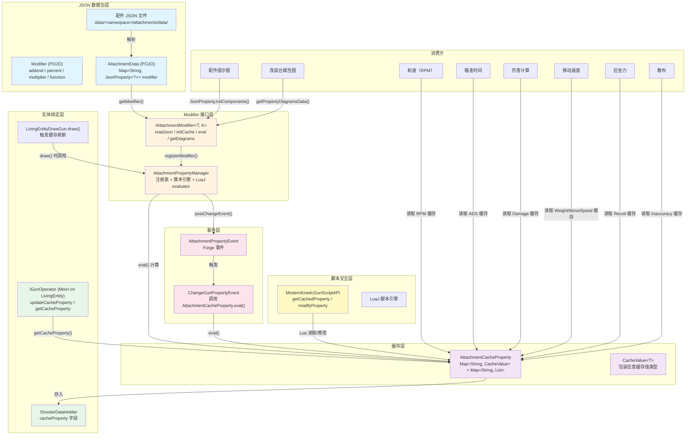

[English](#English)

# TaCZ Attachment Modifier Architecture

> 配件属性修改器体系的完整文档。覆盖 JSON 数据格式 → 读取解析 → 缓存计算 → 实体绑定 → 事件通知 → 脚本交互 → UI 消费的完整链路。

## 体系总览

## 体系概要

本体系解决的核心问题：**配件的 JSON 数据如何影响枪械的运行时属性**。

一把枪可能安装多个配件（瞄准镜、消音器、握把、弹匣等），每个配件都可能修改枪械的多种属性。为高效计算最终属性值并避免重复计算，系统设计了一套「读取-缓存-计算-消费」管道。

### 关键设计特征

- **字符串键和泛型接口**：每个 Modifier 由字符串 ID 标识，通过接口统一 JSON 读取、初始化和计算行为
- **实体绑定缓存**：计算结果缓存在实体数据对象上（每个实体一个实例），仅在切枪时重新计算
- **Forge 事件扩展**：通过事件允许外部模组修改缓存值
- **Lua 脚本集成**：缓存值可在 Lua 脚本中被读取和修改

### 文档导航

| 文档 | 内容 |
|---|---|
| [JSON 数据结构与格式要求](./data-structure.md) | 通用修改值结构、配件总数据、复合型修改器格式 |
| [Modifier 接口](./modifier-interface.md) | 接口契约、数值型和复合型修改器设计 |
| [缓存系统](./cache-system.md) | 缓存生命周期、计算流水线 |
| [管理器与事件系统](./manager-and-event.md) | 管理器注册/计算引擎，事件流，实体绑定 |
| [Modifier 计算流程](./calculation-flow.md) | `GunData`、`AttachmentData` 与 modifier 接口三者间的数据流与计算过程 |

# English
