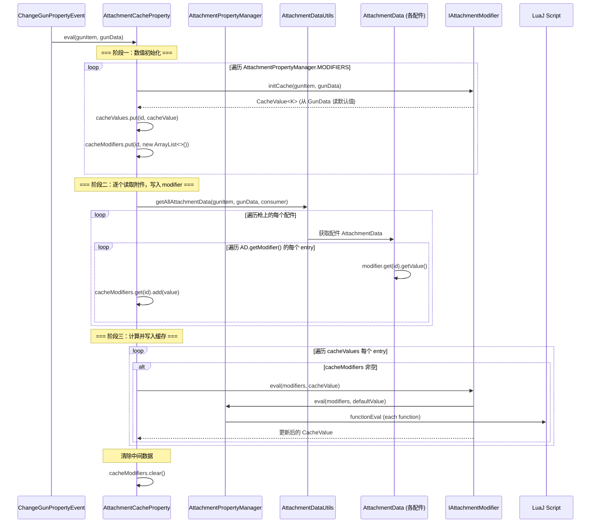
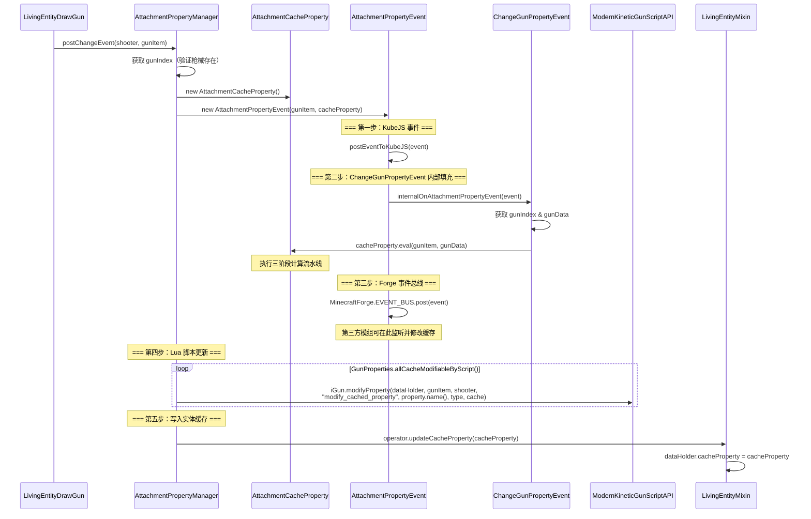

[English](#English)

# 缓存系统

> `AttachmentCacheProperty` 是配件属性修改值的运行时缓存，绑定在 `ShooterDataHolder` 上，随切枪事件刷新。

## 数据模型

### CacheValue

`com.tacz.guns.api.modifier.CacheValue`

```java
public class CacheValue<T> {
    private T value;

    public CacheValue(T value) { this.value = value; }
    public T getValue() { return value; }
    public void setValue(T value) { this.value = value; }
}
```

最简单的泛型包装类，持有单个缓存值。**不是所有缓存都是数值类型** — `T` 可以是：

| T 类型 | 示例 Modifier |
|---|---|
| `Float` | AdsModifier, AmmoSpeedModifier, WeightModifier 等 |
| `Integer` | RpmModifier, PierceModifier |
| `LinkedList<DistanceDamagePair>` | DamageModifier |
| `Map<InaccuracyType, Float>` | InaccuracyModifier |
| `ExplosionData` | ExplosionModifier |
| `Ignite` | IgniteModifier |
| `MoveSpeed` | ExtraMovementModifier |
| `Pair<Integer, Boolean>` | SilenceModifier |
| `ParameterizedCachePair<Float, Float>` | RecoilModifier |

### AttachmentCacheProperty

`com.tacz.guns.resource.modifier.AttachmentCacheProperty`

```java
public class AttachmentCacheProperty {
    // 缓存值存储：Key = modifier ID, Value = 计算后的缓存
    private final Map<String, CacheValue> cacheValues = Maps.newHashMap();

    // 中间数据：Key = modifier ID, Value = 所有配件该 modifier 的原始值列表
    private final Map<String, List<?>> cacheModifiers = Maps.newHashMap();
}
```

## 计算流水线

`AttachmentCacheProperty.eval()` 方法执行三个阶段的串行流水线：



### 阶段一：数值初始化

```java
modifiers.forEach((id, value) -> {
    cacheValues.put(id, value.initCache(gunItem, gunData));
    cacheModifiers.put(id, Lists.newArrayList());
});
```

遍历 `AttachmentPropertyManager` 中注册的所有修改器，用枪械的 `GunData` 初始化每个属性的默认值存入 `cacheValues`，同时为每个属性创建一个空列表用于收集配件数据。

### 阶段二：采集配件数据

```java
AttachmentDataUtils.getAllAttachmentData(gunItem, gunData, data -> {
    data.getModifier().forEach((id, value) -> {
        List objects = cacheModifiers.get(id);
        objects.add(value.getValue());
    });
});
```

通过 `AttachmentDataUtils.getAllAttachmentData()` 遍历枪械上安装的所有配件（遍历 `AttachmentType` 枚举的每个槽位），获取每个配件的 `AttachmentData`，将其中的所有 `modifier` 条目按 ID 分类追加到 `cacheModifiers` 的对应列表中。

### 阶段三：计算最终值

```java
cacheValues.forEach((id, value) -> {
    List cacheModifier = cacheModifiers.get(id);
    if (cacheModifier == null || cacheModifier.isEmpty()) {
        return;
    }
    modifiers.get(id).eval(cacheModifier, value);
});
```

对每个属性，如果配件对其有修改（`cacheModifier` 非空），则调用对应 `IAttachmentModifier.eval()` 进行组合计算，更新 `cacheValue`。

最后清除 `cacheModifiers` 释放内存。

## 缓存的生命周期

### 创建时机

缓存在**切枪**时创建：`LivingEntityDrawGun.draw()` 调用 `AttachmentPropertyManager.postChangeEvent()`。

### 更新流程



### 可被脚本修改的缓存属性

`GunProperties.allCacheModifiableByScript()` 返回一个限定列表，这些属性在缓存计算完成后可通过 Lua 脚本再次修改

### 消费时机

缓存写入实体后，各消费者通过 `IGunOperator.fromLivingEntity(entity).getCacheProperty()` 获取缓存，再通过 `cacheProperty.getCache(modifierId)` 或 `cacheProperty.getCache(GunProperty)` 获取具体值。

消费方包括：
- **每 tick**：`LivingEntitySpeedModifier.updateSpeedModifier()` — 读取重量和移动速度
- **每 tick**：`LocalPlayerAim.tickAimingProgress()` — 读取瞄准时间
- **射击时**：`ModernKineticGunScriptAPI.shootOnce()` — 读取散布、消音、弹速、弹丸数等
- **射击时**：`CameraSetupEvent` — 读取后坐力
- **射击时**：`LocalPlayerShoot` — 读取消音状态
- **子弹创建**：`EntityKineticBullet` 构造器 — 读取多种属性写入子弹
- **GUI**：`GunPropertyDiagrams` — 读取所有属性绘制属性条

# English
