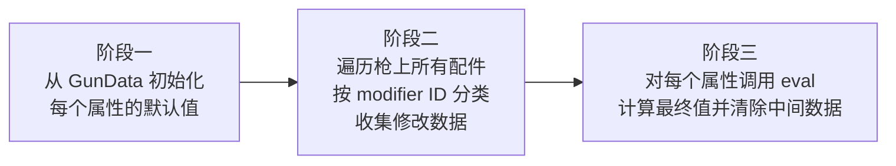
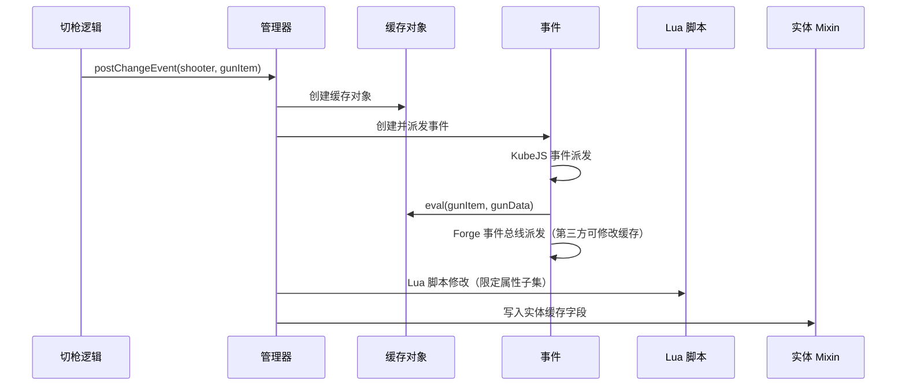
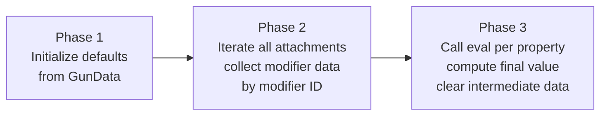
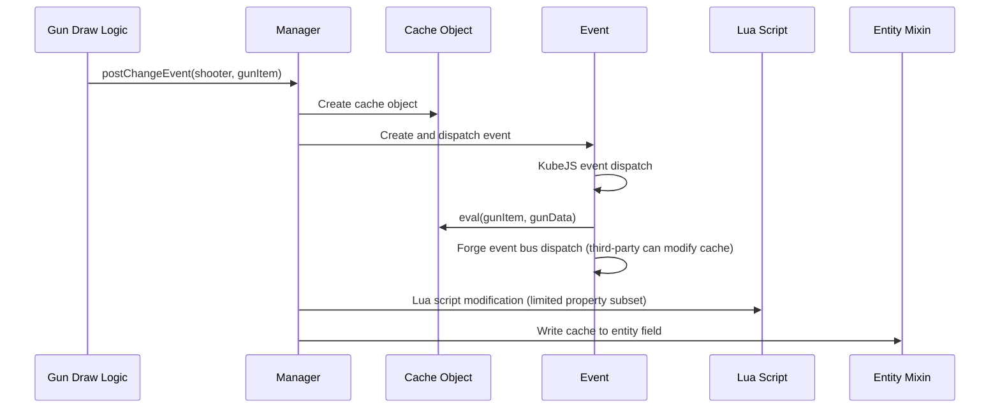

[English](#English)

# 缓存系统

> 配件属性修改值的运行时缓存，绑定在实体数据上，随切枪事件刷新。

## 数据模型

每个 modifier 的缓存值类型各异：`Float`（如瞄准速度、重量）、`Integer`（如射速、穿透数）、`LinkedList`（伤害衰减曲线）、`Map`（散布值）、自定义对象（爆炸参数）等，通过泛型包装类持有。

缓存对象内部用两个 Map 存储数据——一个存最终计算结果（以 modifier ID 为键），一个存配件修改值的中间列表（计算后清除）。

## 计算流水线

数值型修改器的算术引擎按固定顺序计算：`(defaultValue + Σaddend) × max(Σ(1+percent), 0) × Π(max(multiplier, 0))`，然后对每个配件的 Lua 表达式逐一执行二次处理。

整个缓存刷新分三个阶段：

- 阶段一：遍历所有已注册 modifier，从 GunData 读取每个属性的默认值作为缓存初始值
- 阶段二：遍历枪上安装的所有配件（按槽位），将各配件的 Modifier 数据按 ID 分类收集
- 阶段三：对每个有修改的属性，将默认值加所有收集的修改值传入 eval 计算最终结果

## 缓存的生命周期

缓存在切枪时创建并刷新。事件流如下：

触发时机：实体初始化和切枪时，由管理器统一编排。缓存写入实体后，消费方通过实体接口获取缓存对象，再按 ID 读取具体属性值。

# English

> Runtime cache for attachment property modifiers, bound to entity data and refreshed on gun draw events.

## Data Model

Each modifier's cached value has a different type: `Float` (e.g. aim speed, weight), `Integer` (e.g. fire rate, pierce count), `LinkedList` (damage falloff curve), `Map` (inaccuracy values), custom objects (explosion parameters), etc., wrapped in a generic holder class.

The cache object internally uses two Maps: one for final computation results (keyed by modifier ID), and one for intermediate modifier data lists (cleared after computation).

## Computation Pipeline

The arithmetic engine follows a fixed formula: `(defaultValue + Σaddend) × max(Σ(1+percent), 0) × Π(max(multiplier, 0))`, then executes each attachment's Lua expression for secondary processing.

The cache refresh proceeds in three phases:

- Phase 1: Iterate all registered modifiers, read each property's default value from GunData as the initial cache value
- Phase 2: Iterate all attachments on the gun (by slot), collect each attachment's modifier data classified by ID
- Phase 3: For each modified property, pass the default value plus all collected modifier values to eval for final computation

## Cache Lifecycle

The cache is created and refreshed on gun draw. The event flow:

Trigger timing: entity initialization and gun draw, both orchestrated by the manager. After the cache is written, consumers access the cache object through the entity interface and read specific property values by modifier ID.
