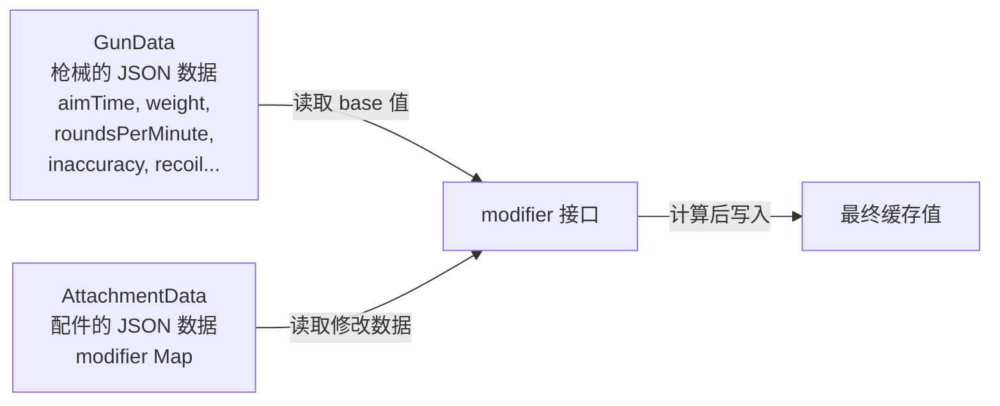
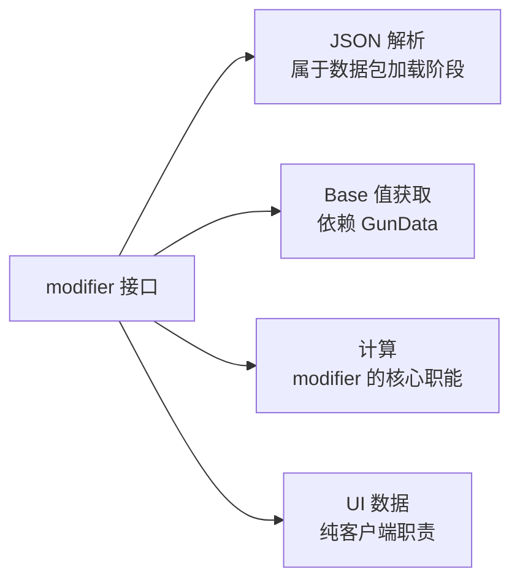

[English](#English)

# Modifier 计算流程

> TaCZ 原版中 modifier 接口与枪械数据、配件数据之间的数据流关系。

### 核心数据关系

modifier 接口的两个方法依赖不同的数据源：一个取 `GunData` 获取 base 值，另一个消费各配件的修改值列表。两个数据源解耦——modifier 计算本身只关心 base 值和配件的修改数据。

### 计算两步走

- **第一步** `initCache`：从 `GunData` 读取枪械属性的默认值，作为缓存初始值
- **第二步** `eval`：将收集到的所有配件修改值汇总到初始值上，更新为最终缓存

base 值不一定只来自 `GunData` 本身——有些来自其子数据（如子弹属性），有些来自全局配置。`GunData` 参数实际上是获取所有枪械静态数据的入口点。

### 设计中存在的问题

原版 modifier 接口承担了过多的职责：

核心问题在于 base 值获取和计算的数据源不同，却耦合在同一个接口中。重构方向是将获取 base 值的职责从 modifier 接口中移出——管理器从 `GunData` 获取 base 值并作为参数传入 `eval`，modifier 本身成为无状态的纯计算单元。

这正是 CGC 重构版的设计方向：一个方法只从数据源提取修改值，另一个方法只做计算。

# English
