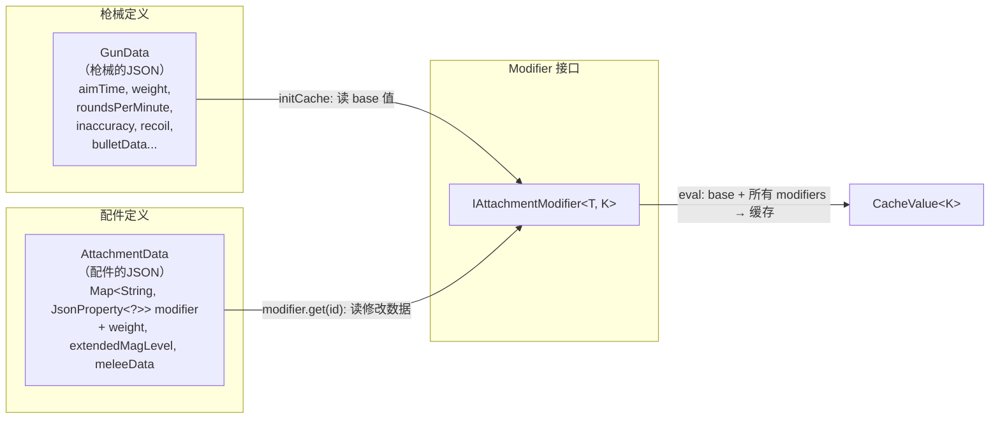
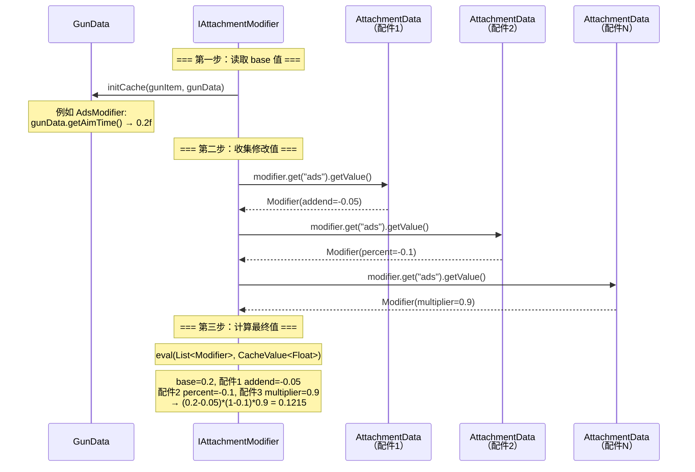

# Modifier 计算流程

> TaCZ 原版中 `IAttachmentModifier` 与 `GunData`、`AttachmentData` 之间的数据流。本文专注于缓存计算过程本身，不涉及消费方。

## 核心数据关系



**关键点**：`IAttachmentModifier` 的 `initCache` 方法签名包含 `GunData`，因为枪械的 **base 值**（配件修改前的默认值）来自 `GunData`。`eval` 方法则消费从各配件 `AttachmentData` 收集来的修改值列表。

## 计算两步走

TaCZ 的 `IAttachmentModifier<T, K>` 把计算拆成两步：

| 步骤 | 方法 | 输入 | 输出 | 调用次数 |
|---|---|---|---|---|
| 第一步 | `initCache(gunItem, gunData)` | `GunData`（枪械 base 值） | `CacheValue<K>`（初始缓存，包含默认值） | 每个 Modifier 一次 |
| 第二步 | `eval(List<T>, CacheValue<K>)` | 从各配件 `AttachmentData` 收集来的 `List<T>` | 更新 `CacheValue<K>` 为最终值 | 每个 Modifier 一次 |

**为什么需要两步？** 因为枪械自身的 base 值（来自 `GunData`）和配件修改值（来自 `AttachmentData`）来自不同的数据源，且 base 值只需要读一次。

## 完整计算序列



## 具体例子：AdsModifier 的完整计算

下面是 TaCZ 中 `AdsModifier` 从数据到缓存的完整路径：

### 数据准备阶段（数据包加载时）

```
配件JSON文件 (data/<ns>/attachments/data/red_dot.json)
  → CommonAttachmentIndexSerializer 解析
  → 遍历 AttachmentPropertyManager.MODIFIERS 找 key "ads"
  → 找到 AdsModifier，调用 readJson(json)
  → 返回 AdsJsonProperty{Modifier(addend=-0.05, percent=0, multiplier=1)}
  → 存入 AttachmentData.modifier["ads"] = AdsJsonProperty
```

### 计算阶段（缓存刷新时）

```
1. initCache(gunItem, gunData)
   → gunData.getAimTime() 返回 0.2 (秒)
   → CacheValue<Float>(0.2)
   → 存入 cacheValues["ads"]

2. 遍历枪身上的所有配件:
   → 对配件 red_dot: AttachmentData.modifier["ads"].getValue() → Modifier(addend=-0.05)
   → 对配件 grip:    AttachmentData.modifier["ads"].getValue() → Modifier(percent=-0.1)
   → 对配件 stock:   AttachmentData.modifier["ads"].getValue() → Modifier(multiplier=0.8)
   → 收集到 cacheModifiers["ads"] = [M₁, M₂, M₃]

3. eval(List<Modifier>, CacheValue<Float>)
   → AttachmentPropertyManager.eval(modifiers, 0.2)
     → addend = 0.2 + (-0.05) + 0 + 0 = 0.15
     → percent = 1 + 0 + (-0.1) + 0 = 0.9
     → multiplier = 1 * 1 * 1 * 0.8 = 0.8
     → value = 0.15 * 0.9 * 0.8 = 0.108
     → (如有 Lua function 再执行)
   → CacheValue<Float>(0.108)  ← 最终缓存值
```

### 消费阶段

```java
// LocalPlayerAim 读取
float aimTime = cacheProperty.<Float>getCache("ads");
// aimTime = 0.108 → 瞄准动画比默认快约46%
```

## GunData 的角色：base 值提供者

`GunData` 在计算管线中只扮演一个角色：**提供每个属性的 base 值（默认值）**。

| Modifier | GunData 中读取的 base 值 | 说明 |
|---|---|---|
| AdsModifier | `gunData.getAimTime()` | 瞄准所需时间（秒） |
| RpmModifier | `gunData.getRoundsPerMinute(fireMode)` | 射速（含射火模式调整） |
| DamageModifier | `BulletData.extraDamage.damageAdjust` + `FireModeAdjust` + `SyncConfig 乘子` | 伤害衰减曲线 |
| WeightModifier | `gunData.getWeight()` | 枪械重量 |
| RecoilModifier | `gunData.getRecoil()` | 后坐力关键帧 |
| InaccuracyModifier | `gunData.getInaccuracy()` + `FireModeAdjust` | 散布值 |
| SilenceModifier | `GunConfig.DEFAULT_GUN_FIRE_SOUND_DISTANCE` | 声音距离（来自配置文件，非 GunData） |
| ArmorIgnoreModifier | `BulletData.extraDamage.armorIgnore` + `FireModeAdjust` + `SyncConfig` | 穿甲值 |
| HeadShotModifier | `BulletData.extraDamage.headShotMultiplier` + `FireModeAdjust` + `SyncConfig` | 爆头倍率 |

可以看到 **base 值并不总是来自 GunData 本身**——有些来自 `BulletData`（GunData 的子数据），有些来自 `GunConfig`（全局配置文件）。`initCache` 方法签名的 `GunData gunData` 参数实际上是一个**获取所有枪械静态数据的入口点**。

## 设计中存在的问题

在 TaCZ 原版中，`IAttachmentModifier` 接口承担了过多职责：

1. **JSON 解析**（`readJson`）— 这个职责属于数据包加载阶段
2. **Base 值获取**（`initCache`）— 依赖 `GunData`，与 modifier 计算无关
3. **计算**（`eval`）— 参数是 `List<T>`（配件数据），这才是 modifier 的核心
4. **UI**（`getPropertyDiagramsData`）— 纯客户端职责

**核心问题**：`eval(List<T>, CacheValue<K>)` 的输入是配件修改值（来自 `AttachmentData`），但 `initCache` 的输入是 `GunData`。这两个数据源是解耦的——modifier 计算本身只关心"配件提供了什么修改数据"和"base 值是多少"，并不需要知道 base 值来自 `GunData`。

这意味着重构时可以将"获取 base 值"的职责从 modifier 接口中移出，由外部的管理器负责：
- 管理器从 `GunData` 获取 base 值
- 管理器遍历配件、调用 `IAttachmentModifier.getModifier(AttachmentData)` 获取修改数据
- 管理器调用 `IAttachmentModifier.eval(modifiers, base)` 完成计算

这正是 CGC 重构版中新 `IItemModifier<T, K, V>` 接口的设计方向——`getModifier(T pojo)` 只关心从数据源提取修改值，`eval(Collection<K> modifiers, V base)` 只做计算。
