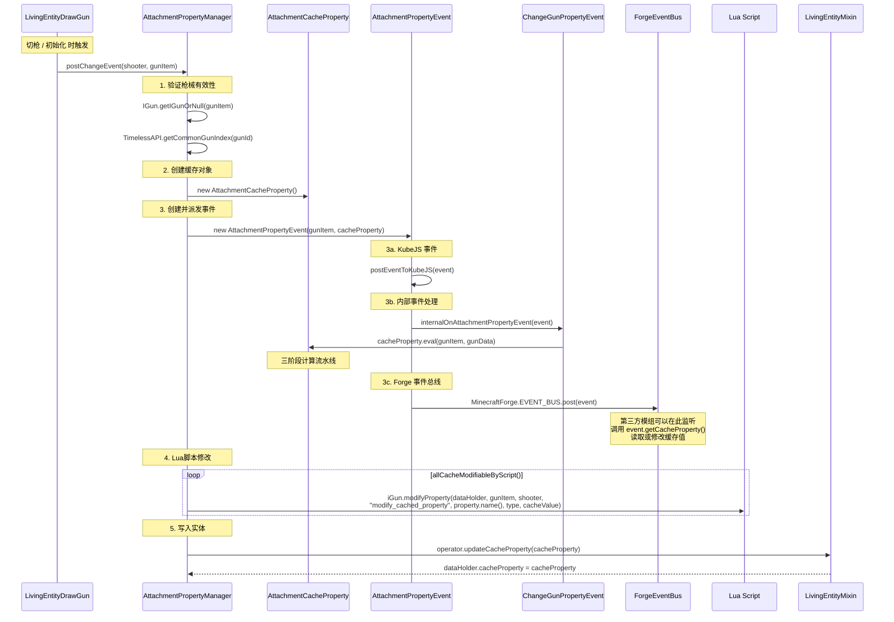

[English](#English)

# 管理器与事件系统

> `AttachmentPropertyManager` 是 Modifier 体系的中央管理器，负责注册所有修改器、提供算术引擎，以及编排缓存刷新事件流。

## AttachmentPropertyManager

`com.tacz.guns.resource.modifier.AttachmentPropertyManager`

### 修改器注册

```java
private static final Map<String, IAttachmentModifier<?, ?>> MODIFIERS = Maps.newLinkedHashMap();

public static void registerModifier() {
    MODIFIERS.put(AdsModifier.ID, new AdsModifier());
    MODIFIERS.put(AmmoSpeedModifier.ID, new AmmoSpeedModifier());
    MODIFIERS.put(ArmorIgnoreModifier.ID, new ArmorIgnoreModifier());
    MODIFIERS.put(DamageModifier.ID, new DamageModifier());
    MODIFIERS.put(EffectiveRangeModifier.ID, new EffectiveRangeModifier());
    MODIFIERS.put(ExplosionModifier.ID, new ExplosionModifier());
    MODIFIERS.put(HeadShotModifier.ID, new HeadShotModifier());
    MODIFIERS.put(IgniteModifier.ID, new IgniteModifier());
    MODIFIERS.put(InaccuracyModifier.ID, new InaccuracyModifier());
    MODIFIERS.put(KnockbackModifier.ID, new KnockbackModifier());
    MODIFIERS.put(PierceModifier.ID, new PierceModifier());
    MODIFIERS.put(RecoilModifier.ID, new RecoilModifier());
    MODIFIERS.put(RpmModifier.ID, new RpmModifier());
    MODIFIERS.put(SilenceModifier.ID, new SilenceModifier());
    MODIFIERS.put(WeightModifier.ID, new WeightModifier());
    MODIFIERS.put(ExtraMovementModifier.ID, new ExtraMovementModifier());
}
```

使用 `LinkedHashMap` 保持插入顺序，共注册 16 个修改器。

## 事件流详解

缓存刷新事件流是体系中最重要的运行时行为：



### 关键事件

#### AttachmentPropertyEvent

`com.tacz.guns.api.event.common.AttachmentPropertyEvent`

```java
public class AttachmentPropertyEvent extends Event {
    private final ItemStack gunItem;
    private final AttachmentCacheProperty cacheProperty;
}
```

- 在 `AttachmentCacheProperty` 创建后立即触发
- 实现 `KubeJSGunEventPoster` 接口以支持 KubeJS 脚本
- 第三方模组可监听此事件来修改 `cacheProperty`

#### ChangeGunPropertyEvent

`com.tacz.guns.event.ChangeGunPropertyEvent`（`@ApiStatus.Internal`）

```java
public static void internalOnAttachmentPropertyEvent(AttachmentPropertyEvent event) {
    ItemStack gunItem = event.getGunItem();
    IGun iGun = IGun.getIGunOrNull(gunItem);
    if (iGun == null) return;
    ResourceLocation gunId = iGun.getGunId(gunItem);
    TimelessAPI.getCommonGunIndex(gunId).ifPresent(gunIndex ->
        event.getCacheProperty().eval(gunItem, gunIndex.getGunData())
    );
}
```

这是内部事件处理器，在 Forge 事件总线派发之前执行。它负责调用 `AttachmentCacheProperty.eval()` 完成三阶段计算。

#### 触发时机

缓存在以下时机触发刷新：

1. **实体初始化**：`LivingEntityMixin.initialData()` → `AttachmentPropertyManager.postChangeEvent()`
2. **切枪**：`LivingEntityDrawGun.draw()` → `AttachmentPropertyManager.postChangeEvent()`
3. **脚本调用**：通过 Lua API 直接调用刷新逻辑

## 实体绑定

### IGunOperator 接口

`com.tacz.guns.api.entity.IGunOperator`

缓存在实体上的接口契约：

```java
void updateCacheProperty(AttachmentCacheProperty cacheProperty);
@Nullable AttachmentCacheProperty getCacheProperty();
ShooterDataHolder getDataHolder();
```

`LivingEntity` 通过 Mixin 实现此接口。

### LivingEntityMixin

缓存的存储和检索：

```java
@Override
public void updateCacheProperty(AttachmentCacheProperty cacheProperty) {
    this.tacz$data.cacheProperty = cacheProperty;
}

@Override
@Nullable
public AttachmentCacheProperty getCacheProperty() {
    return this.tacz$data.cacheProperty;
}
```

### ShooterDataHolder

缓存存储在 `ShooterDataHolder` 的 `cacheProperty` 字段中：

```java
@Nullable
public AttachmentCacheProperty cacheProperty = null;
```

`ShooterDataHolder` 与 `LivingEntity` 的实例一一对应，由 Mixin 持有。

## GunProperty — 类型安全键（实验性）

`com.tacz.guns.api.GunProperty`

```java
public record GunProperty<T>(String name, Class<T> type) {
    public static <T> GunProperty<T> of(String name, Class<T> type) { ... }
}
```

`GunProperties` 类定义了一系列 `GunProperty` 常量作为类型安全的缓存键。这些在 `AttachmentCacheProperty` 上提供可选的存取方式：

```java
// 旧的方式（字符串键）
cacheProperty.<Float>getCache("ads");

// 新的方式（类型安全键，实验性）
cacheProperty.getCache(GunProperties.ADS_TIME);
```

这些类型安全键与 `CacheModifiableByScript` 和 `ValueModifiableAtRuntime` 注解配合使用，标记哪些属性可以被 Lua 脚本修改。

### 注解

- **`@CacheModifiableByScript`** — 标记在 `GunProperty` 字段上，表示该属性在被 `allCacheModifiableByScript()` 返回后可被脚本修改
- **`@ValueModifiableAtRuntime`** — 标记属性在运行时可通过 `iGun.modifyProperty()` 修改的类型

### RuntimeOnly 属性

`GunProperties.RuntimeOnly` 类文档了一组**仅运行时存在**的属性 — 它们不在配件缓存中，但可通过脚本在运行时修改：

```java
MAX_HEAT, BULLET_AMOUNT, BURST_COUNT, BURST_SHOOT_INTERVAL,
BULLET_LIFE, BULLET_GRAVITY, BULLET_FRICTION, SOUND_DISTANCE,
IGNITE_ENTITY, IGNITE_ENTITY_TIME, IGNITE_BLOCK,
EXPLODE_ENABLED, EXPLOSION_DAMAGE, EXPLOSION_RADIUS,
EXPLOSION_KNOCKBACK, EXPLOSION_DESTROYS_BLOCK, EXPLOSION_DELAY
```

# English
