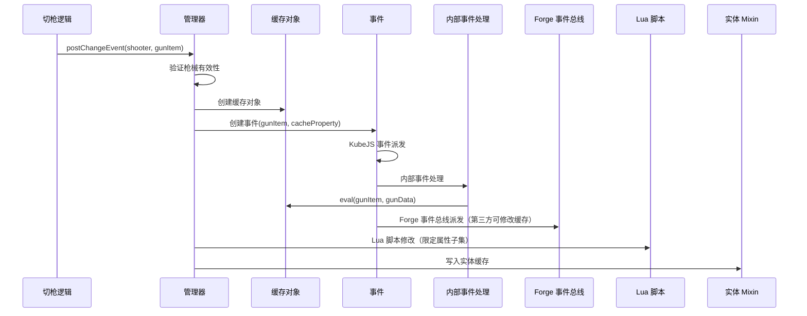
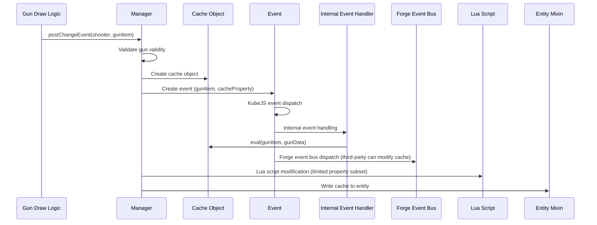

[English](#English)

# 管理器与事件系统

> Modifier 体系的中央管理器，负责注册所有修改器、提供算术引擎，以及编排缓存刷新事件流。

## 管理器

管理器使用有序 Map 维护 modifier 注册表，键为字符串 ID，值为对应的 modifier 实现。共注册 16 个修改器。

## 事件流

缓存刷新通过`postChangeEvent`统一编排：

事件系统的两个核心组件：

- AttachmentPropertyEvent：在缓存对象创建后立即触发，携带枪械物品和缓存对象，第三方模组可监听修改缓存
- ChangeGunPropertyEvent（内部）：在 Forge 事件总线派发之前执行，负责调用缓存对象的 eval 完成三阶段计算

触发时机：实体初始化、切枪、Lua API 直接调用。

## 实体绑定

缓存通过实体接口绑定在生物实体上（通过 Mixin 实现），存储在与实体一一对应的数据对象中。接口提供写入和读取两个方法。缓存刷新后，消费方通过实体接口获取缓存对象，再按 modifier ID 读取具体属性值。

# English

> The central manager of the modifier system, responsible for registering all modifiers, providing the arithmetic engine, and orchestrating the cache refresh event flow.

## Manager

The manager maintains the modifier registry in an ordered Map, keyed by string ID with the corresponding modifier implementation as the value. A total of 16 modifiers are registered.

## Event Flow

Cache refresh is orchestrated through `postChangeEvent`:

Two core components of the event system:

- AttachmentPropertyEvent: triggered immediately after cache object creation, carrying the gun item and cache object; third-party mods can listen and modify the cache
- ChangeGunPropertyEvent (internal): executes before Forge event bus dispatch, responsible for invoking the cache object's eval to complete the three-phase computation

Trigger timing: entity initialization, gun draw, and direct Lua API calls.

## Entity Binding

The cache is bound to living entities through an entity interface (implemented via Mixin) and stored in a data object with one-to-one correspondence to the entity. The interface provides write and read (nullable) methods. After cache refresh, consumers access the cache object through the entity interface and read specific property values by modifier ID.
