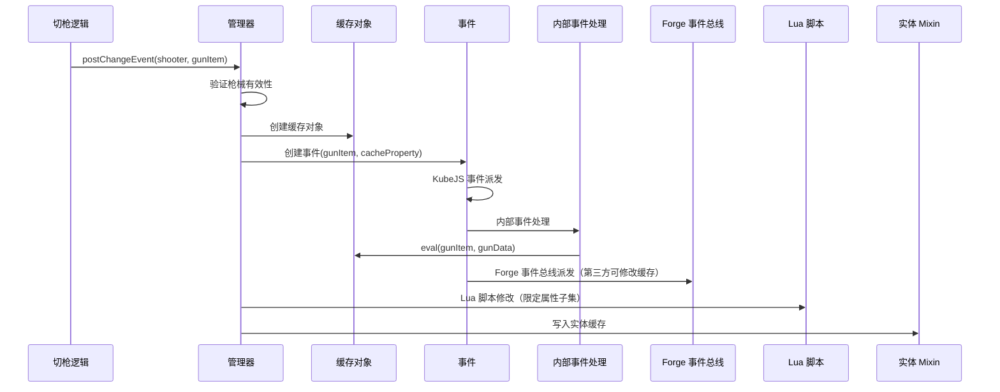

[English](#English)

# 管理器与事件系统

> Modifier 体系的中央管理器，负责注册所有修改器、提供算术引擎，以及编排缓存刷新事件流。

## 管理器

管理器使用有序 Map 维护 modifier 注册表，键为字符串 ID（如 `"ads"`, `"rpm"`），值为对应的 modifier 实现。共注册 16 个修改器。

## 事件流

缓存刷新通过 `postChangeEvent()` 统一编排：

事件系统的两个核心组件：

- **AttachmentPropertyEvent**：在缓存对象创建后立即触发，携带枪械物品和缓存对象，第三方模组可监听修改缓存
- **ChangeGunPropertyEvent**（内部）：在 Forge 事件总线派发之前执行，负责调用缓存对象的 eval 完成三阶段计算

触发时机：实体初始化、切枪、Lua API 直接调用。

## 实体绑定

缓存通过实体接口绑定在生物实体上（通过 Mixin 实现），存储在与实体一一对应的数据对象中。接口提供写入和读取（nullable）两个方法。缓存刷新后，消费方通过实体接口获取缓存对象，再按 modifier ID 读取具体属性值。

# English
