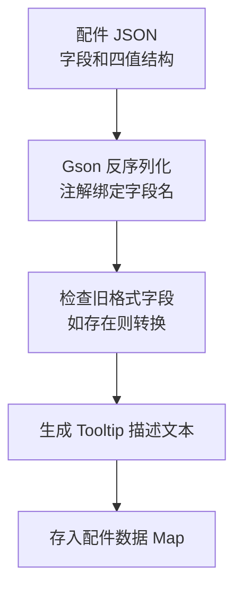
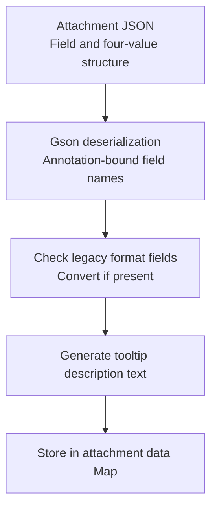

[English](#English)

# Modifier 接口

> modifier 体系的核心契约，定义 JSON 解析、缓存初始化、计算和 UI 数据四个职责。

## 接口定义

接口声明了两个泛型参数：一个为 JSON 读取后的中间类型（大部分为通用修改值结构，少数为自定义类型），另一个为最终缓存值类型（可为 `Float`、`Integer`、`LinkedList`、`Map`、自定义对象等）。

四个核心职责：

- JSON 解析（数据包加载时）：把 JSON 字符串解析为中间类型，处理旧格式兼容
- 缓存初始化（每次缓存刷新时）：从枪械数据读取默认值作为缓存初始值
- 计算（收集完所有配件修改数据后）：将默认值加所有配件修改值汇总计算
- UI 数据（客户端改装台 GUI）：返回属性条数据，每个 modifier 可返回多条

## 数值型修改器

大部分修改器直接使用通用的四字段结构（加数、百分比、乘数、Lua 表达式），JSON key 如 `ads`、`ammo_speed` 等。实现模式如下：

计算阶段委托给管理器的统一算术引擎处理。

## 复合型修改器

部分修改器需要自定义数据结构，不使用通用的四字段模式：

- 爆炸：含启用开关（OR 语义：任一配件启用即生效）、多个子 Modifier、多个开关字段
- 后坐力：使用参数化缓存保留各乘区原始值，以便后续结合瞄准进度动态缩放
- 散布：五种射击姿态各有独立的修改值，计算时按类型分组处理
- 消音器、移动速度修正等也使用自定义结构

# English

> The core contract of the modifier system, defining four responsibilities: JSON parsing, cache initialization, computation, and UI data.

## Interface Definition

The interface declares two generic parameters: one for the intermediate type after JSON parsing (mostly the common modifier value structure, a few custom types), and one for the final cached value type (can be `Float`, `Integer`, `LinkedList`, `Map`, custom objects, etc.).

Four core responsibilities:

- JSON parsing (at datapack load time): parses JSON strings into the intermediate type, handling legacy format compatibility
- Cache initialization (on each cache refresh): reads default values from gun data as initial cache values
- Computation (after collecting all attachment modifier data): aggregates the default value with all attachment modifier values into the final result
- UI data (client-side gun modification GUI): returns property diagram data; each modifier can return multiple entries

## Numeric Modifiers

Most modifiers directly use the common four-field structure (addend, percent, multiplier, Lua expression) with JSON keys like `ads`, `ammo_speed`, etc. The implementation pattern:

The computation phase delegates to the manager's unified arithmetic engine.

## Composite Modifiers

Some modifiers require custom data structures instead of the common four-field pattern:

- Explosion: includes an enable switch (OR semantics: any attachment enables it), multiple sub-modifiers, and multiple toggle fields
- Recoil: uses parameterized cache to preserve raw values per multiplier tier, enabling dynamic scaling with aim progress
- Inaccuracy: five shooting stances each have independent modifier values, processed by type during computation
- Silencer, movement speed modifier and others also use custom structures
