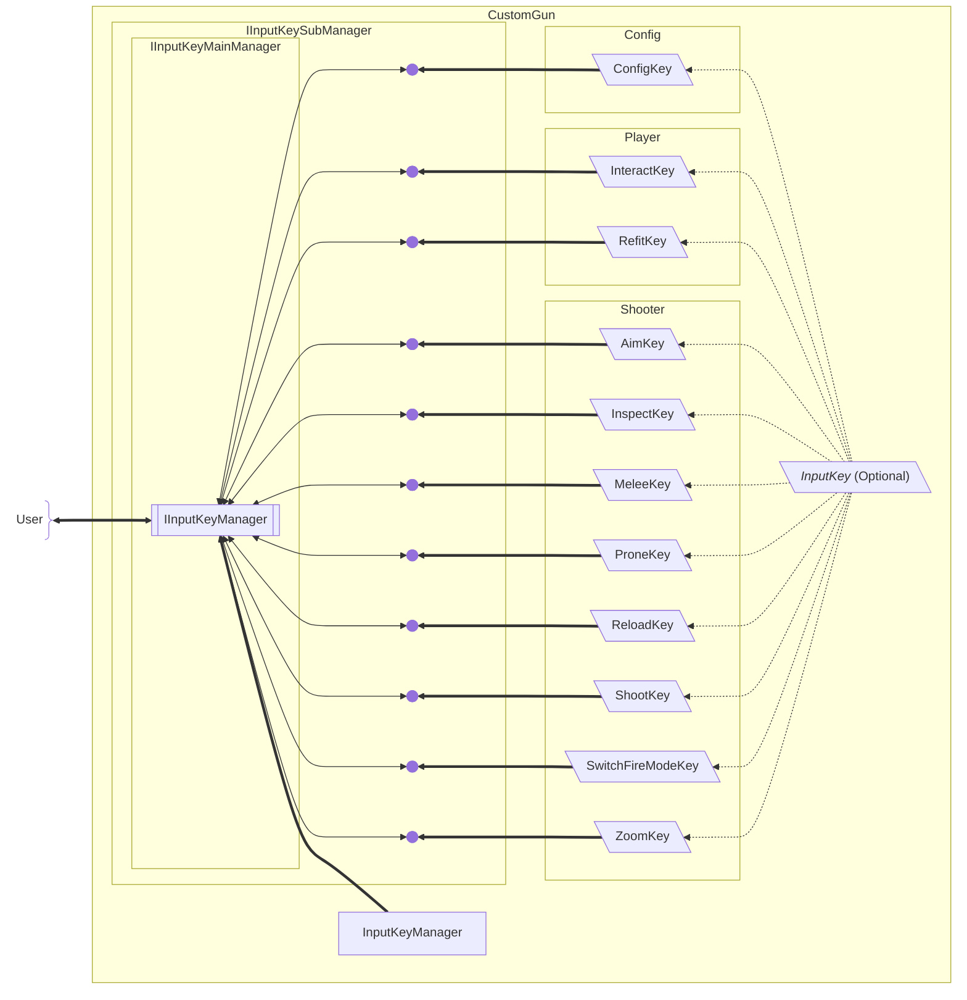

[English](#English)

```mermaid
flowchart RL
	subgraph CustomGun
		%% --------IInputKeySubManager分形--------
		subgraph IInputKeySubManager
			subgraph IInputKeyMainManager
				IInputKeyManager
			end
			
			IConfigKey & IInteractKey & IRefitKey & IAimKey & IInspectKey & IMeleeKey & IProneKey & IReloadKey & IShootKey & ISwitchFireModeKey & IZoomKey <--> IInputKeyManager
			IConfigKey@{ shape: f-circ }
			IInteractKey@{ shape: f-circ }
			IRefitKey@{ shape: f-circ }
			IAimKey@{ shape: f-circ }
			IInspectKey@{ shape: f-circ }
			IMeleeKey@{ shape: f-circ }
			IProneKey@{ shape: f-circ }
			IReloadKey@{ shape: f-circ }
			IShootKey@{ shape: f-circ }
			ISwitchFireModeKey@{ shape: f-circ }
			IZoomKey@{ shape: f-circ }
		end
		
		%% --------实现类--------
		InputKeyManager ==> IInputKeyManager@{ shape: fr-rect }
		ConfigKey ==> IConfigKey@{ shape: f-circ }
		InteractKey ==> IInteractKey@{ shape: f-circ }
		RefitKey ==> IRefitKey@{ shape: f-circ }
		AimKey ==> IAimKey@{ shape: f-circ }
		InspectKey ==> IInspectKey@{ shape: f-circ }
		MeleeKey ==> IMeleeKey@{ shape: f-circ }
		ProneKey ==> IProneKey@{ shape: f-circ }
		ReloadKey ==> IReloadKey@{ shape: f-circ }
		ShootKey ==> IShootKey@{ shape: f-circ }
		SwitchFireModeKey ==> ISwitchFireModeKey@{ shape: f-circ }
		ZoomKey ==> IZoomKey@{ shape: f-circ }
		
		%% ----分类----
		subgraph Config
			ConfigKey
		end
		subgraph Player
			InteractKey
			RefitKey
		end
		subgraph Shooter
			AimKey
			InspectKey
			MeleeKey
			ProneKey
			ReloadKey
			ShootKey
			SwitchFireModeKey
			ZoomKey
		end
		
		%% --------切面父类（可选）--------
		InputKey@{ shape: lean-l, label: "_InputKey_ (Optional)" }
		InputKey -.-> ConfigKey@{ shape: lean-l }
		InputKey -.-> InteractKey@{ shape: lean-l }
		InputKey -.-> RefitKey@{ shape: lean-l }
		InputKey -.-> AimKey@{ shape: lean-l }
		InputKey -.-> InspectKey@{ shape: lean-l }
		InputKey -.-> MeleeKey@{ shape: lean-l }
		InputKey -.-> ProneKey@{ shape: lean-l }
		InputKey -.-> ReloadKey@{ shape: lean-l }
		InputKey -.-> ShootKey@{ shape: lean-l }
		InputKey -.-> SwitchFireModeKey@{ shape: lean-l }
		InputKey -.-> ZoomKey@{ shape: lean-l }
	end
	
	%% --------外部调用--------
	IInputKeyManager <==> User@{ shape: brace-r }
```

# 输入框架

# English
