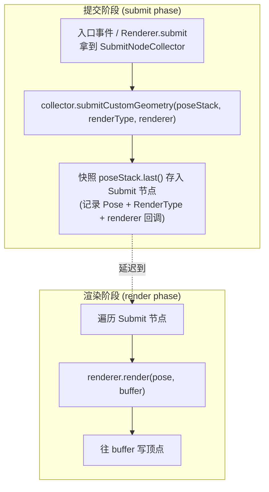
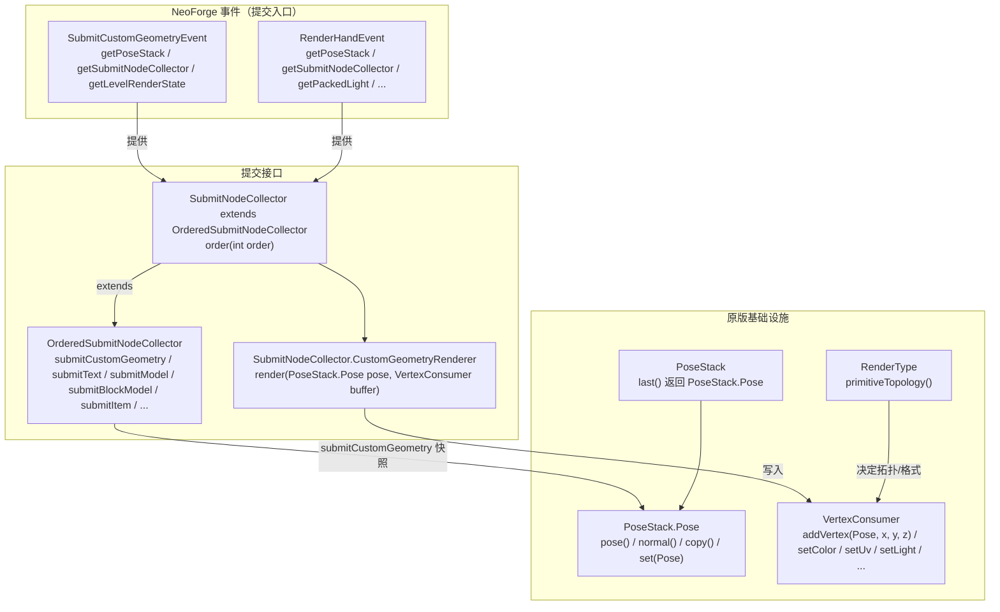
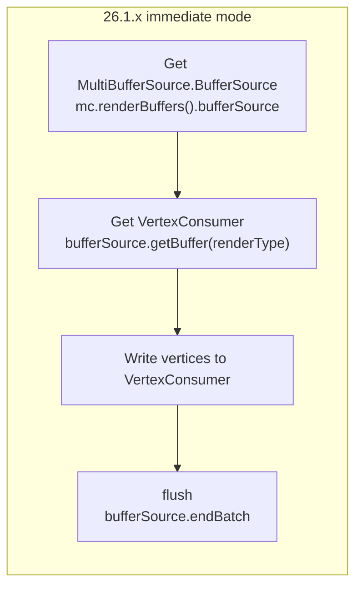
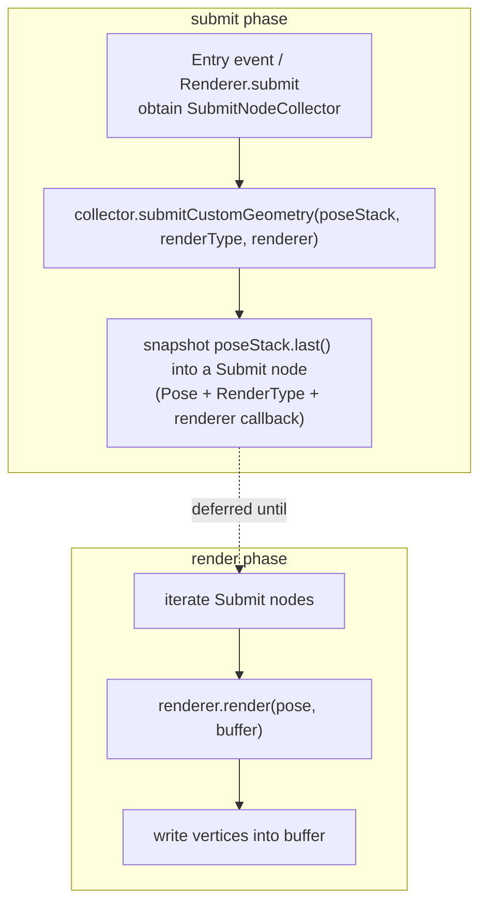
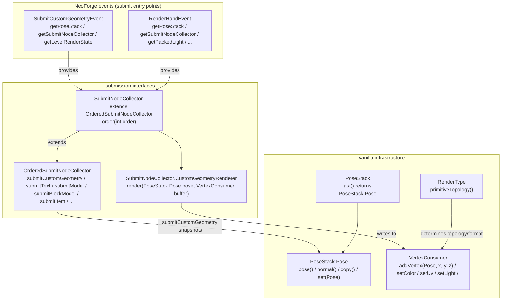

[English](#English)

# 26.1.x → 26.2 渲染系统差异参考

> 本文档沉淀了 Custom Gun Continued 从 26.1.2 移植到 26.2 NeoForge 时研究到的**原版渲染 API 变更**。
> 目标是作为**后续再次更新渲染版本时的辅助参考**——当未来某个 MC 版本再次重构渲染时，可对照本文快速定位「旧接口 → 新接口」的映射。
>
> 说明：本文不描述「本次移植改了什么」（那见 [26.2 MultiBufferSource 移除移植调查报告](./26.2-multibuffersource-migration-report.md)），而是描述**原版在 26.2 发生的变更本身**，并给出「去哪找源码」的指引。

---

## 一、核心范式转变：即时模式 → 延迟提交

26.2 渲染最大的变化不是某个类的改名，而是**提交模型的重构**。

### 26.1.x 及更早（即时模式 / Immediate Mode）

自定义几何的渲染是「当场拉缓冲区 → 写顶点 → 当场 flush」：

```mermaid
graph LR
    subgraph "26.1.x 即时模式"
        B[获取 MultiBufferSource.BufferSource<br/>mc.renderBuffers().bufferSource] --> C[获取 VertexConsumer<br/>bufferSource.getBuffer(renderType)]
        C --> D[写顶点到 VertexConsumer]
        D --> E[flush<br/>bufferSource.endBatch]
    end
```

- 缓冲区是**全局共享**的，通过 `Minecraft.renderBuffers().bufferSource()` 拿到。
- 顶点写入与提交**同步发生**，没有延迟。

### 26.2（延迟提交 / Deferred Submit）

所有几何必须通过 `SubmitNodeCollector` 提交一个「提交节点」，节点在渲染阶段才真正执行：



关键语义：

- `submitCustomGeometry` **在提交时**对 `poseStack.last()` 做快照，把 `PoseStack.Pose` 快照 + `RenderType` + 回调存进提交节点。
- 回调 `CustomGeometryRenderer.render(PoseStack.Pose pose, VertexConsumer buffer)` **在渲染阶段**才执行；`pose` 是提交时的快照，`buffer` 是渲染阶段的真实顶点缓冲。
- 因此回调内**不能依赖提交时的可变状态**（矩阵栈、`visible` 标志、循环局部变量等都要在提交时固化进快照或 `final` 变量）。

> 具体实现见源码：`net.minecraft.client.renderer.feature.CustomFeatureRenderer`（`buildGroup` 里 `submit.customGeometryRenderer().render(submit.pose(), builder)`，直观展示了「快照 + 延迟回调」）。

---

## 二、逐项 API 变更总表

以下为 26.1.x → 26.2 的具体接口映射。每个条目给出「旧 → 新」，以及「去哪找源码」。

### 2.1 缓冲区与顶点写入

| 旧 (26.1.x) | 新 (26.2) | 去哪找 |
|---|---|---|
| `MultiBufferSource` / `MultiBufferSource.BufferSource` | **移除**，无直接等价物 | — |
| `Minecraft.renderBuffers().bufferSource()` | 移除；`RenderBuffers` 只剩 `fixedBufferPack()`/`sectionBufferPool()`/`stagedVertexBuffer()` | `net.minecraft.client.renderer.RenderBuffers` |
| `Tesselator.getInstance().begin(VertexFormat.Mode.X, VertexFormat)` | `new BufferBuilder(new ByteBufferBuilder(n), PrimitiveTopology.X, DefaultVertexFormat.X)` | `com.mojang.blaze3d.vertex.BufferBuilder` / `ByteBufferBuilder` |
| `VertexFormat.Mode`（`QUADS`/`TRIANGLE_FAN`/…） | `com.mojang.blaze3d.PrimitiveTopology` 枚举 | `com.mojang.blaze3d.PrimitiveTopology` |
| `RenderType.draw(MeshData)` | **移除**，改由 `SubmitNodeCollector.submitCustomGeometry` 提交 | `net.minecraft.client.renderer.OrderedSubmitNodeCollector` |
| `BufferUploader.draw()` | **移除** | — |
| `BufferBuilder.build()` / `buildOrThrow()` 返回 `MeshData` | 仍存在，但 `MeshData` 需交给 `submitCustomGeometry` 的 `VertexConsumer`（或直接在建 buffer 时就写进 collector） | `com.mojang.blaze3d.vertex.MeshData` |

### 2.2 自定义几何提交

| 旧 (26.1.x) | 新 (26.2) | 去哪找 |
|---|---|---|
| `bufferSource.getBuffer(renderType)` → 写顶点 → `endBatch()` | `collector.submitCustomGeometry(poseStack, renderType, (pose, buffer) -> { 写顶点 })` | `net.minecraft.client.renderer.SubmitNodeCollector` |
| `SubmitNodeCollector.CustomGeometryRenderer`（回调接口） | 新增，签名 `void render(PoseStack.Pose pose, VertexConsumer buffer)` | 同上（内嵌接口） |
| 顶点写入用 `VertexConsumer` | 不变，`VertexConsumer.addVertex(PoseStack.Pose, x, y, z).setColor(...).setUv(...)` 等 | `com.mojang.blaze3d.vertex.VertexConsumer` |

`OrderedSubmitNodeCollector` 提供的其它提交方法（用于对照）：`submitModel` / `submitModelPart` / `submitBlockModel` / `submitItem` / `submitText` / `submitShapeOutline` / `submitNameTag` / `submitShadow` / `submitFlame` / `submitLeash` / `submitMovingBlock` / `submitQuadParticleGroup` / `submitGizmoPrimitives` 等。全部见 `net.minecraft.client.renderer.OrderedSubmitNodeCollector`。

### 2.3 文字渲染

| 旧 (26.1.x) | 新 (26.2) | 去哪找 |
|---|---|---|
| `Font.drawInBatch(String/Component, x, y, color, shadow, Matrix4f, MultiBufferSource, DisplayMode, backgroundColor, packedLight)` | **移除** | — |
| 同上 | `collector.submitText(PoseStack, x, y, FormattedCharSequence, dropShadow, DisplayMode, lightCoords, color, backgroundColor, outlineColor)` | `net.minecraft.client.renderer.OrderedSubmitNodeCollector` |
| 入参 `Matrix4f` | 改为整个 `PoseStack`（内部取 `last()` 快照） | — |
| 入参 `String`/`Component` | 需转 `FormattedCharSequence`，如 `Component.literal(text).getVisualOrderText()` | `net.minecraft.network.chat.Component` / `FormattedText` |

### 2.4 RenderPipeline 构建

| 旧 (26.1.x) | 新 (26.2) | 去哪找 |
|---|---|---|
| `RenderPipelines.MATRICES_PROJECTION_SNIPPET` | **移除**，用 `RenderPipelines.MATRICES_FOG_SNIPPET`（= `GLOBALS_SNIPPET` + `BindGroupLayouts.MATRICES_PROJECTION` + `BindGroupLayouts.FOG`） | `net.minecraft.client.renderer.RenderPipelines` |
| snippet 体系 | 重组为 `GLOBALS_SNIPPET` / `MATRICES_FOG_SNIPPET` / `MATRICES_FOG_LIGHT_DIR_SNIPPET` / `BLOCK_SNIPPET` / `ENTITY_SNIPPET` / `ENTITY_EMISSIVE_SNIPPET` / `TEXT_SNIPPET` / `DEBUG_FILLED_SNIPPET` / `GUI_SNIPPET` / … | `net.minecraft.client.renderer.RenderPipelines`（所有 snippet 与预置 pipeline 都在此，最权威参考） |
| `.withVertexFormat(format, mode)` | `.withVertexBinding(bindingIndex, format)` + `.withPrimitiveTopology(topology)` | `com.mojang.blaze3d.pipeline.RenderPipeline.Builder` |
| `.withSampler("Sampler0")` | `.withBindGroupLayout(BindGroupLayouts.SAMPLER0)`（sampler 声明挪到了 `BindGroupLayout.Builder`） | `net.minecraft.client.renderer.BindGroupLayouts` |
| `.bufferSize(...)` | **移除**（更早版本即已移除；26.2 用 `StagedVertexBuffer` 管理） | — |

### 2.5 事件

| 旧 (26.1.x) | 新 (26.2) | 去哪找 |
|---|---|---|
| `RenderHandEvent.getMultiBufferSource()` | `RenderHandEvent.getSubmitNodeCollector()` | `net.neoforged.neoforge.client.event.RenderHandEvent` |
| （无） | 新增 `SubmitCustomGeometryEvent`：`getPoseStack()` / `getSubmitNodeCollector()` / `getLevelRenderState()`（含 `cameraRenderState.pos`），在粒子提交与不透明提交之间触发 | `net.neoforged.neoforge.client.event.SubmitCustomGeometryEvent` |
| `ViewportEvent.ComputeFov.usedConfiguredFov()` | **移除** | `net.neoforged.neoforge.client.event.ViewportEvent` |

### 2.6 相机与渲染目标

| 旧 (26.1.x) | 新 (26.2) | 去哪找 |
|---|---|---|
| `gameRenderer.getMainCamera()` | `gameRenderer.mainCamera()` | `net.minecraft.client.renderer.GameRenderer` |
| `Minecraft.getMainRenderTarget()` | `gameRenderer.mainRenderTarget()` | `net.minecraft.client.renderer.GameRenderer`（`mainRenderTarget()` 返回 `RenderTarget`） |

---

## 三、核心类关系



要点：

- `SubmitNodeCollector` 是 `OrderedSubmitNodeCollector` 的子接口，后者承载几乎所有 `submit*` 方法。
- `submitCustomGeometry` 是「自定义几何」的通用入口，CGC 的基岩版模型渲染全部走它。
- `PoseStack.Pose` 有 `copy()` 和 `set(Pose)`，可用于在回调内从快照重建一个独立 `PoseStack`（见下节模式）。

---

## 四、CGC 侧的适配模式（去哪看 CGC 源码）

以下模式是本次移植沉淀下来的、可直接复用的写法。**这些类就是「去哪看 CGC 源码」的答案**。

### 4.1 收集器线程局部传递

CGC 的深层渲染方法（`ModelObject.render` 等）拿不到 `SubmitNodeCollector`，于是沿用既有的 `ClientRenderHelper.FirstPersonArmHelper` 的 `ThreadLocal<SubmitNodeCollector>` 作为「当前渲染收集器」：

- 入口设置：`ClientRenderHelper.FirstPersonArmHelper.setFirstPersonArmCollector(collector)`
- 内部读取：`ClientRenderHelper.FirstPersonArmHelper.getFirstPersonArmCollector()`
- 见源码：`client/util/ClientRenderHelper.java`（`FirstPersonArmHelper` 内嵌类，含跨版本的占位重载 `setFirstPersonArmCollector_(Object)` 与 `disableCollectorCheck`）。

### 4.2 自定义几何提交 + 快照重建 PoseStack

`ModelObject.render` 是「提交自定义几何」的规范样例：

```java
@Nullable SubmitNodeCollector collector = ClientRenderHelper.FirstPersonArmHelper.getFirstPersonArmCollector();
if (collector == null) return;

collector.submitCustomGeometry(matrixStack, renderType, (pose, builder) -> {
    PoseStack _matrixStack = new PoseStack();
    _matrixStack.last().set(pose);   // 从快照重建，避免污染调用方 PoseStack
    // ... 往 builder 写顶点 ...
});
```

见源码：`client/model/ModelObject.java` 的 `render(...)`。同模式在 `_AttachmentModelRender.renderModelPart`、`BeamRender.render`、`MuzzleFlashRender.doRender`、`AttachmentRender.renderAttachment`、各 `renderByItem`/`_renderSlotTexture` 中反复出现。

### 4.3 文字提交

`TextRender` 是 `Font.drawInBatch` → `submitText` 的规范样例：

```java
collector.submitText(poseStack2,
        -xOffset, -font.lineHeight / 2f,
        Component.literal(text).getVisualOrderText(),
        shadow, Font.DisplayMode.NORMAL,
        packLight, color, 0, 0);
```

见源码：`client/renderer/model/TextRender.java`。

### 4.4 实体渲染入口

实体渲染器的 `submit` 方法直接持有 `SubmitNodeCollector` 参数：

```java
@Override
public void submit(State state, PoseStack poseStack, SubmitNodeCollector submitNodeCollector, CameraRenderState cameraRenderState) {
    super.submit(...);
    // 将 submitNodeCollector 写入 ThreadLocal，再调用内部 render
}
```

见源码：`client/renderer/entity/GunProjectileRenderer.java` 的 `submit(...)`。

### 4.5 手部渲染事件

第一人称渲染入口通过 `IRenderHandEvent.getMultiBufferSource_SubmitNodeCollector()` 拿到收集器（26.2 下返回 `SubmitNodeCollector`）：

见源码：`client/api/event/IRenderHandEvent.java`、`neoforgeclient/event/NeoRenderHandEvent.java`、`client/renderer/item/GunItemRenderer.java` 的 `renderFirstPerson(...)`。

---

## 五、迁移注意事项与坑

以下是从本次移植中总结的、未来迁移容易踩的坑：

1. **延迟回调 ≠ 立即执行**：`submitCustomGeometry` 的回调在渲染阶段执行，不能在回调外修改它依赖的状态。循环局部变量要在回调里 `final` 固化，`part.visible` 这类标志要在回调内设置/恢复。
2. **快照语义**：`submitCustomGeometry` 只快照 `poseStack.last()`（矩阵），不复制整个 `PoseStack`。回调内要递归变换 `BedrockPart` 时，需先 `PoseStack ps = new PoseStack(); ps.last().set(pose);` 重建独立栈。
3. **拓扑/顶点格式由 renderType 决定**：旧 `RenderType.draw(mesh)` 里 `TRIANGLE_FAN`/`POSITION_COLOR` 来自 mesh 本身；新 `submitCustomGeometry` 里拓扑和格式来自传入的 `renderType`。若 renderType 是 `QUADS` 而几何是 `TRIANGLE_FAN`，会不匹配（见 `_AttachmentModelRender.renderOcularAndDivision` 的圆形模板层，属已知风险点）。
4. **嵌套提交的时序**：在 `submitCustomGeometry` 回调内再调用 `collector.submitXxx` 属于「渲染阶段追加提交」，时序与收集顺序可能不符。CGC 的 `delegateRenderers` 委托渲染目前就走这条路径，需运行时验证。
5. **死代码也要能编译**：`ClientRenderRegistry.LaserBeamRenderState` 的自定义 pipeline 虽未被注册使用（`getLaserBeam()` 实际返回 `RenderTypes.entityTranslucent`），但 `static final` 字段初始化器仍要编译通过，迁移时不能漏。
6. **事件语义变化**：`RenderHandEvent` 由「给 `MultiBufferSource`」改为「给 `SubmitNodeCollector`」；`SubmitCustomGeometryEvent` 是新增的非实体/非方块实体的自定义几何提交入口，适用于需要在世界空间画自定义形状的场景（对比 BattleRoyale 的 `ZoneRenderer` 迁移）。

---

## 六、对照参考

- 原版 26.2 反编译源码 jar（含上述所有类的完整实现）：
  - NeoForge 补丁/事件类：`net.neoforged.neoforge.client.event.*`、`net.neoforged.neoforge.client.extensions.*`
  - 原版类：`net.minecraft.client.renderer.*`、`com.mojang.blaze3d.*`
  - 建议用 IDEA MCP 的 `search_symbol`（勾选 external）按 FQCN 直接跳转。
- BattleRoyale 26.2 移植的调查报告（跨项目先例，描述同一渲染重构在另一个模组中的落地）：`BattleRoyale` 仓库 `docs/architecture/client/26.2-rendering-system-investigation-report.md`。

---

# English

# 26.1.x → 26.2 Rendering System Differences Reference

> Notes captured while porting Custom Gun Continued from 26.1.2 to 26.2 NeoForge, documenting the **vanilla rendering API changes** themselves.
> Intended as a reference for the next time a Minecraft version reworks rendering — a quick map of "old API → new API".
>
> This document does not describe what the port changed (see [26.2 MultiBufferSource Removal Migration Report](./26.2-multibuffersource-migration-report.md)); it describes the vanilla 26.2 changes and where to find the source.

## 1. Core Paradigm Shift: Immediate Mode → Deferred Submit

### 26.1.x and earlier (Immediate Mode)

Custom geometry was rendered "grab a buffer → write vertices → flush now":



### 26.2 (Deferred Submit)

All geometry must be submitted through `SubmitNodeCollector` as a "submit node", executed later during the render phase:



Key semantics:

- `submitCustomGeometry` snapshots `poseStack.last()` **at submit time** and stores `PoseStack.Pose` + `RenderType` + callback.
- The callback `CustomGeometryRenderer.render(PoseStack.Pose pose, VertexConsumer buffer)` runs **during the render phase**; `pose` is the submit-time snapshot, `buffer` is the real render-phase vertex buffer.
- Therefore the callback must not depend on mutable submit-time state (matrix stack, `visible` flags, loop locals must be frozen into the snapshot or `final` variables).

> See source: `net.minecraft.client.renderer.feature.CustomFeatureRenderer` (`buildGroup` calls `submit.customGeometryRenderer().render(submit.pose(), builder)` — a direct illustration of the snapshot + deferred callback).

## 2. API Change Table

### 2.1 Buffers & vertex writing

| Old (26.1.x) | New (26.2) | Where |
|---|---|---|
| `MultiBufferSource` / `MultiBufferSource.BufferSource` | **removed**, no direct equivalent | — |
| `Minecraft.renderBuffers().bufferSource()` | removed; `RenderBuffers` only has `fixedBufferPack()`/`sectionBufferPool()`/`stagedVertexBuffer()` | `net.minecraft.client.renderer.RenderBuffers` |
| `Tesselator.getInstance().begin(VertexFormat.Mode.X, VertexFormat)` | `new BufferBuilder(new ByteBufferBuilder(n), PrimitiveTopology.X, DefaultVertexFormat.X)` | `com.mojang.blaze3d.vertex.BufferBuilder` / `ByteBufferBuilder` |
| `VertexFormat.Mode` | `com.mojang.blaze3d.PrimitiveTopology` enum | `com.mojang.blaze3d.PrimitiveTopology` |
| `RenderType.draw(MeshData)` | **removed**, submit via `SubmitNodeCollector.submitCustomGeometry` | `net.minecraft.client.renderer.OrderedSubmitNodeCollector` |
| `BufferUploader.draw()` | **removed** | — |

### 2.2 Custom geometry submission

| Old (26.1.x) | New (26.2) | Where |
|---|---|---|
| `bufferSource.getBuffer(renderType)` → write → `endBatch()` | `collector.submitCustomGeometry(poseStack, renderType, (pose, buffer) -> { write })` | `net.minecraft.client.renderer.SubmitNodeCollector` |
| `SubmitNodeCollector.CustomGeometryRenderer` | new, signature `void render(PoseStack.Pose pose, VertexConsumer buffer)` | same (inner interface) |
| write via `VertexConsumer` | unchanged (`addVertex(Pose, x, y, z)` / `setColor` / `setUv` / `setLight`) | `com.mojang.blaze3d.vertex.VertexConsumer` |

Other submit methods on `OrderedSubmitNodeCollector`: `submitModel` / `submitModelPart` / `submitBlockModel` / `submitItem` / `submitText` / `submitShapeOutline` / `submitNameTag` / `submitShadow` / `submitFlame` / `submitLeash` / `submitMovingBlock` / `submitQuadParticleGroup` / `submitGizmoPrimitives`.

### 2.3 Text rendering

| Old (26.1.x) | New (26.2) | Where |
|---|---|---|
| `Font.drawInBatch(...)` | **removed** | — |
| same | `collector.submitText(PoseStack, x, y, FormattedCharSequence, dropShadow, DisplayMode, lightCoords, color, backgroundColor, outlineColor)` | `net.minecraft.client.renderer.OrderedSubmitNodeCollector` |
| `Matrix4f` arg | whole `PoseStack` (snapshots `last()`) | — |
| `String`/`Component` | convert to `FormattedCharSequence`, e.g. `Component.literal(text).getVisualOrderText()` | `net.minecraft.network.chat.Component` |

### 2.4 RenderPipeline building

| Old (26.1.x) | New (26.2) | Where |
|---|---|---|
| `RenderPipelines.MATRICES_PROJECTION_SNIPPET` | **removed**, use `MATRICES_FOG_SNIPPET` (= `GLOBALS_SNIPPET` + `MATRICES_PROJECTION` + `FOG`) | `net.minecraft.client.renderer.RenderPipelines` |
| snippet system | reorganized into `GLOBALS_SNIPPET` / `MATRICES_FOG_SNIPPET` / `MATRICES_FOG_LIGHT_DIR_SNIPPET` / `BLOCK_SNIPPET` / `ENTITY_SNIPPET` / `ENTITY_EMISSIVE_SNIPPET` / `TEXT_SNIPPET` / `DEBUG_FILLED_SNIPPET` / `GUI_SNIPPET` / … | `net.minecraft.client.renderer.RenderPipelines` (authoritative) |
| `.withVertexFormat(format, mode)` | `.withVertexBinding(bindingIndex, format)` + `.withPrimitiveTopology(topology)` | `com.mojang.blaze3d.pipeline.RenderPipeline.Builder` |
| `.withSampler("Sampler0")` | `.withBindGroupLayout(BindGroupLayouts.SAMPLER0)` | `net.minecraft.client.renderer.BindGroupLayouts` |
| `.bufferSize(...)` | **removed** | — |

### 2.5 Events

| Old (26.1.x) | New (26.2) | Where |
|---|---|---|
| `RenderHandEvent.getMultiBufferSource()` | `RenderHandEvent.getSubmitNodeCollector()` | `net.neoforged.neoforge.client.event.RenderHandEvent` |
| (none) | new `SubmitCustomGeometryEvent` (`getPoseStack`/`getSubmitNodeCollector`/`getLevelRenderState`), fired between particle submission and opaque submits | `net.neoforged.neoforge.client.event.SubmitCustomGeometryEvent` |
| `ViewportEvent.ComputeFov.usedConfiguredFov()` | **removed** | `net.neoforged.neoforge.client.event.ViewportEvent` |

### 2.6 Camera & render target

| Old (26.1.x) | New (26.2) | Where |
|---|---|---|
| `gameRenderer.getMainCamera()` | `gameRenderer.mainCamera()` | `net.minecraft.client.renderer.GameRenderer` |
| `Minecraft.getMainRenderTarget()` | `gameRenderer.mainRenderTarget()` | `net.minecraft.client.renderer.GameRenderer` |

## 3. Core Class Relationships



## 4. CGC Adaptation Patterns (where to look in CGC source)

### 4.1 Thread-local collector

Deep render methods obtain the collector via the existing `ClientRenderHelper.FirstPersonArmHelper` `ThreadLocal<SubmitNodeCollector>`:

- Set at entry: `ClientRenderHelper.FirstPersonArmHelper.setFirstPersonArmCollector(collector)`
- Read internally: `ClientRenderHelper.FirstPersonArmHelper.getFirstPersonArmCollector()`
- Source: `client/util/ClientRenderHelper.java` (inner class `FirstPersonArmHelper`, incl. cross-version placeholder overload `setFirstPersonArmCollector_(Object)` and `disableCollectorCheck`).

### 4.2 Custom geometry submit + snapshot rebuild

`ModelObject.render` is the canonical example of submitting custom geometry:

```java
@Nullable SubmitNodeCollector collector = ClientRenderHelper.FirstPersonArmHelper.getFirstPersonArmCollector();
if (collector == null) return;

collector.submitCustomGeometry(matrixStack, renderType, (pose, builder) -> {
    PoseStack _matrixStack = new PoseStack();
    _matrixStack.last().set(pose);   // rebuild from snapshot
    // ... write vertices into builder ...
});
```

Source: `client/model/ModelObject.java`. The same pattern recurs in `_AttachmentModelRender.renderModelPart`, `BeamRender.render`, `MuzzleFlashRender.doRender`, `AttachmentRender.renderAttachment`, and the `renderByItem`/`_renderSlotTexture` methods.

### 4.3 Text submission

`TextRender` is the canonical `drawInBatch` → `submitText` example:

```java
collector.submitText(poseStack2,
        -xOffset, -font.lineHeight / 2f,
        Component.literal(text).getVisualOrderText(),
        shadow, Font.DisplayMode.NORMAL,
        packLight, color, 0, 0);
```

Source: `client/renderer/model/TextRender.java`.

### 4.4 Entity renderer entry

Entity renderers receive `SubmitNodeCollector` directly in `submit`:

```java
@Override
public void submit(State state, PoseStack poseStack, SubmitNodeCollector submitNodeCollector, CameraRenderState cameraRenderState) {
    super.submit(...);
    // write submitNodeCollector into the ThreadLocal, then call internal render
}
```

Source: `client/renderer/entity/GunProjectileRenderer.java`.

### 4.5 Hand render event

First-person rendering obtains the collector via `IRenderHandEvent.getMultiBufferSource_SubmitNodeCollector()` (returns `SubmitNodeCollector` on 26.2):

Source: `client/api/event/IRenderHandEvent.java`, `neoforgeclient/event/NeoRenderHandEvent.java`, `client/renderer/item/GunItemRenderer.java` (`renderFirstPerson`).

## 5. Migration Pitfalls

1. **Deferred callback ≠ immediate execution**: the `submitCustomGeometry` callback runs during the render phase; don't mutate state it depends on outside the callback. Freeze loop locals as `final`, set/restore `visible`-style flags inside the callback.
2. **Snapshot semantics**: `submitCustomGeometry` snapshots only `poseStack.last()`. To recursively transform `BedrockPart` inside the callback, rebuild an independent stack via `PoseStack ps = new PoseStack(); ps.last().set(pose);`.
3. **Topology/format come from renderType**: old `RenderType.draw(mesh)` took topology/format from the mesh; new `submitCustomGeometry` takes them from the passed `renderType`. A `TRIANGLE_FAN` geometry with a `QUADS` renderType mismatches (see `_AttachmentModelRender.renderOcularAndDivision` circle stencil — a known risk).
4. **Nested-submit ordering**: calling `collector.submitXxx` inside a `submitCustomGeometry` callback appends submits during the render phase, whose ordering may differ. CGC's `delegateRenderers` path currently does this and needs runtime verification.
5. **Dead code must still compile**: `ClientRenderRegistry.LaserBeamRenderState`'s custom pipeline is unused but its `static final` initializers must still compile — don't skip it.
6. **Event semantics changed**: `RenderHandEvent` now gives a `SubmitNodeCollector`; `SubmitCustomGeometryEvent` is the new entry point for custom world-space geometry outside entities/block-entities/particles (compare BattleRoyale's `ZoneRenderer` migration).

## 6. Cross-References

- Vanilla 26.2 decompiled sources (full implementations of all classes above): NeoForge patch/event classes `net.neoforged.neoforge.client.event.*` / `net.neoforged.neoforge.client.extensions.*`, vanilla classes `net.minecraft.client.renderer.*` / `com.mojang.blaze3d.*`. Use IDEA MCP `search_symbol` (with external enabled) to jump by FQCN.
- BattleRoyale 26.2 port investigation report (cross-project precedent for the same rendering rework): `BattleRoyale` repo `docs/architecture/client/26.2-rendering-system-investigation-report.md`.
