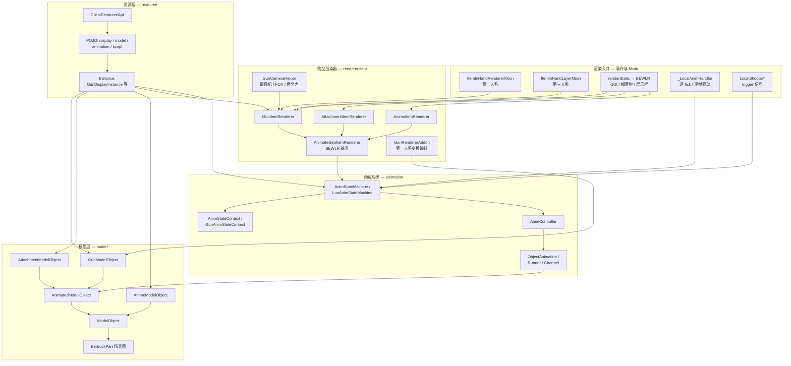

# 渲染体系总览

> 本文档是 CGC 客户端渲染架构的入口。它回答一个问题：一套从 BlockBench 导出的基岩版资源，如何变成游戏里可动的枪械。

## 体系总图

## 渲染主线

一杆枪从资源到画面的主线是固定的，所有渲染场景都在这条主线上插拔：

1. 资源加载阶段：`_AllAssetsManager` 把资源包里的 display、model、animation、script 文件读成 POJO，`_AssetsInstanceManager` 对 POJO 做二次校验并构建 Instance（模型对象、动画控制器、状态机脚本）。
2. 渲染入口阶段：Minecraft 的渲染循环通过某个事件或 `renderStatic` 调起对应的 BEWLR 渲染器。
3. 状态机更新阶段：渲染前由 `_LocalAnimHandler` 或渲染器自身调用状态机的 `update()`，把动画关键帧写入模型节点的位移 / 旋转 / 缩放。
4. 变换编排阶段：第一人称下 `GunRendererAddon` 依次叠加瞄准、改装界面、后坐力、跳跃晃动等变换，并应用动画约束。
5. 模型渲染阶段：`GunModelObject` 遍历场景图 `BedrockPart`，在主渲染中插入配件、瞄具模板测试、激光，并在结尾执行 delegate 渲染（枪口火焰、抛壳、手臂、文字）。

这条主线各环节的细节分别记录在子文档中。

## 各层职责

|层|包路径|职责|
|---|---|---|
|渲染入口|`client.mixin` / `client.renderer.shooter`|把 Minecraft 渲染循环的各个钩子转成 CGC 的渲染事件，分发给对应渲染器|
|物品渲染器|`client.renderer.item`|承接第一 / 第三人称、GUI、掉落物、展示框等场景，执行实际的姿态与渲染调用|
|模型层|`client.model`|把几何 POJO 转成场景图，缓存定位组路径，注册功能性渲染器|
|动画系统|`client.animation`|解析动画 POJO，用状态机 + 控制器 + 轨道驱动模型节点变形|
|附加模块|`client.renderer.item.gun` / `client.renderer.model`|后坐力、摄像机、枪口火焰、抛壳、激光、手臂、文字等独立渲染能力|
|资源层|`client.resource`|资源包加载、POJO 校验、Instance 缓存，是渲染体系的数据来源|
|装配界面|`client.gui`|枪械改装界面与物品提示框，复用模型渲染并叠加 GUI 变换|

## 文档导航

|文档|内容|
|---|---|
|[渲染入口与场景](./rendering-entry-points.md)|第一 / 第三人称、GUI、tooltip、掉落物、展示框分别从哪里进入渲染体系|
|[主渲染链路](./render-pipeline.md)|从渲染事件到模型渲染的完整调用链，以及附加模块的插入点|
|[模型与几何系统](./model-and-geometry.md)|几何 POJO 到场景图、坐标转换、模型对象层次与定位组|
|[动画状态机与轨道](./animation-state-machine.md)|状态机、状态上下文、轨道、控制器、动画实例与 trigger 信号|
|[动画状态机脚本 API](./animation-script-api.md)|状态机脚本通过哪些能力影响动画与渲染|
|[枪械附加变换模块](./gun-render-addons.md)|后坐力、摄像机动画、FOV、跳跃晃动、改装界面、约束等变换|
|[功能性渲染器](./functional-renderers.md)|枪口火焰、抛壳、激光、配件、手臂、文字、瞄具模板、LOD 等|
|[GUI 装配界面与提示框](./gui-and-tooltip.md)|枪械改装界面、tooltip 的渲染与变换|
|[资源读取](./resource-reading.md)|从 ClientResourceApi 获取的 POJO / Instance 与美术资源的对应关系|
|[26.1.x → 26.2 渲染系统差异](./26.2-rendering-differences.md)|26.2 渲染 API 变更对照（即时模式 → 延迟提交）、去哪找源码、迁移坑|
|[26.2 MultiBufferSource 移除移植报告](./26.2-multibuffersource-migration-report.md)|MultiBufferSource 移除的迁移记录与运行时风险|
