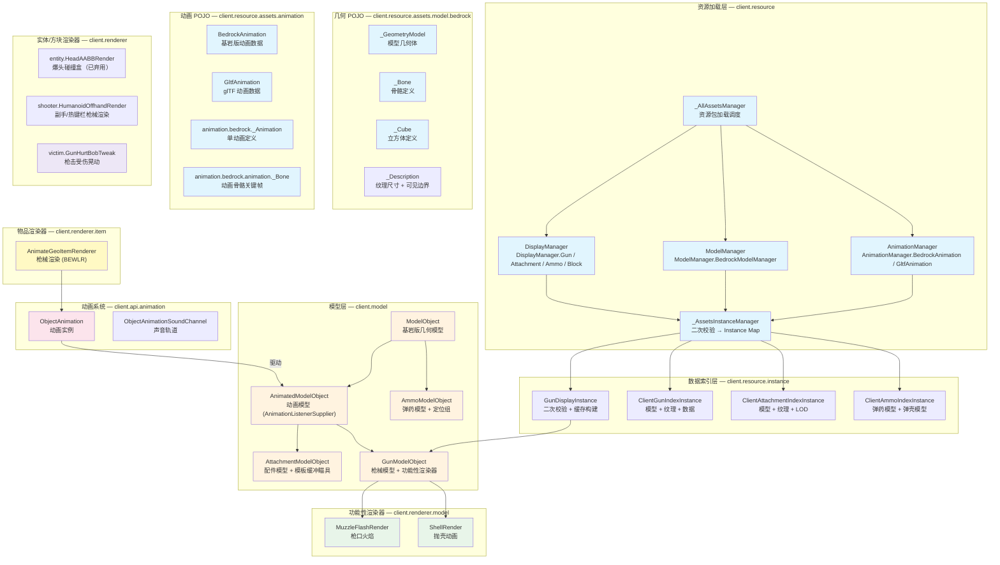

# 渲染体系总览

> 本文档作为渲染架构的导航索引

## 体系总图

## 体系概要

渲染体系解决的核心问题：**如何将 BlockBench 导出的基岩版模型文件，结合基岩版动画和 Lua 状态机，渲染为游戏中的第一/第三人称枪械、配件、弹药和方块实体**。

整个体系分为六个层次：

|层|包路径|职责|
|---|---|---|
|资源加载层|`client.resource`|加载资源包中的 display、model、animation JSON 文件，构建 ResourcePojo → Instance 管道|
|数据索引层|`client.resource.instance`|将二次校验后的 POJO 数据组织为可查询的索引|
|模型层|`client.model`|构建基岩版几何模型的场景图，提供动画监听器接口和功能性渲染注册|
|几何 POJO 层|`client.resource.assets.model.bedrock`|基岩版几何模型的 JSON 数据结构定义（骨骼、立方体、UV）|
|动画 POJO 层|`client.resource.assets.animation`|基岩版动画和 glTF 动画的 JSON 数据结构定义|
|渲染器层|`client.renderer`|对接 Minecraft BEWLR / EntityRenderer，执行实际渲染|

## 关键设计特征

- 统一 ResourcePojo 模型：所有资源 POJO 继承 `ResourcePojo<T>`，通过 `ResourcePojoManager<T>` 管理加载和索引
- 基岩版坐标转换：模型加载时将 BlockBench 的 Y-up 度和绝对坐标转换为 Minecraft 的弧度相对坐标
- 功能性渲染器模式：通过 `IModelComponentRenderer` 接口实现动态渲染逻辑替换
- 两阶段 Instance 构建：POJO 校验（类型安全检查）+ Instance 校验（跨 POJO 索引检查）
- 资源重载后自动刷新：重载后自动切枪触发状态机重新初始化

## 文档导航

|文档|内容|
|---|---|
|[基岩版模型与几何系统](./bedrock-model-geometry.md)|BedrockModel POJO → ModelObject 场景图、骨骼/立方体数据、坐标转换算法|
|[动画系统](./animation-system.md)|ObjectAnimation 动画实例、BedrockAnimation POJO 结构、GunAnimationState 枚举|
|[渲染管线](./render-pipeline.md)|AnimateGeoItemRenderer 枪械渲染、渲染器分类、事件钩子|
|[客户端资源 POJO](./client-resource-pojos.md)|Display POJO（GunDisplay / AttachmentDisplay / AmmoDisplay）、动画 POJO、GunDisplayInstance 缓存|
