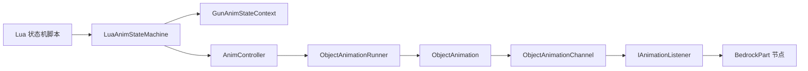

# 动画状态机与轨道

> 动画状态机是渲染链路的「大脑」：它决定当前播放哪些动画、以什么过渡方式衔接，并通过动画控制器把关键帧写入模型。本文说明状态机、状态上下文、轨道、控制器、动画实例这几个概念如何协作，以及 trigger 信号如何驱动状态转移。

## 体系位置

状态机位于资源层与模型渲染之间。`GunDisplayInstance` 在构建时读取 `GunDisplay` 里的动画文件与 Lua 脚本，创建 `AnimController` 和 `LuaAnimStateMachine`。渲染前由 `_LocalAnimHandler` 或渲染器调用状态机的 `update()`，状态机让每个活跃状态运行动画控制器，控制器再把关键帧经动画监听器写入 `GunModelObject` 的场景图。

## 状态机

`AnimStateMachine<T>` 是通用状态机，`LuaAnimStateMachine` 是其 Lua 驱动版本。核心概念：

- 当前状态列表 `currentStates`：状态机可以同时处于多个状态（例如「idle」和「reload」叠加），每个状态是一个 `IAnimationStateContext`。
- 上下文 `context`：一个 `AnimStateContext` 子类，承载状态行为需要的参数（partialTicks、当前物品、轨道数组等）。
- 状态供应器 `statesSupplier`：Lua 版本通过脚本里的 `states` 函数返回初始状态表。

状态机的生命周期方法：

- `initialize()`：把初始状态加入列表并触发各自的 `entryAction`。
- `update()`：更新所有活跃状态并推进动画控制器（写模型）。
- `visualUpdate()`：只更新状态与声音，不写模型（非第一人称用）。
- `trigger(condition)`：遍历所有状态，让每个状态尝试 `transition`，转移成功则先 `exitAction` 旧状态、再 `entryAction` 新状态。
- `exit()`：触发所有状态的 `exitAction` 并清空状态列表。

`exitingTime` 机制用于切枪后延迟重新初始化：收枪动画期间状态机仍处于「已退出但未重初始化」状态，等收枪动画播完再重新 `initialize`。

## 状态上下文

`AnimStateContext` 是状态机与动画控制器之间的桥梁，承载两件东西：

- 离散轨道数组 `DiscreteTrackArray`：状态脚本通过它向控制器分配轨道（见下）。
- 一批操作动画的方法：`runAnimation` / `stopAnimation` / `holdAnimation` / `pauseAnimation` / `resumeAnimation` / `setAnimationProgress` 等。

这些方法由 Lua 状态脚本调用，把「在哪个轨道播放哪个动画、以什么过渡时间衔接」这类决策落到控制器上。

`GunAnimStateContext` 在 `ItemAnimStateContext`（partialTicks、putAwayTime）基础上补充枪械相关信息：当前枪械物品、`IGun`、`GunIndexInstance`、`GunDisplayInstance`、本地射手等，同时实现 `IClientGunScriptApi`，把这些信息暴露给脚本（见 [动画状态机脚本 API](./animation-script-api.md)）。

## 轨道与离散轨道数组

动画控制器维护一组「轨道」（track），每条轨道同一时刻只能跑一个动画实例（或一个过渡）。轨道是有层级诉求的：比如「走路」动画和「换弹」动画要叠在两条不同轨道上互不干扰。`DiscreteTrackArray` 就是状态脚本用来管理「轨道行 → 轨道指针」的容器：

- `addTrackLine()` 新增一行，`assignNewTrack(index)` 在某一行里分配一条新轨道并返回其全局指针。
- `findIdleTrack(index, interruptHolding)` 优先复用某行里已停止（或可打断的 hold）的轨道，避免无谓增轨。
- `getAsSingletonTrack(index)` 适用于一行只需一条轨道的场景。

状态脚本通过 `AnimStateContext` 暴露的轨道方法操作这个数组，而控制器则按数组指定的顺序逐条更新轨道。

## 动画控制器

`AnimController` 持有「动画原型表」和「当前各轨道的 runner」，负责：

- 原型注册：从动画文件解析出的 `ObjectAnimation` 按名称存入原型表，`runAnimation` 时按名取出。
- 轨道运行：`run(track, name, playType, transitionTime)` 克隆原型、绑定监听器、创建 `ObjectAnimationRunner`，有过渡时间时让旧 runner 过渡到新 runner。
- 队列：`queueAnimation` 支持在一条轨道上排队多个 `AnimPlan`，当前动画播完后依次播放。
- 更新：`update()` 按 `updatingTrackArray` 的顺序推进各轨道；`updateSoundOnly()` 只推进声音不写模型。

## 动画实例与轨道

- `ObjectAnimation`：一个命名动画的解析结果，包含「节点名 → 通道列表」的映射和声音轨道。它由 `AnimationHelper.createAnimationFromBedrock()` 从 `BedrockAnimation` POJO 构建。
- `ObjectAnimationChannel`：单个节点单个类型（位移 / 旋转 / 缩放）的关键帧序列，内部用 `IInterpolator` 在关键帧之间插值，并把结果交给该通道的 `IAnimationListener`。
- `ObjectAnimationRunner`：动画实例的播放状态机，维护进度（纳秒）、running / hold / stop / pause 状态，以及过渡目标。`update()` 推进进度并处理过渡插值与声音关键帧。
- 播放类型 `AnimationPlayType`：`PLAY_ONCE_HOLD` 播完定格、`PLAY_ONCE_STOP` 播完停止、`LOOP` 循环。

一条动画的完整播放路径：状态机 `trigger` 决定切换状态 → 状态调用 `runAnimation` → 控制器在轨道上启动 runner → 每帧 `update` 推进 runner → 通道按时间插值 → 监听器把结果写入模型节点。

## trigger 信号

`GunAnimationState` 枚举定义了标准 trigger 信号（如 `draw`、`put_away`、`shoot`、`reload`、`idle`、`walk`、`run`、`inspect`、`bolt`、`switch_fire_mode` 等），每个信号是一个字符串标签。信号来源有两类：

- 玩家输入与枪械动作：`LocalShooter*` 各处理器在对应动作发生时向状态机投递信号，例如 `LocalShooterReload` 投递 `reload` / `cancel_reload`，`LocalShooterShoot` 投递 `shoot`，`LocalShooterDraw` / 收枪流程投递 `draw` / `put_away`。
- 持续状态：`_LocalAnimHandler` 每 tick 根据玩家移动状态投递 `idle` / `walk` / `run`。

信号进入 `AnimStateMachine.trigger()` 后，由每个活跃状态的 `transition(context, condition)` 决定是否转移，从而驱动整个动画状态机流转。
