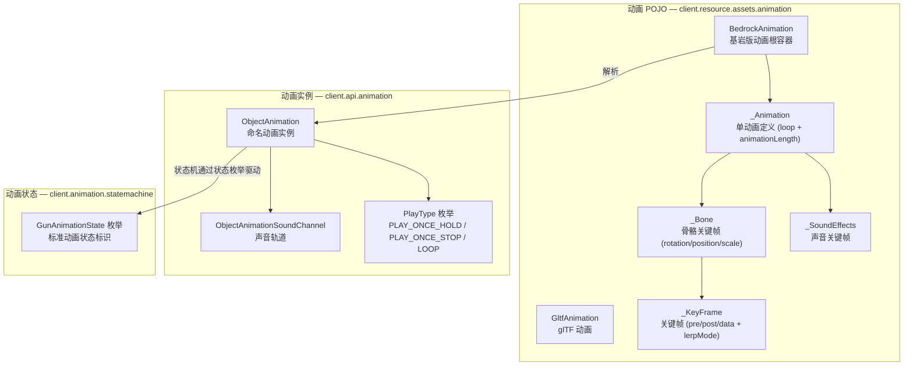

# 动画系统

> ObjectAnimation → GunAnimationState 枚举的完整动画链路

## 体系总览

## 动画 POJO 层

### BedrockAnimation — 基岩版动画

- `formatVersion`：格式版本
- `animations`：`Map<String, _Animation>`，动画名称到动画数据

### _Animation — 单个动画定义

- `loop`：是否循环
- `animationLength`：动画总时长（秒）
- `bones`：`HashMap<String, _Bone>`，骨骼名称到动画骨骼关键帧数据
- `soundEffects`：`_SoundEffects`，声音关键帧

### 动画 _Bone — 骨骼关键帧

每个动画骨骼包含三个 `Double2ObjectRBTreeMap<_KeyFrame>`（时间戳 → 关键帧）：

- `rotation`：旋转关键帧
- `position`：位移关键帧
- `scale`：缩放关键帧

### _KeyFrame — 关键帧

支持三种 JSON 形态：
- **简写数组**：`[x, y, z]`，直接作为 data 值
- **复杂对象**：含 `pre`、`post`、`data`、`lerp_mode` 字段
- **部分简写**：仅有 `pre` 或仅有 `post`

- `pre` / `post`：贝塞尔手柄 `float[3]`（用于三次插值）
- `data`：关键帧值 `float[3]`
- `lerpMode`：插值模式字符串（`"linear"`、`"catmullrom"` 等）

支持 Molang 表达式容错（读取时静默忽略而非崩溃）。

### _SoundEffects — 声音关键帧

`Double2ObjectRBTreeMap<ResourceLocation>`：时间戳 → 声音效果资源位置。

解析格式：`{"0.0": {"effect": "namespace:sound_path"}, "0.5": ...}`，其中每个值对象通过 `effect` 字段表示声音文件路径。

## 动画实例层

### ObjectAnimation

代表一个命名的、可播放的动画实例。核心结构是将骨骼/节点名称映射到动画轨道列表。

关键属性：
- `name`：动画名称，用作状态机中的标识符
- `playType`：播放类型枚举
- 动画轨道 Map：每个骨骼节点各通道（位移/旋转/缩放）的关键帧数据

### ObjectAnimation.PlayType 枚举

|枚举值|行为|
|---|---|
|`PLAY_ONCE_HOLD`|播放一次，停留在最后一帧（如射击动作播放完毕后保持枪口归位）|
|`PLAY_ONCE_STOP`|播放一次后停止（用于一次性过场动画）|
|`LOOP`|循环播放（如 idle 呼吸动画、跑步循环）|

### ObjectAnimationSoundChannel

处理动画中的声音关键帧。在动画播放的时间跨度内，根据声音关键帧时间戳触发声音播放。

通过 `playSound(fromTimeS, toTimeS, entity, soundDistance, volume, pitch)` 在指定时间区间内播放声音。

## 动画状态枚举

### GunAnimationState

`client.animation.statemachine.GunAnimationState` 是实现 `ResourceTag.ConstantTag` 的枚举，定义了标准的枪械动画状态标识：

|枚举常量|标签名称|含义|
|---|---|---|
|`INPUT_BOLT`|`"bolt"`|拉栓|
|`INPUT_DRAW`|`"draw"`|拔枪|
|`INPUT_PUT_AWAY`|`"put_away"`|收枪|
|`INPUT_SWITCH_FIRE_MODE`|`"switch_fire_mode"`|切换开火模式|
|`INPUT_INSPECT`|`"inspect"`|检视|
|`INPUT_BAYONET_MUZZLE`|`"bayonet_muzzle"`|刺刀（枪口）|
|`INPUT_BAYONET_STOCK`|`"bayonet_stock"`|刺刀（枪托）|
|`INPUT_BAYONET_PUSH`|`"bayonet_push"`|刺刀（推刺）|
|`INPUT_RELOAD`|`"reload"`|换弹|
|`INPUT_CANCEL_RELOAD`|`"cancel_reload"`|中断换弹|
|`INPUT_SHOOT`|`"shoot"`|射击|
|`INPUT_WALK`|`"walk"`|行走|
|`INPUT_RUN`|`"run"`|跑步|
|`INPUT_IDLE`|`"idle"`|空闲|

每个枚举常量可携带一个旧标签名称（`typeNameOld`），用于兼容旧版 Lua 脚本的命名。

### ResourceTag 体系

`GunAnimationState` 实现了 `ResourceTag.ConstantTag` 接口，配合 `GunAnimationStateTag`（定义在 `core.api.animation.statemachine` 中）作为标签常量来源。这种分离使标签定义（core.api 层）与枚举实现（client.animation 层）独立，标签定义可被服务端引用而不依赖客户端类。

## 与状态机的关系

`GunAnimationState` 枚举的标签名称作为状态机 `trigger()` 的输入信号。当游戏事件发生时（例如玩家按 R 换弹），系统调用 `stateMachine.trigger(GunAnimationState.INPUT_RELOAD.getTagName())`，状态机评估每个活跃状态是否应转移到新状态。

动画状态的完整生命周期（从触发到模型变形）由状态机驱动，详见 [动画状态机框架](/docs/architecture/core/gun/script/gun-script-framework.md) 和 [Lua 脚本与 modifier 交互](/docs/architecture/core/gun/script/script-and-modifier.md)。
