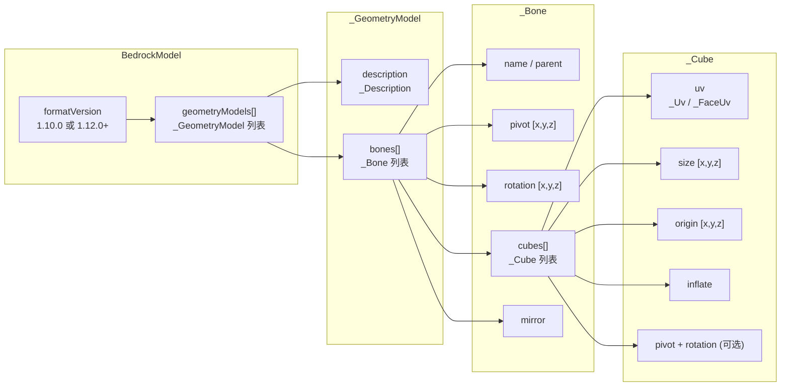

# 基岩版模型与几何系统

> 基岩版几何模型（BlockBench 导出）从 JSON 到 Minecraft 渲染场景图的完整链路

## JSON 数据格式

基岩版模型文件以 `.geo.json` 格式存储，顶层结构：

旧版格式（`format_version: "1.10.0"`）将纹理尺寸和可见边界直接放在根对象，新版格式（`"1.12.0"` 及以上）通过 `_Description` 子对象嵌套。

## 数据 POJO 结构

所有基岩版几何 POJO 均继承 `ResourcePojo<T>`，定义在 `client.resource.assets.model.bedrock` 及其子包中。

### 包结构

|包|POJO 类|对应 JSON 层级|
|---|---|---|
|`assets.model`|`BedrockModel`|根容器|
|`assets.model.bedrock`|`_GeometryModel`|单个模型几何体|
|`assets.model.bedrock.geometry`|`_Bone`|骨骼定义|
|`assets.model.bedrock.geometry`|`_Description`|纹理尺寸和可见边界|
|`assets.model.bedrock.geometry.bone`|`_Cube`|立方体定义|
|`assets.model.bedrock.geometry.bone.cube`|`_Uv`|统一 UV|
|`assets.model.bedrock.geometry.bone.cube`|`_FaceUv`|逐面 UV|

### BedrockModel

根容器，包含：
- `formatVersion`：格式版本
- `geometryModels`：`List<_GeometryModel>`

通过 `fromJson(JsonReader)` 直接从流式 JSON 解析，是 `ResourcePojo<BedrockModel>` 的子类。

### _GeometryModel

- `description`：`_Description`（纹理宽度、高度、可见边界偏移和尺寸）
- `bones`：`List<_Bone>`

### _Bone

- `name` / `parent`：名称和父骨骼名称，`parent` 为空的骨骼作为根节点
- `pivot`：旋转支点 `float[3]`
- `rotation`：初始旋转 `float[3]`（度）
- `cubes`：`List<_Cube>`
- `mirror`：镜像标志

### _Cube

- `origin`：立方体原点 `float[3]`
- `size`：立方体尺寸 `float[3]`
- `inflate`：膨胀因子
- `pivot` / `rotation`：立方体自身的旋转支点和旋转角（可选）
- `uv`：`_Uv` 对象，支持统一 UV 或逐面 UV

### UV 格式

- `_Uv`：统一 UV，所有面共享一组 UV 偏移（未细分字段，适配标准 BlockBench 格式）
- `_FaceUv`：逐面 UV，为六个方向分别定义 UV 原点和大小

## 模型对象层

`client.model` 包将 POJO 数据包装为面向渲染的模型对象：

### ModelObject — 基类

继承 `PojoInstance<BedrockModel>`，在构造时关联 POJO 引用。提供 `fromPojo(BedrockModel)` 工厂方法，返回 null 表示 POJO 校验不通过。

### AnimatedModelObject

继承 `ModelObject`，作为支持动画的模型对象基类。

### GunModelObject

继承 `AnimatedModelObject`，代表枪械的动画基岩版模型。负责注册功能性渲染器和处理配件的动态显示。

### AttachmentModelObject

继承 `AnimatedModelObject`，代表配件的动画基岩版模型。处理模板缓冲瞄具渲染。

### AmmoModelObject

继承 `ModelObject`（不继承 `AnimatedModelObject`），代表子弹的静态基岩版模型。缓存三个定位组路径（fixed / ground / thirdPersonHand）。

## 坐标转换

基岩版（BlockBench）和 Minecraft Java 版使用不同的坐标系，模型加载时需要转换：

|维度|基岩版|Java 版（转换后）|
|---|---|---|
|Y 轴方向|朝上|朝下（相对），无父骨骼时为 `24 - pivotY`，有父骨骼时为 `parentY - pivotY`|
|X / Z 方向|绝对坐标|相对坐标（有父骨骼时减去父骨骼坐标）|
|旋转单位|度|弧度：`degree × π / 180`|
|方块原点 Y|方块顶部|方块底部（额外减去方块 Y 长度）|
|比例|基岩单位 (1/16 块)|渲染时映射为块单位|

## 枪械模型常量

`gun.GunModelType` 枚举定义了模型的分类标识。约定的节点名称参考 `core.api.resource.assets.model.bedrock` 下的标签常量类，涵盖：

- 弹药可视化节点（膛内子弹、弹匣子弹、弹链）
- 弹匣状态节点（标准弹匣、扩容弹匣 L1/L2/L3）
- 瞄具状态节点（机械瞄具、折叠准星、提把、瞄具导轨）
- 相机定位组（机瞄视线、非瞄准视线、改装界面视线、第三人称手持、展示框、掉落物）
- 特效定位组（抛壳起点、枪口火焰、手部定位）
- 配件相关（转接口、弹匣、配件定位后缀/默认后缀）
