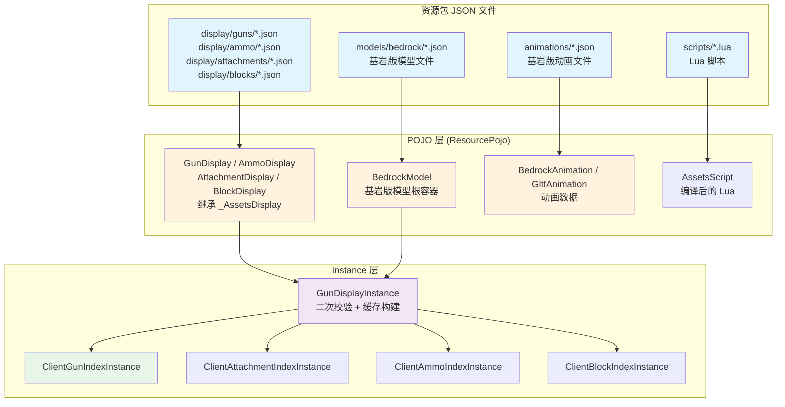
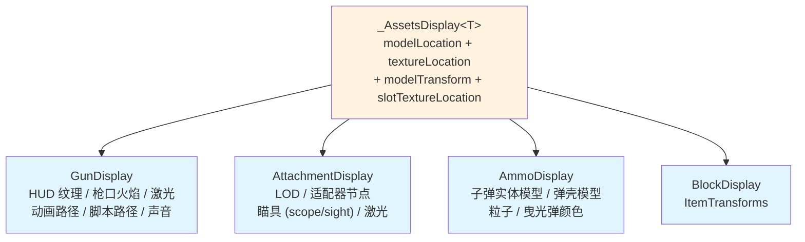

# 客户端资源 POJO

> Display POJO、模型 POJO、动画 POJO 和 GunDisplayInstance 缓存的结构与生命周期

## 资源加载管道

`_AllAssetsManager` 注册多个 `ResourcePojoManager` 子类作为 Minecraft 资源重载监听器。所有 POJO 加载完成后，`_AssetsInstanceManager.reload()` 构建 Instance 对象（二次校验的运行时缓存）。

## ResourcePojo 统一模型

所有资源 POJO 继承 `core.resource.ResourcePojo<T>`，统一的结构为：

- `fromJson(JsonReader)`：静态工厂方法通过流式 GSON 解析 JSON
- `toJson(JsonWriter)`：序列化回 JSON
- `validatePojo()`：校验 POJO 自身字段的合法性（类型检查、非空检查）
- `isValid()`：返回 POJO 是否通过校验
- 统一的标签常量体系：JSON 字段名定义在 `core.api.resource` 的标签常量类中，与解析逻辑分离

## ResourcePojoManager 体系

`client.resource.assets` 包中的 Manager 类继承 `core.resource.ResourcePojoManager<T>`，负责：

- 指定资源包的搜索目录（如 `models/bedrock/`、`display/guns/`）
- 指定文件扩展名过滤
- 提供 `fromJson` 解析函数
- 同时支持新版路径和旧版路径（向后兼容）

### Manager 层级结构

|Manager 基类|子类|管理的 POJO 类型|
|---|---|---|
|`DisplayManager<T>`|`DisplayManager.GunDisplayManager`|`GunDisplay`|
||`DisplayManager.AttachmentDisplayManager`|`AttachmentDisplay`|
||`DisplayManager.AmmoDisplayManager`|`AmmoDisplay`|
||`DisplayManager.BlockDisplayManager`|`BlockDisplay`|
|`ModelManager<T>`|`ModelManager.BedrockModelManager`|`BedrockModel`|
|`AnimationManager<T>`|`AnimationManager.BedrockAnimationManager`|`BedrockAnimation`|
||`AnimationManager.GltfAnimationManager`|`GltfAnimation`|
||`AnimationManager.PlayerAnimationManager`|`BedrockAnimation`（Player Animator 模组）|
|`ClientScriptManager`|—|`AssetsScript`|
|`GunpackInfoManager`|—|`GunpackInfo`|

## Display POJO 类层次

### _AssetsDisplay — 公共基类

所有 Display POJO 的公共字段：

- `modelLocation`：基岩版模型的 `ResourceLocation`
- `textureLocation`：模型纹理
- `modelTransform`：`_ModelTransform`（可选，含三种场景的缩放）
- `slotTextureLocation`：物品栏槽位图标

### GunDisplay — 枪械显示

除基类字段外还包含：

|类别|字段|说明|
|---|---|---|
|材质|`hudTextureLocation` / `hudEmptyTextureLocation`|HUD 覆盖层纹理|
|模型|`gunModelType` / `lodDisplay` / `enableTransparency`|模型类型、LOD、半透明渲染开关|
|显示|`ironZoomScale` / `ironViewFov`|机瞄缩放倍率和 FOV|
|显示|`enableCrosshair`|是否显示原版准星|
|显示|`muzzleFlashDisplay`|枪口火焰配置|
|显示|`modelNodeTextDisplay`|3D 文字覆盖（节点名 → 文字配置）|
|显示|`laserDisplay`|激光瞄准器配置|
|显示|`surroundDisplayByHotbar` / `surroundDisplayByOffhand`|热键栏/副手包围显示|
|显示|`damageDisplayType` / `ammoCountType`|伤害显示/弹药计数样式|
|显示|`ammoDisplayOverride`|曳光弹颜色和弹药粒子覆盖|
|动画|`gunAnimationLocation`|Bedrock 动画文件路径|
|动画|`scriptLocation` / `scriptParam`|Lua 状态机脚本及参数|
|动画|`thirdPersonAnimationType` / `playerAnimatorLocation`|第三人称动画|
|动画|`shellEjectionParam`|抛壳物理参数|
|声音|`gunSounds` / `preloadSoundLocation`|声音映射和预加载|
|操控|`controllableData`|手柄震动配置|

### AttachmentDisplay — 配件显示

|类别|字段|说明|
|---|---|---|
|模型|`lodDisplay` / `adapterNodeName`|LOD 和挂载节点名|
|瞄具|`enableSight` / `enableScope`|是否为瞄准具/瞄准镜|
|瞄具|`scopeZoomScale` / `scopeViewIndex` / `scopeViewFov`|缩放/视图/FOV|
|显示|`showMuzzle` / `showMount`|是否显示枪口和导轨|
|显示|`modelNodeTextDisplay` / `laserDisplay`|3D 文字和激光|
|声音|`attachmentSounds`|配件声音映射|

### AmmoDisplay — 弹药显示

|字段|说明|
|---|---|
|`ammoEntityDisplay`|世界中子弹实体模型和纹理|
|`shellDisplay`|弹壳模型和纹理|
|`ammoParticle`|击中/飞行粒子效果|
|`tracerColor`|曳光弹颜色|

## 可配置显示组件

Display POJO 中可复用的配置组件（以 `_` 前缀命名，表示内部数据类）：

- `_ModelTransform` / `_ModelTransformScale`：三种渲染上下文的缩放因子
- `_LodDisplay`：LOD 模型的 modelLocation + textureLocation
- `_MuzzleFlashDisplay`：枪口火焰纹理和缩放
- `_LaserDisplay`：激光颜色、尺寸、长度
- `_ModelNodeTextDisplay`：3D 文字样式
- `_ShellEjectionParam`：抛壳物理参数
- `_AmmoDisplayOverride`：弹药显示覆盖
- `_AmmoEntityDisplay`：子弹实体模型和纹理
- `_ShellDisplay`：弹壳模型和纹理
- `_AmmoParticle`：粒子位置、计数、存活时间
- `_SurroundDisplay`：热键栏/副手包围显示变换
- `_ControllableData`：手柄震动参数

## 动画 POJO

### BedrockAnimation

- `formatVersion`：格式版本
- `animations`：`Map<String, _Animation>`，动画名称到动画数据

### _Animation（bedrock 子包）

- `loop`：是否循环
- `animationLength`：动画总时长（秒）
- `bones`：`HashMap<String, _Bone>`，骨骼名称到动画骨骼数据
- `soundEffects`：`_SoundEffects`，声音关键帧（`Double2ObjectRBTreeMap<ResourceLocation>`）

### 动画 _Bone / _KeyFrame

每个动画骨骼包含三个 `Double2ObjectRBTreeMap<_KeyFrame>`（旋转/位移/缩放）。`_KeyFrame` 支持 pre/post 贝塞尔手柄、简写数组和 Molang 容忍。

## GunDisplayInstance — 运行时缓存

`GunDisplayInstance` 是 `GunDisplay` POJO 的二次校验和缓存包装器，在 `_AssetsInstanceManager.reload()` 时构建。

### 构建流程

1. 从 `GunDisplay.modelLocation` 查找 `BedrockModel` → 创建 `GunModelObject`
2. 从 `GunDisplay.lodDisplay` 查找 LOD 模型 → 创建 LOD `GunModelObject`
3. 解析 `surroundDisplayByHotbar` 的字符串键为整数
4. 解析弹药粒子的 `ResourceLocation` 为 `ParticleOptions`
5. 加载和编译 Lua 脚本为 `LuaTable`
6. 编译 Lua 脚本参数为 `LuaTable`

### 资源重载时的刷新

1. 若玩家在线且手持枪械：触发 `ShooterGunModifierManager.postChangeEvent()` 刷新属性缓存
2. 自动执行一次切枪（`ILocalShooter.cgc$clientDraw(EMPTY)`），强制状态机重新初始化

## 标签常量体系

所有 POJO 的 JSON 字段名定义在 `core.api.resource` 的标签常量类中，与解析逻辑分离：

- 模型标签：`core.api.resource.assets.model.BedrockModelTag` 及其子包
- 动画标签：`core.api.resource.assets.animation.BedrockAnimationTag` 及其子包
- Display 标签：`core.api.resource.assets.display.GunDisplayTag` 等
- 每个字段标签常量支持新旧两种字段名，实现 JSON 向后兼容
