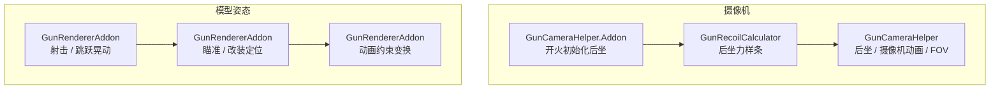

# 枪械附加变换模块

> 枪械渲染不只是「把模型画出来」。第一人称下，一组独立的变换模块会在模型渲染前后叠加，共同决定枪在画面里的位置与姿态。本文逐个说明这些模块解决什么问题、处于哪个阶段、依赖哪些状态。

## 总览

附加变换分两类，落在渲染链路的不同阶段：

- 摄像机类（后坐力、摄像机动画、FOV）：由平台层的摄像机事件驱动 `GunCameraHelper`，发生在模型渲染之外，作用于玩家视角。
- 模型姿态类（射击 / 跳跃晃动、瞄准 / 改装定位、动画约束）：由 `GunRendererAddon.applyFirstPersonGunTransform()` 在 `renderFirstPerson()` 内部依次执行，作用于 `PoseStack` 或模型 root 节点。

## 后坐力

解决开火时镜头跳动的观感。分两段：

1. 初始化：`GunCameraHelper.Addon` 监听 `GUN_FIRE_EVENT`，读取枪械后坐数据（经配件 modifier 修正）和当前射击姿态倍率，调用 `GunRecoilCalculator.getSplineFunction()` 生成一条三次样条曲线，描述开火后 pitch / yaw 随时间的变化。
2. 应用：`GunCameraHelper` 在 `COMPUTE_CAMERA_ANGLES_EVENT` 里按当前时间采样样条，把增量施加到玩家视角。

后坐曲线每次开火重新生成，每发子弹独立，停止射击后自然回落到曲线后段。它依赖 `GunIndexInstance` 的枪械数据、配件 modifier 缓存、射击姿态（潜行 / 趴下倍率）。

## 摄像机动画

由资源包动画里的 `camera` 节点驱动。`AnimatedModelObject` 把 `camera` 节点的动画写进 `CameraAnimationObject`，`GunCameraHelper` 与 `GunItemRenderer` 分别：

- 世界摄像机：`applyLevelCameraAnimation` 在 `COMPUTE_CAMERA_ANGLES_EVENT` 里把四元数转换成 yaw / pitch / roll 加到视角上。
- 手部摄像机：`applyItemInHandCameraAnimation` 在 `BeforeRenderHandEvent` 里把四元数乘到手的 `PoseStack` 上。

两者都按瞄准进度对倍率做缩放，瞄准后摄像机动画减弱。摄像机动画数据消费后会被清空，避免残留到其他视角。

## FOV 与瞄准缩放

`GunCameraHelper` 在 `COMPUTE_FOV_EVENT` 里区分两种 FOV：

- 世界 FOV：按瞄准进度把枪械瞄具倍率 `scopeZoomScale` 转成 FOV，实现开镜放大。
- 手部模型 FOV：优先使用瞄具配件的 `scopeViewFov`，否则用枪械 `ironViewFov`，让瞄准时手部模型与镜内画面匹配。

两者都用二阶动力学平滑过渡，避免 FOV 突变。它依赖 `IGun` 的瞄具信息、`ClientAttachmentIndexInstance` 的配件显示数据。

## 射击晃动与跳跃晃动

`GunRendererAddon` 里的程序化晃动，直接写模型 root 节点的 offset 与附加四元数：

- 射击晃动：开火后的短暂时间窗口内，用平滑随机噪声给 root 节点叠加 X 轴位移和 Y 轴旋转，按瞄准进度衰减。
- 跳跃晃动：检测玩家起跳 / 落地的垂直速度，用二阶动力学生成 Y 轴晃动并写入 root 节点。

它们与 [主渲染链路](./render-pipeline.md) 里「抵消原版视角晃动、改为写入模型」的做法一致：程序化晃动都不走原版手部渲染，而是直接改模型姿态。

## 瞄准与改装界面定位

`GunRendererAddon._applyFirstPersonPositioningTransform()` 是持枪姿态的核心，它在多个摄像机定位组之间插值：

- 腰射：用 `idle_view` 定位组。
- 机瞄：未装瞄具时用 `iron_view`；装了瞄具时用 `scope_pos` 定位组加上瞄具的 `scope_view` 视野路径。
- 改装界面：打开界面时用改装界面各槽位的视角定位组。

插值由瞄准进度、改装界面开启进度、改装界面槽位切换进度三组量共同驱动。多个 `scope_view` 之间切换时还有额外的二阶动力学平滑。定位组的概念见 [模型与几何系统](./model-and-geometry.md)。

## 动画约束变换

`_applyAnimationConstraintTransform()` 处理「动画约束」节点：读取约束点经过动画变换前后的坐标差，按约束系数反向补偿，抵消动画对约束点造成的位移与旋转。这样可以让某些节点的动画只影响局部姿态、不带动整体漂移。它依赖 `AnimatedModelObject` 的 `ConstraintObject`（动画写入）与约束路径，权重随瞄准进度与改装进度插值。

## 蹲下侧倾

蹲下侧倾没有硬编码的变换，而是一个暴露给脚本的谓词：`shouldTilting()` 综合「玩家是否下蹲」「配置是否禁用」「枪械数据是否开启 `enable_tilting`」三个条件，返回当前是否应侧倾。资源包脚本据此触发自己定义的侧倾动画，实际倾斜姿态由脚本动画决定（见 [动画状态机脚本 API](./animation-script-api.md)）。

## 受伤晃动

当本地玩家被子弹命中时，`GunHurtBobTweak` 接管原版的受伤镜头晃动：`PROJECTILE_HIT_ENTITY_EVENT` 记录命中时间戳与枪械数据里的晃动倍率，`GameRendererMixin` 在 `bobHurt` 里用它替换原版晃动矩阵。它属于「被枪击中」这一侧的相机效果，与上面的「持枪」变换共用同一批相机事件与 Mixin 钩子。

## 模块依赖关系

这些模块共享同一批状态来源，互相之间通过进度量协调：

- 瞄准进度 `getRenderAimingProgress`：同时作用于摄像机动画缩放、FOV、射击晃动衰减、动画约束权重。
- 改装界面进度：由 `RefitScreenTransformState` 维护，作用于第一人称定位变换。
- 开火时间戳：由 `GUN_FIRE_EVENT` 写入，同时驱动后坐力（摄像机）和枪口火焰（功能性渲染器，见 [功能性渲染器](./functional-renderers.md)）。
