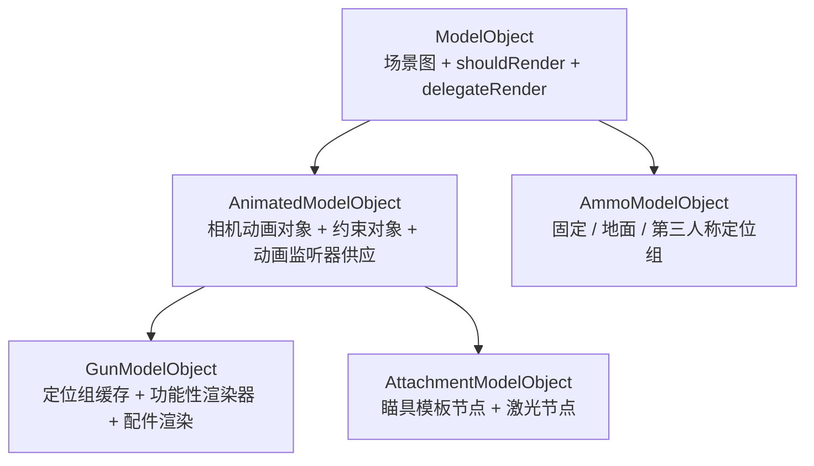

# 模型与几何系统

> 基岩版几何文件（`.geo.json`）先被解析成 POJO，再在加载时转成面向渲染的场景图（`BedrockPart` 节点树）。模型对象层在场景图之上缓存各类定位组路径并注册功能性渲染器。本文说明这一层的结构与坐标转换。

## 从 POJO 到场景图

几何 POJO 定义在 `client.resource.assets.model` 及其子包：

|POJO|对应 JSON 层级|
|---|---|
|`BedrockModel`|根容器，含格式版本与几何模型列表|
|`bedrock._GeometryModel`|单个几何体，含描述与骨骼列表|
|`bedrock.geometry._Bone`|骨骼，含 pivot、rotation、parent、cubes|
|`bedrock.geometry.bone._Cube`|立方体，含 origin、size、uv、可选旋转|
|`bedrock.geometry.bone.cube._Uv`|统一 UV 或逐面 UV|

`_ModelLoader.loadNewModel()` 负责把 `_GeometryModel` 转成场景图。它做两趟遍历：

1. 第一趟把所有骨骼名写入 `indexBones` 和 `modelMap`，为每根骨骼建立一个空的 `BedrockPart`。
2. 第二趟填充数据：计算旋转点、设置旋转、绑定父子关系、把立方体转成 `BedrockCubeBox`（统一 UV）或 `BedrockCubePerFace`（逐面 UV）。

只有没有父骨骼的 `BedrockPart` 才进入 `shouldRender` 列表作为渲染根；挂在父骨骼下的子骨骼不单独渲染，而是随父节点一起遍历。

## 坐标转换

基岩版（BlockBench）与 Minecraft Java 版坐标系不一致，加载时通过 `ClientModelUtils` 转换：

|维度|基岩版|Java 版（转换后）|
|---|---|---|
|旋转单位|度|弧度（`rotation_BEtoJE`）|
|旋转点 Y（根骨骼）|绝对 Y|`24 - pivotY`（`pivot_BEtoJE`）|
|旋转点 Y（子骨骼）|绝对 Y|`父pivotY - 本pivotY`|
|旋转点 X / Z（子骨骼）|绝对|`本pivot - 父pivot`|
|立方体原点 Y|绝对|`pivotY - originY - sizeY`（`origin_BEtoJE`）|
|立方体原点 X / Z|绝对|`origin - pivot`|

转换后的模型仍以基岩版的「方块顶部、Y 向上」为基准，渲染时再统一 `translate(0, 1.5, 0)` 并翻转 180°，把渲染原点从 `(0, 24, 0)` 对齐到 `(0, 0, 0)`。

## 模型对象层次

`client.model` 包在场景图之上提供分类型的模型对象，它们都是 `PojoInstance<BedrockModel>` 的子类，`fromPojo()` 失败时返回 null 表示 POJO 校验不过：

### ModelObject

模型对象的基类。持有场景图、`indexBones`、`shouldRender`、`delegateRenderers`。它实现了模型主体渲染：遍历 `shouldRender` 调用每个节点的 `render()`，结束后执行 `delegateRenderers` 里的渲染器（延迟渲染机制，见 [功能性渲染器](./functional-renderers.md)）。

### AnimatedModelObject

在基类之上初始化两个动画相关对象：

- 相机动画对象：绑定名为 `camera` 的节点，用于驱动摄像机动画。
- 约束对象：绑定名为 `constraint` 的节点，供第一人称的动画约束变换读取。

它还实现 `IAnimationListenerSupplier`，为每个节点 + 轨道类型供应对应的动画监听器（位移 / 旋转 / 缩放），把动画关键帧写入 `BedrockPart`。

### GunModelObject

枪械专用的模型对象。`resetCache()` 通过 `_GunLoader` 缓存所有定位组路径并注册功能性渲染器：

- 摄像机定位组：机瞄视线、idle 视线、瞄具定位组、改装界面各槽位视角。
- 渲染原点定位组：第三人称手持、展示框、地面。
- 特效定位组：枪口火焰、抛壳、激光、弹匣、额外弹匣。

它还维护 `currentAttachmentItem`（各槽位当前配件）、`adapterToRender`（需渲染的转接口）、`shellRenders`（抛壳渲染器列表）。

### AttachmentModelObject

配件专用的模型对象，额外缓存瞄具相关节点：镜身、目镜环、目镜（ocular）、准心（division）、开镜视野、激光。这些节点在渲染瞄具模板时使用（见 [功能性渲染器](./functional-renderers.md)）。

### AmmoModelObject

弹药模型对象，只缓存固定 / 地面 / 第三人称手持三个定位组，不参与动画。

## 定位组的作用

定位组（positioning node）是模型里约定命名的空节点，本身不可见，只用来给代码提供「这个位置在世界 / 摄像机坐标系里的变换」。模型加载后，`_GunLoader` 把从根节点到定位组的完整路径缓存起来，渲染或变换时按路径逆推反相矩阵，把定位组所在位置作为渲染中心或摄像机原点。

例如机瞄定位组 `iron_view` 决定第一人称瞄准时枪械对准眼睛的位置，`idle_view` 决定腰射时的持枪姿态。第一人称变换编排（见 [枪械附加变换模块](./gun-render-addons.md)）就是在多个定位组之间插值。
