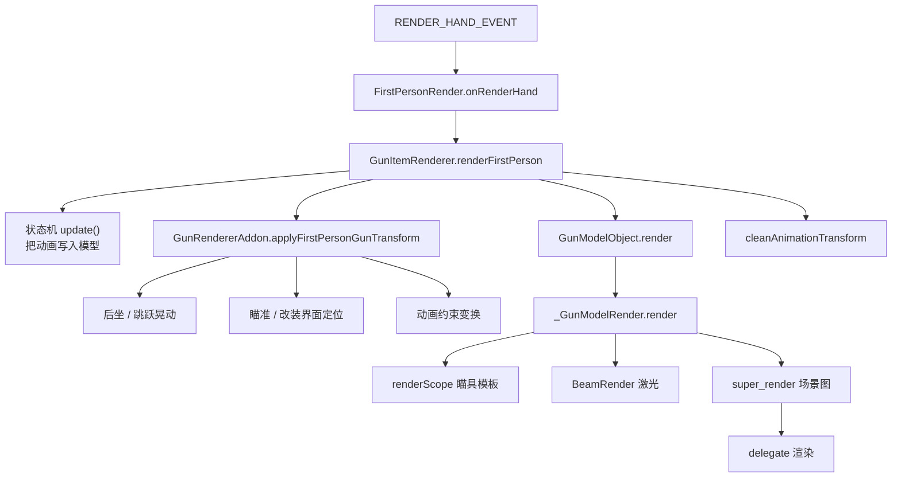

# 主渲染链路

> 从第一人称渲染事件开始，到枪械模型真正被绘制，中间经过状态机、变换编排、配件渲染与 delegate 渲染。本文只描述主链路的模块间调用关系，不展开各模块的内部实现（后坐力、摄像机等见 [枪械附加变换模块](./gun-render-addons.md)，功能性渲染器见 [功能性渲染器](./functional-renderers.md)）。

## 第一人称链路总图

## 第一人称渲染流程

`FirstPersonRender` 从事件拿到物品栈后，调用 `GunItemRenderer.renderFirstPerson()`，其内部按以下顺序执行：

1. 解析物品：通过 `ClientResourceApi.getGunDisplayInstance()` 拿到 `GunDisplayInstance`，进而取得 `GunModelObject` 和 `LuaAnimStateMachine`。
2. 更新状态机：先把 partialTicks 和当前枪械物品写入 `GunAnimStateContext`，再调用 `stateMachine.update()`，让当前状态计算出的关键帧通过动画监听器写入模型节点的 offset / 旋转 / 缩放。
3. 抵消原版晃动：把原版施加在手上的视角晃动反向抵消，转而以 root 节点的 offset 与附加四元数写入模型，作为自定义的走路 / 跑步晃动来源。
4. 移到模型原点并翻转：`translate(0, 1.5, 0)` 把渲染原点从 `(0, 24, 0)` 移到 `(0, 0, 0)`，再绕 Z 轴旋转 180° 摆正上下颠倒的基岩版模型。
5. 应用第一人称变换：`GunRendererAddon.applyFirstPersonGunTransform()` 依次叠加后坐 / 跳跃晃动、瞄准 / 改装界面定位、动画约束变换。
6. 渲染模型：调用 `GunModelObject.render()`，它委托给 `_GunModelRender.render()`。
7. 缓存枪口位置：`cacheMuzzlePosition()` 计算枪口相对摄像机的坐标，供第一人称曳光弹使用。
8. 清理动画变换：`cleanAnimationTransform()` 把写入模型的动画 offset / 旋转 / 缩放清零，避免污染其他视角。

## 模型渲染内部

`_GunModelRender.render()` 是枪械模型的渲染核心，它把多个独立模块串起来：

1. 刷新状态：记录当前枪械物品、清空配件转接口集合、遍历所有配件槽位更新 `currentAttachmentItem` 缓存，并读取弹匣类别与瞄具导轨显示需求。
2. 渲染激光：若有激光节点路径，先调 `BeamRender.render()`。
3. 渲染瞄具：`renderScope()` 先渲染 scope 配件并开启模板测试（详见 [功能性渲染器](./functional-renderers.md)）。
4. 渲染主体：`super_render()` 遍历场景图绘制枪身，随后执行 delegate 渲染器（枪口火焰、抛壳、手臂、文字、配件）。

这个结构说明：配件、激光、瞄具、delegate 渲染器都挂在主模型渲染的固定阶段上，而不是各自独立调度。

## 非第一人称链路

第三人称主手、掉落物、展示框走 `GunItemRenderer.renderByItem()`：

- GUI 分支渲染槽位图标。
- 其他分支先做 LOD 替换（`ClientRenderDistance.shouldRenderLod()`），再应用对应定位组的位移 / 旋转 / 缩放，最后调用 `GunModelObject.render()`。此路径同样会走 `_GunModelRender.render()` 的配件 / 激光 / delegate 逻辑。

## 摄像机与 FOV 链路

第一人称的摄像机与 FOV 调整与模型渲染并行，由平台层投递的摄像机事件驱动 `GunCameraHelper`：

- `COMPUTE_CAMERA_ANGLES_EVENT`：应用摄像机动画（`applyLevelCameraAnimation`）与后坐力（`_applyCameraRecoil`）。
- `COMPUTE_FOV_EVENT`：区分世界渲染与手部渲染两种 FOV，分别应用瞄具倍率（世界）与配件 / 机瞄 FOV（手部）。

这些逻辑与 [枪械附加变换模块](./gun-render-addons.md) 里的后坐力、瞄准紧密相关。

## 主链路中的数据来源

链路里反复出现的几个数据入口都收敛到 `ClientResourceApi`：

- 枪械模型、纹理、动画、状态机脚本：来自 `GunDisplayInstance`（由 `GunDisplay` POJO 二次校验构建）。
- 配件模型、瞄具视野、激光：来自 `ClientAttachmentIndexInstance`。
- 弹壳模型：来自 `ClientAmmoIndexInstance`（抛壳时用）。

这些 Instance 的构建与读取方式见 [资源读取](./resource-reading.md)。
