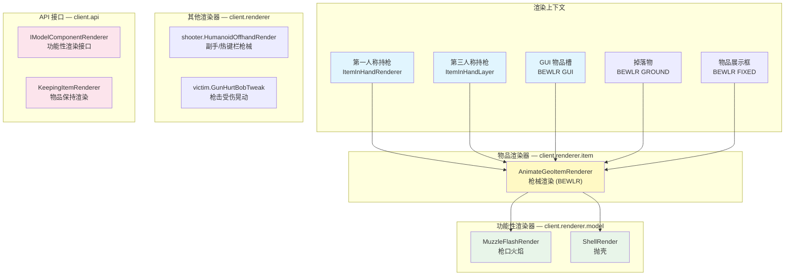

# 渲染管线

> 从物品渲染器（BEWLR）到 Minecraft 渲染管线的流程概览

## 渲染上下文总览

渲染覆盖了多种 Minecraft 渲染上下文：



物品渲染全部通过 `BlockEntityWithoutLevelRenderer`（BEWLR）体系实现，绕过 MC 原版的 JSON 模型系统，直接操作基岩版模型。

## AnimateGeoItemRenderer — 枪械渲染器

`client.renderer.item.AnimateGeoItemRenderer` 是枪械物品的完整渲染器。处理第一人称和第三人称枪械渲染，包括动画播放、音效触发。

### 第一人称渲染流程

`renderFirstPerson()` 的执行顺序：

1. 获取模型对象、纹理和 `GunDisplayInstance`
2. 更新动画状态机，将动画数据写入模型
3. 取消原版视角晃动，将其作为根节点偏移重新应用到基岩版模型
4. 平移到模型原点并翻转
5. 应用第一人称定位变换（瞄准、后坐力、改装界面等）
6. 设置功能性渲染器标记（`MuzzleFlashRender.isSelf` 等）
7. 渲染模型
8. 清除动画变换残留

### 非第一人称渲染

GUI 上下文中渲染平面槽位图标；其他上下文（第三人称、掉落物、展示框）应用定位变换和缩放变换后渲染模型。

### 动画生命周期

- `triggerDraw()`：初始化状态机、播放拔枪音效
- `triggerPutAway()`：退出状态机、播放收枪音效

## 功能性渲染器

### IModelComponentRenderer 接口

```java
void render(PoseStack poseStack, VertexConsumer vertexBuffer,
            ItemDisplayContext transformType, int light, int overlay);
```

实现类通过模型对象注册到特定节点，渲染时由对应的模型部件调用。

### MuzzleFlashRender

枪口火焰效果：射击时记录时间戳和随机旋转角度，在 50ms 时间窗口内通过两阶段渲染（半透明背景层 + 加性混合发光层）产生火焰视觉效果。

### ShellRender

抛壳动画效果：维护弹壳队列（上限 128），每个弹壳按匀变速直线运动公式计算位移，按角速度计算旋转，使用弹壳模型渲染。

## 其他渲染器

### HumanoidOffhandRender

第三人称枪械渲染：处理其他实体手持枪械时的可见性（副手和热键栏），确保枪械在非第一人称视角下正确显示。

### GunHurtBobTweak

枪击受伤镜头调整：当本地玩家被枪械击中时，替换原版受伤晃动逻辑，根据枪械数据中配置的晃动倍率调整受伤晃动的幅度。通过 `ProjectileHitEntityEvent` 触发，在渲染帧通过 `onHurtBobTweak()` 应用自定义晃动矩阵。

## KeepingItemRenderer 接口

`client.api.renderer.KeepingItemRenderer` 用于在物品切换动画后延长物品可见性。通过 Mixin 注入到 `ItemInHandRenderer`：

- `cgc$keep(itemStack, timeMs)`：在指定时间内用保持的物品覆盖主手物品
- `cgc$getCurrentItem()`：获取当前应渲染的物品（保持期内返回保持的物品，过期后返回实际主手物品）
- `cgc$getRenderer()`：通过 `fromItemInHandRenderer()` 获取当前 `ItemInHandRenderer` 的 `KeepingItemRenderer` 接口实例

## 渲染顺序

第一人称枪械渲染的完整事件顺序：

1. Mixin 层：`ItemInHandRendererMixin` 触发 `BeforeRenderHandEvent`
2. 相机动画应用（通过事件处理）
3. `AnimateGeoItemRenderer.renderFirstPerson()`：状态机更新 + 模型渲染
4. 第一人称变换编排应用（瞄准、后坐力、改装界面等）
5. 功能性渲染器（枪口火焰、抛壳等）
6. `KeepingItemRenderer` 保持物品机制确保拔枪/收枪动画期间物品不消失
