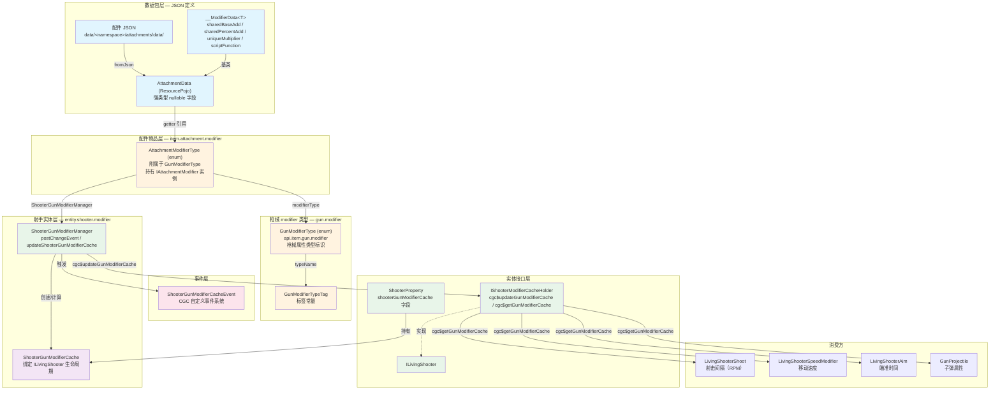

# Shooter Gun Modifier 体系

> CGC 对 TaCZ 配件属性修改器体系的重构版本。覆盖从 `AttachmentModifierType` 枚举 → `ShooterGunModifierCache` 缓存 → `ShooterGunModifierManager` 管理器 → 事件 → 消费方的完整链路。

## 体系总览

## 体系架构

本体系解决的核心问题：**配件的 JSON 数据如何影响射手持有的枪械的运行时属性**。

### 三层职责划分

| 层 | 包路径 | 职责 | 关键类 |
|---|---|---|---|
| **数据定义层** | `api.item.gun.modifier` | 定义 gun modifier 的类型标识（typeName） | `GunModifierType` 枚举, `GunModifierTypeTag` |
| **配件实现层** | `api.item.attachment.modifier` | 附属于 GunModifierType，持有 `IAttachmentModifier` 计算实例 | `AttachmentModifierType` 枚举 |
| **缓存计算层** | `entity.shooter.modifier` | 缓存生命周期管理、计算编排、事件触发 | `ShooterGunModifierManager` |
| **缓存存储层** | `api.entity.shooter` | 缓存在实体上的存取接口 | `IShooterModifierCacheHolder`, `ShooterGunModifierCache` |

### 架构要点

- `GunModifierType` 是枪械 modifier 的**权威类型标识**——定义 typeName，未来任何来源（attachment/ammo/其他）的 gun modifier 都指向它
- `AttachmentModifierType` **附属于** `GunModifierType`——每个常量持有对应的 `GunModifierType` 引用和 `IAttachmentModifier` 计算实例
- 所有 gun modifier 类型的权威来源在 `GunModifierType`，`AttachmentModifierType` 为当前唯一的实现来源（一一对应，未来可扩展非 attachment 来源）

## 重构设计哲学

### 枚举替代字符串（类型安全）

| 维度 | TaCZ（原版） | CGC（重构） |
|---|---|---|
| Modifier 标识 | `String` ID（如 `"ads"`, `"damage"`） | `GunModifierType` 枚举（类型标识）+ `AttachmentModifierType` 枚举（计算实例） |
| JSON 字段名 | 散落在各 Modifier 的 `@SerializedName` | 集中在 `GunModifierTypeTag` 常量类 |
| AttachmentData 修改器存储 | `Map<String, JsonProperty<?>>` | 强类型 nullable 字段，每个枚举有一个 getter |
| 从 AttachmentData 取值 | `data.getModifier().get(id).getValue()` + 强制转换 | `type.modifier.getModifier(data)` + 编译期类型检查 |

### 语义化重命名

| TaCZ 名称 | CGC 名称 | 含义变更 |
|---|---|---|
| `AttachmentCacheProperty` | `ShooterGunModifierCache` | 明确此为**射手枪械修饰缓存**，绑在 ILivingShooter 生命周期 |
| `AttachmentPropertyManager` | `ShooterGunModifierManager` | 强调管理的是**射手枪械修饰器** |
| `ShooterDataHolder` | `ShooterProperty` | 精简名称 |
| `IGunOperator` | `ILivingShooter`（含 `IShooterModifierCacheHolder`） | 语义精确 + 接口隔离 |
| `AttachmentPropertyEvent` | `ShooterGunModifierCacheEvent` | 事件描述缓存更新动作 |
| `IGunOperator.updateCacheProperty` | `IShooterModifierCacheHolder.cgc$updateGunModifierCache` | 明确修饰缓存概念 |
| `addend` / `percent` / `multiplier` | `sharedBaseAdd` / `sharedPercentAdd` / `uniqueMultiplier` | 明确共享/唯一的语义 |

### 接口替代枚举字段（可扩展性）

`AttachmentModifierType` 枚举已全部迁移完成，每个常量持有 `IAttachmentModifier` 实例。计算逻辑通过接口层次（`IItemModifier` → `IGunModifier` → `I*Modifier` → `IAttachmentModifier` → `AttachmentModifier` → 具体类）分离。详见 [AttachmentModifierType 枚举](./modifier-type.md)。

## 文档导航

| 文档 | 内容 |
|---|---|
| [JSON 数据结构](./data-structure.md) | `__ModifierData<T>` 基类与子类, `AttachmentData` 强类型字段设计, JSON 标签常量体系 |
| [AttachmentModifierType 枚举](./modifier-type.md) | 枚举设计、附属于 GunModifierType、持有 IAttachmentModifier 实例、与 TaCZ 字符串键体系的对比 |
| [缓存系统](./cache-system.md) | `ShooterGunModifierCache` 生命周期、`ShooterGunModifierManager` 管线、`IShooterModifierCacheHolder` 接口 |
| [事件与通知](./event-and-notification.md) | `ShooterGunModifierCacheEvent` 事件设计、自定义事件派发流 |
| [Modifier 计算流程](./calculation-flow.md) | CGC 重构后 `IItemModifier`→`IAttachmentModifier`→`AttachmentModifier` 计算管线、与 TaCZ 的差异 |
| [消费方汇总](./consumer-sites.md) | 所有 `cgc$getGunModifierCache()` 调用位置、消费模式、当前 TODO 状态 |
| [迁移对照](./migration-mapping.md) | TaCZ → CGC 逐类迁移映射与兼容说明 |
| [接口设计演进](./design-evolution.md) | 从 TaCZ 到 CGC 最终方案的设计推演，含各候选方案的 Mermaid 图和否决原因 |
