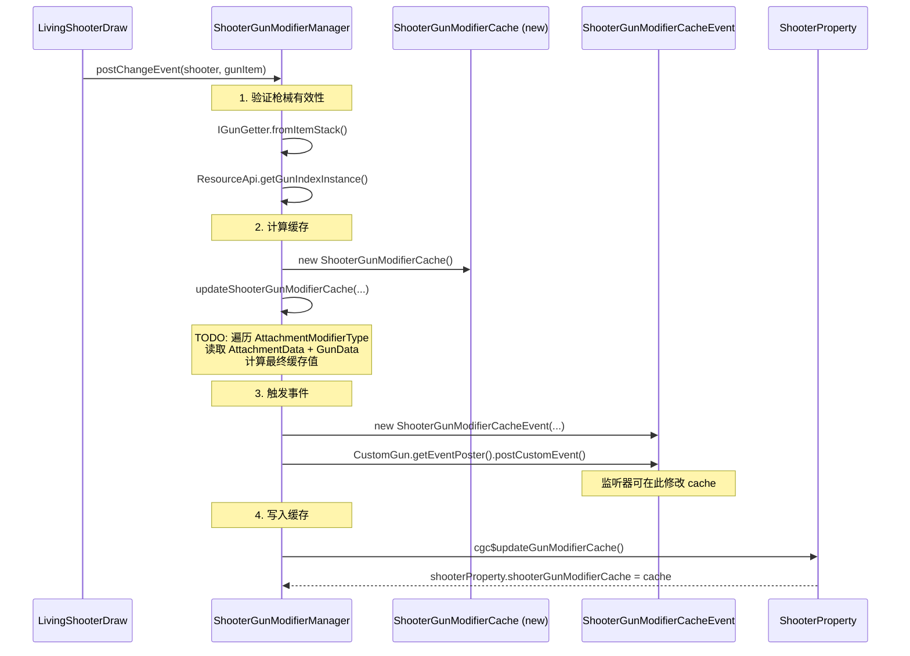

# 缓存系统 — CGC 重构版

> `ShooterGunModifierCache` 的架构设计、生命周期、与 `ShooterGunModifierManager` 的配合关系。

## 命名语义

`ShooterGunModifierCache` 的名称明确了三个事实：
- **Shooter** — 绑定在射手（`ILivingShooter`）上
- **Gun** — 缓存作用的是枪械属性
- **Modifier** — 缓存内容是被修饰器（modifier）修改过的属性值
- **Cache** — 这是一个计算缓存（临时值），区别于持久化保存的属性。保留 Cache 后缀以区分持久化属性和临时计算值

与 TaCZ 的 `AttachmentCacheProperty` 相比：
- 消除了 "Attachment" 引起的歧义——cache 存的是 gun 属性的计算结果，不是 attachment 数据本身
- 保留了 "Cache" 后缀——说明这是计算结果的临时缓存，不是权威数据源

## 实体接口架构

```
                    ILivingShooter
                    ├── IGunOperator (枪械操作: draw/shoot/aim...)
                    ├── IShooterState (弹药检查/冲刺状态)
                    ├── ISynGunState (同步状态查询)
                    └── IShooterModifierCacheHolder (修饰缓存存取) ← 本体系关注
                            ├── cgc$updateGunModifierCache(ShooterGunModifierCache)
                            └── cgc$getGunModifierCache() → @Nullable ShooterGunModifierCache
```

### IShooterModifierCacheHolder

`xiao.customgun.core.api.entity.shooter.IShooterModifierCacheHolder`

```java
public interface IShooterModifierCacheHolder {
    void cgc$updateGunModifierCache(ShooterGunModifierCache modifierCache);
    @Nullable ShooterGunModifierCache cgc$getGunModifierCache();
}
```

**接口隔离原则**：修饰缓存的存取被独立在 `IShooterModifierCacheHolder` 接口中。消费缓存值的代码只需依赖此接口，不需要知道 `IGunOperator` 的全部方法。

### 实现：LivingEntityMixin

```java
// LivingEntityMixin 实现
@Override public void cgc$updateGunModifierCache(ShooterGunModifierCache modifierCache) {
    this.cgc$shooterProperty.shooterGunModifierCache = modifierCache;
}
@Override public @Nullable ShooterGunModifierCache cgc$getGunModifierCache() {
    return this.cgc$shooterProperty.shooterGunModifierCache;
}
```

缓存存储在 `ShooterProperty.shooterGunModifierCache` 字段中。

## ShooterProperty 的缓存字段

```java
public class ShooterProperty {
    // ... 其他字段 ...
    
    /**
     * 配件修改过的各种属性缓存
     */
    @Nullable
    public ShooterGunModifierCache shooterGunModifierCache = null;
}
```

注意 `resetProperty()` 方法**不会**清除 `shooterGunModifierCache`——缓存在切枪时才更新，不受射击状态重置的影响。

## ShooterGunModifierManager — 缓存编排

`xiao.customgun.core.entity.shooter.modifier.ShooterGunModifierManager`

这是 CGC 修饰缓存体系的管理器（对应 TaCZ 的 `AttachmentPropertyManager`）。

### 当前实现

```java
public class ShooterGunModifierManager {
    public static void postChangeEvent(LivingEntity livingShooter) {
        postChangeEvent(livingShooter, livingShooter.getMainHandItem());
    }

    public static void postChangeEvent(LivingEntity livingShooter, ItemStack gunItem) {
        IGun iGun = IGunGetter.fromItemStack(gunItem);
        if (iGun == null) return;

        var gunLocation = iGun.getGunLocation(gunItem);
        GunIndexInstance gunIndexInstance = ResourceApi.getGunIndexInstance(gunLocation);
        if (gunIndexInstance == null) return;

        // 1. 计算缓存值
        ILivingShooter iLivingShooter = ILivingShooterGetter.cgc$fromLivingEntity(livingShooter);
        ShooterGunModifierCache gunModifierCache = updateShooterGunModifierCache(gunIndexInstance, iGun, gunItem);

        // 2. 触发事件
        CustomGun.getEventPoster().postCustomEvent(new ShooterGunModifierCacheEvent(
            CustomGun.getSideExecutor().getLogicalSide(),
            iLivingShooter, livingShooter,
            iGun, gunItem,
            gunModifierCache));

        // 3. TODO: 脚本修改缓存值（对应 TaCZ GunProperties）
        {
            ShooterProperty shooterProperty = iLivingShooter.cgc$getShooterProperty();
            // TODO GunProperties移植
        }

        // 4. 写入缓存
        iLivingShooter.cgc$updateGunModifierCache(gunModifierCache);
    }

    private static ShooterGunModifierCache updateShooterGunModifierCache(
            GunIndexInstance gunIndexInstance, IGun iGun, ItemStack gunItem) {
        ShooterGunModifierCache cache = new ShooterGunModifierCache();
        GunData gunData = gunIndexInstance.getGunData();
        // TODO 原 ChangeGunPropertyEvent — 计算逻辑待实现
        return cache;
    }
}
```

### 管线设计



### 待实现的 TODO

`updateShooterGunModifierCache()` 中标注了 `// TODO 原 ChangeGunPropertyEvent`。需要实现的内容对应 TaCZ 的：

1. **初始化**：遍历所有 `AttachmentModifierType`，从 `GunData` 读取枪械的默认属性值创建初始缓存
2. **收集配件数据**：遍历枪上安装的所有配件，收集每个 `AttachmentModifierType` 对应的修改数据
3. **计算**：对每个 modifier，将默认值 + 所有配件的修改值组合计算写入最终缓存
4. **Lua 脚本更新**：在事件触发后、写入实体前调用脚本修改

## 缓存的生命周期

### 创建/更新时机

缓存在以下时机创建或更新：
1. **实体初始化**：`LivingEntityMixin.cgc$initLivingShooter()` → `ShooterGunModifierManager.postChangeEvent()`
2. **切枪**：`LivingShooterDraw.draw()` → `ShooterGunModifierManager.postChangeEvent()`
3. **脚本触发**：Lua 脚本调用的更新路径

### 不更新时机

`ShooterProperty.resetProperty()` **不重置** `shooterGunModifierCache`，理由：
- 缓存与枪械物品相关，不是射击状态相关
- 重置射击状态（如换弹后）不需要重新计算配件属性
- 只有在切枪/换枪时才需要刷新缓存

## ShooterGunModifierCache 类设计（待实现）

当前 `ShooterGunModifierCache.java` 是一个空类，位于 `xiao.customgun.core.api.entity.shooter.modifier` 包：

```java
/*
文档译名: 射手枪械修饰缓存 (XiaoColorful译)
- Cache后缀还是决定保留，以区分持久化保存的属性和临时计算值
 */
public class ShooterGunModifierCache {
}
```

**设计约束**：
1. 不能是简单的 `Map<String, Float>` — 不是所有缓存值都是 `Float` 类型
2. 缓存值类型多样：`_SimpleModifierData` 结果（float）、`_FireAspectModifierData` 结果（boolean）、`_BulletExplosionModifierData` 结果（复合）、`_RecoilDataModifierData` 结果（pitch/yaw pair）等
3. 需要支持 Lua 脚本的 `scriptFunction` 字段执行
