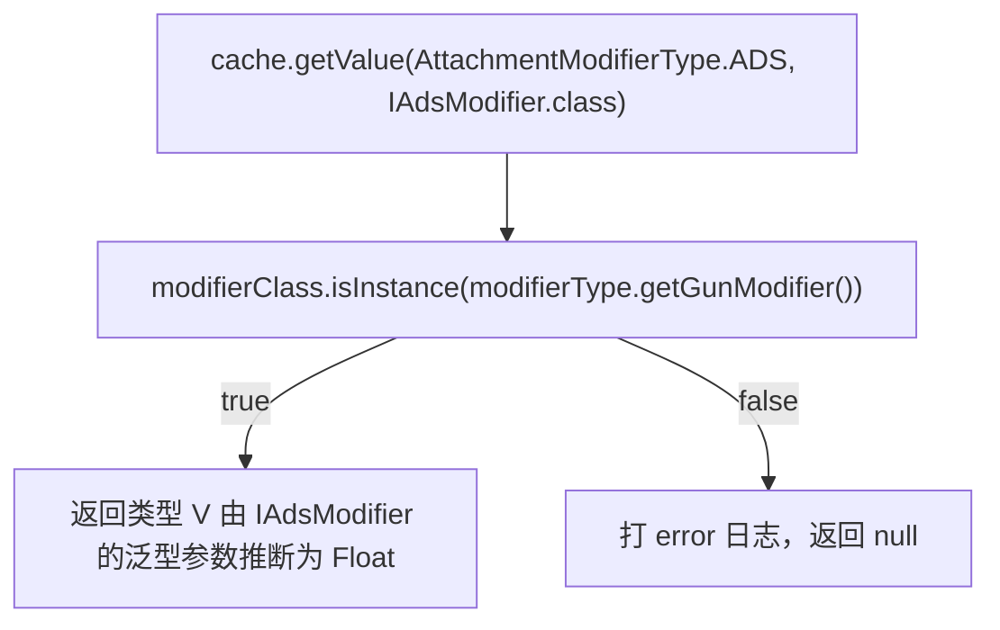
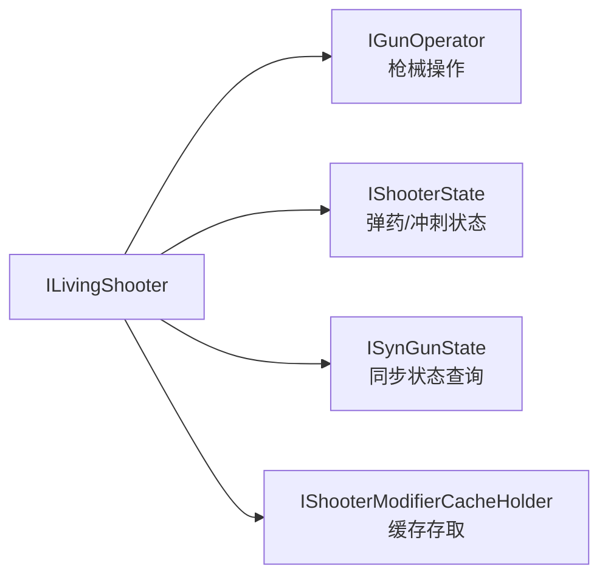
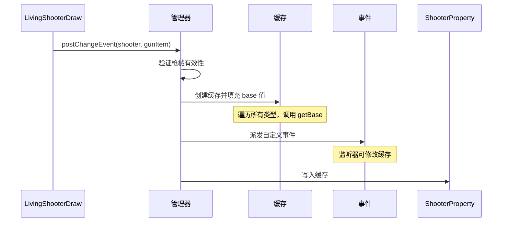
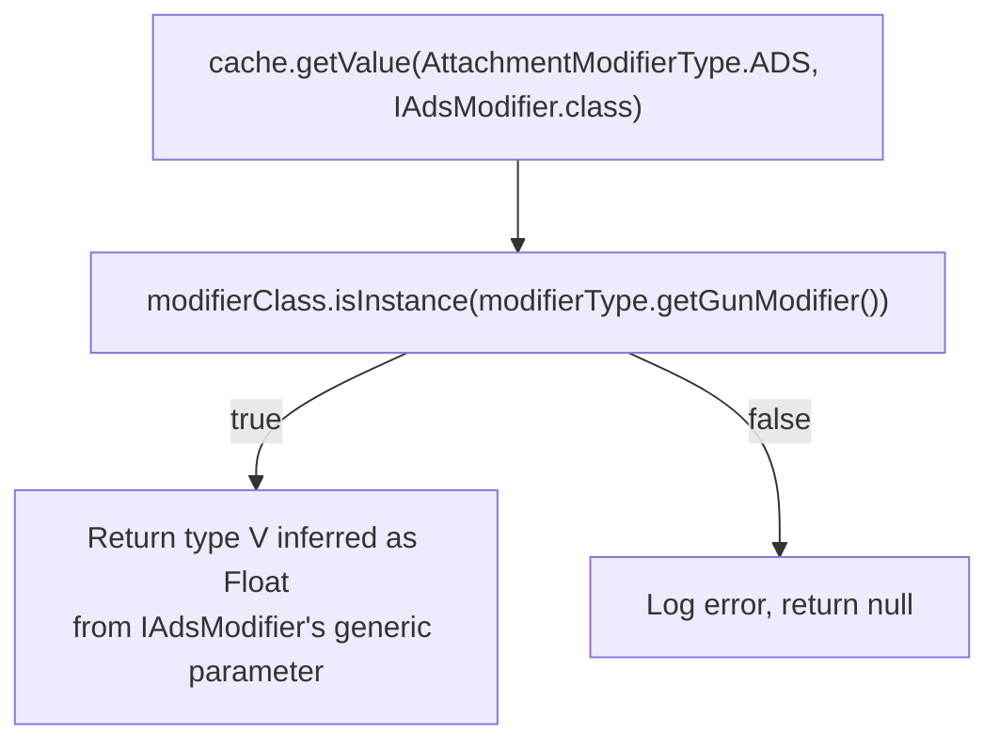
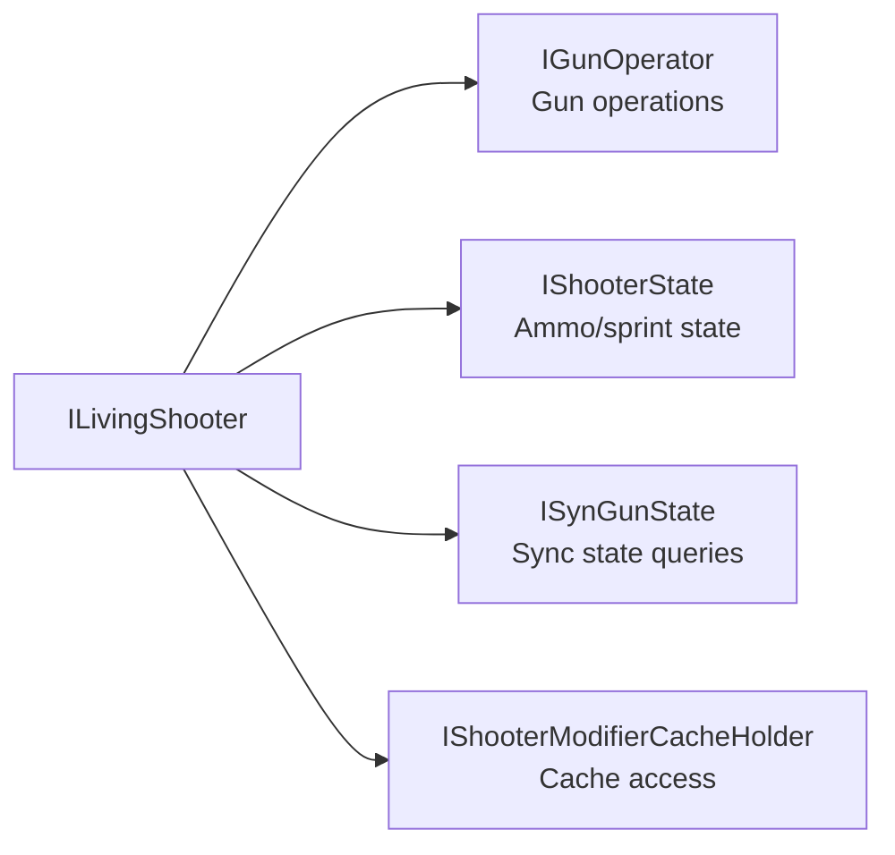
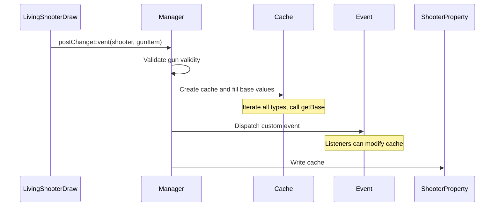

[English](#English)

# 缓存系统

> `ShooterGunModifierCache`的存储模型、与菱形继承泛型约束的配合、以及生命周期。

## 数据模型

`ShooterGunModifierCache`内部以`GunModifierType`为键存储所有 modifier 的缓存值。值类型各异（`Float`、`Integer`、`List`等），取决于该属性对应的 modifier 接口的泛型参数`V`。

### 类型安全的读写

`getValue`和`setValue`利用菱形继承链的泛型约束来保证编译期类型安全：

调用方需传两个参数：

- `modifierType`：提供`GunModifierType`和`IGunModifier`实例
- `modifierClass`：`IGunModifier`的子接口类型（如`IAdsModifier.class`），其泛型已在 API 层固定

运行时通过 isInstance 验证 modifier 实例是否实现了指定子接口——对 ADS 传入其他 modifier 的 class 会打 error 日志并返回 null。

菱形继承链在编译期强制两条路径上`K`和`V`类型一致。`IAdsModifier extends IGunModifier`在接口层固定了`K`和`V`，`AdsModifier extends AttachmentModifier implements IAdsModifier`必须满足相同约束，否则 Java 编译器直接拒绝。

### 实体接口架构

`ILivingShooter`拆分为多个子接口，其中与缓存相关的是`IShooterModifierCacheHolder`：

缓存存储在`ShooterProperty`的字段中，由`LivingEntityMixin`实现该缓存存取接口。`resetProperty`不会清除缓存。

## 缓存编排

缓存创建/更新时机：

- 实体初始化时
- 切枪时

均由`ShooterGunModifierManager.postChangeEvent`统一编排。

# English

> The storage model of `ShooterGunModifierCache`, its interaction with diamond inheritance generic constraints, and its lifecycle.

## Data Model

`ShooterGunModifierCache` stores all modifier cache values keyed by `GunModifierType`. Value types vary (`Float`, `Integer`, `List`, etc.), depending on the generic parameter `V` of the corresponding modifier interface.

### Type-Safe Read and Write

`getValue` and `setValue` leverage the generic constraints of the diamond inheritance chain for compile-time type safety:

The caller provides two parameters:

- `modifierType`: provides a `GunModifierType` and `IGunModifier` instance
- `modifierClass`: a sub-interface type of `IGunModifier` (e.g. `IAdsModifier.class`), whose generics are fixed at the API layer

At runtime, `isInstance` verifies that the modifier instance implements the specified sub-interface—passing the wrong modifier class (e.g. for ADS) logs an error and returns null.

The diamond inheritance chain enforces `K` and `V` type consistency across both paths at compile time. `IAdsModifier extends IGunModifier` fixes `K` and `V` at the interface layer; `AdsModifier extends AttachmentModifier implements IAdsModifier` must satisfy the same constraints, otherwise the Java compiler rejects the code.

### Entity Interface Architecture

`ILivingShooter` is split into multiple sub-interfaces, with `IShooterModifierCacheHolder` responsible for cache access:

The cache is stored in a field of `ShooterProperty`, with `LivingEntityMixin` implementing the cache access interface. `resetProperty` does not clear the cache.

## Cache Orchestration

Cache creation/update timing:

- On entity initialization
- On gun draw

Both orchestrated by `ShooterGunModifierManager.postChangeEvent`.
