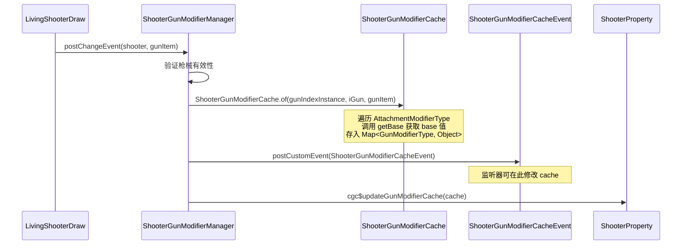

[English](#English)

# 缓存系统

> `ShooterGunModifierCache` 的实现、与菱形继承的泛型约束配合、生命周期。

## 数据模型

`ShooterGunModifierCache` 内部使用 `Map<GunModifierType, Object>` 存储所有 modifier 的缓存值：

```java
public final class ShooterGunModifierCache {
    private final Map<GunModifierType, Object> modifierType_values;
}
```

Key 是 `GunModifierType`（枪械属性的类型标识），Value 是每个 modifier 的计算结果（类型各异：`Float`、`Integer`、`List<_DistanceDamageData>` 等）。

### 类型安全的读写

`getValue` 和 `setValue` 方法利用了菱形继承链的泛型约束来提供类型安全：

```java
public <T extends ResourcePojo<T>, K, V> @Nullable V getValue(
    IGunModifierHolder modifierType,
    Class<? extends IGunModifier<T, K, V>> modifierClass
)
```

**参数含义**：
- `modifierType` — `AttachmentModifierType` 枚举常量（实现了 `IGunModifierHolder`），提供 `GunModifierType` 和 `IGunModifier` 实例
- `modifierClass` — `IGunModifier` 的子接口类型（如 `IAdsModifier.class`），其泛型 `<T, K, V>` 已在 API 层固定

**运行时验证**：`modifierClass.isInstance(modifierType.getGunModifier())` 检查 modifier 实例是否实现了指定的子接口。如果实现不匹配（例如对 ADS 传入了 `IKnockbackStrengthModifier.class`），则打 error 日志并返回 null。

**与菱形继承的关系**：

```
IAdsModifier<T> extends IGunModifier<T, _SimpleModifierData, Float>
    → K = _SimpleModifierData, V = Float（在 IAdsModifier 层面固定）

AdsModifier extends AttachmentModifier<_SimpleModifierData, Float>
            implements IAdsModifier<AttachmentData>
    → 菱形两条路径都要求 K=_SimpleModifierData, V=Float
```

`getValue(AttachmentModifierType.ADS, IAdsModifier.class)` 的调用链路中：
- `AttachmentModifierType.ADS.getGunModifier()` 返回 `AdsModifier.INSTANCE`
- `IAdsModifier.class.isInstance(AdsModifier.INSTANCE)` → true（编译器保证，因为 `AdsModifier implements IAdsModifier<AttachmentData>`）
- 返回值的类型由 `IAdsModifier` 的 `V` 参数推断为 `Float`，编译期安全

### 实体接口架构

```
ILivingShooter
    ├── IGunOperator (枪械操作: draw/shoot/aim...)
    ├── IShooterState (弹药检查/冲刺状态)
    ├── ISynGunState (同步状态查询)
    └── IShooterModifierCacheHolder (修饰缓存存取)
            ├── cgc$updateGunModifierCache(ShooterGunModifierCache)
            └── cgc$getGunModifierCache() → @Nullable ShooterGunModifierCache
```

缓存存储在 `ShooterProperty.shooterGunModifierCache`，由 `LivingEntityMixin` 实现 `IShooterModifierCacheHolder`。`resetProperty()` 不会清除缓存。

## 缓存编排

### 管线



### 缓存的生命周期

**创建/更新**：
1. 实体初始化：`LivingEntityMixin.cgc$initLivingShooter()` → `ShooterGunModifierManager.postChangeEvent()`
2. 切枪：`LivingShooterDraw.draw()` → `ShooterGunModifierManager.postChangeEvent()`

**不更新时机**：`ShooterProperty.resetProperty()` 不重置 `shooterGunModifierCache`。

# English
