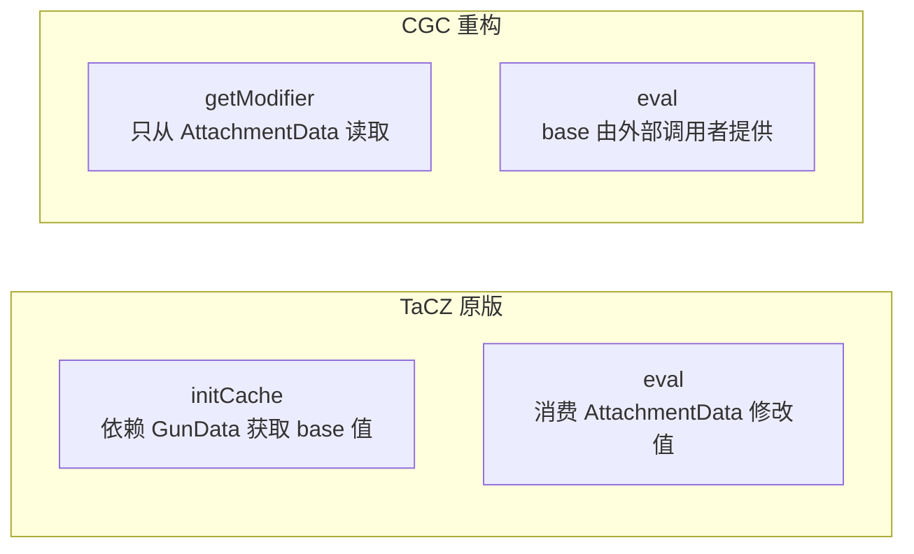
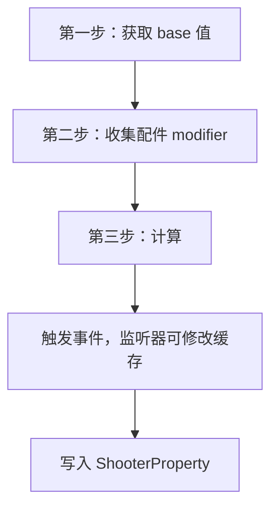
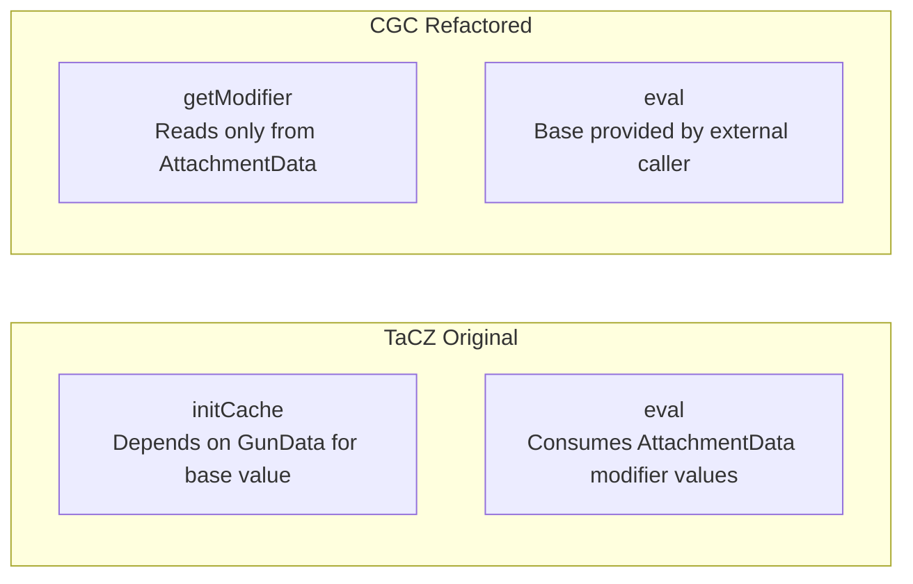
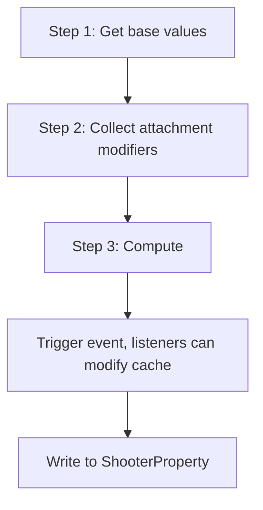

[English](#English)

# Modifier 计算流程

> CGC 重构后`IItemModifier` → `IGunModifier` → `IAttachmentModifier` → `AttachmentModifier` 的计算管线设计。

## 设计原则

原版的`initCache`和`eval`依赖不同的数据源（`GunData`与`AttachmentData`），却耦合在同一个接口中。CGC 将其分离：

关键区别：

- `getModifier`只依赖`AttachmentData`，从配件定义中提取修改值
- `eval`的`base`参数由外部调用者提供，管理器负责从`GunData`获取 base 值
- modifier 本身不再知道 GunData 的存在，成为无状态的纯计算单元

## 计算流程

- 第一步：管理器从`GunData`读取各属性的 base 值（rpm、aimTime、weight 等）
- 第二步：遍历枪上每个配件，调用对应的`getModifier`从`AttachmentData`提取修改数据
- 第三步：对每个类型调用`eval`进行计算，再逐 modifier 执行`scriptFunction`

base 值不再通过 modifier 接口从`GunData`获取。管理器负责提取 base 值并遍历所有类型编排计算，`eval`的`base`由外部传入。同一个 modifier 实例可用于不同的 base 值（不同枪械、不同射击模式），modifier 本身无状态。

## 与 TaCZ 的关键差异

- 接口层次
  - TaCZ：单个接口，含 4 个方法
  - CGC：`IItemModifier` → `IGunModifier` → `IAttachmentModifier`，每层 1 到 2 个方法
- JSON 解析
  - TaCZ：`readJson` 在 Modifier 上
  - CGC：`AttachmentData.fromJsonReader`
- Base 值获取
  - TaCZ：`initCache` 在 Modifier 内部
  - CGC：`getBase`，由子接口 default 实现
- 计算
  - TaCZ：`eval`有副作用
  - CGC：`eval`为纯函数
- Lua 脚本
  - TaCZ：全局`ScriptEngine`
  - CGC：`ThreadLocal`线程隔离
- 缓存读写
  - TaCZ：字符串键
  - CGC：泛型推断加编译期类型检查

# English

> The computation pipeline design after the CGC refactor: `IItemModifier` → `IGunModifier` → `IAttachmentModifier` → `AttachmentModifier`.

## Design Principles

The original `initCache` and `eval` depended on different data sources (`GunData` vs `AttachmentData`) yet were coupled in the same interface. CGC separates them:

Key differences:

- `getModifier` depends only on `AttachmentData`, extracting modifier values from attachment definitions
- `eval` receives its base parameter from the external caller; the manager is responsible for obtaining the base value from `GunData`
- The modifier itself no longer knows about `GunData`'s existence, becoming a stateless pure computation unit

## Calculation Flow

- Step 1: The manager reads each property's base value from `GunData` (rpm, aimTime, weight, etc.)
- Step 2: Iterate each attachment on the gun, calling the corresponding `getModifier` to extract modifier data from `AttachmentData`
- Step 3: Call `eval` for each type to compute, then execute `scriptFunction` per modifier

Base values are no longer obtained from `GunData` through the modifier interface. The manager extracts base values and iterates all types to orchestrate computation, with `eval`'s base passed in externally. The same modifier instance can be used for different base values (different guns, different fire modes)—the modifier itself is stateless.

## Key Differences from TaCZ

- Interface hierarchy
  - TaCZ: single interface with 4 methods
  - CGC: `IItemModifier` → `IGunModifier` → `IAttachmentModifier`, 1 to 2 methods per layer
- JSON parsing
  - TaCZ: `readJson` on the modifier
  - CGC: `AttachmentData.fromJsonReader`
- Base value retrieval
  - TaCZ: `initCache` inside the modifier
  - CGC: `getBase`, implemented as a default method on sub-interfaces
- Computation
  - TaCZ: `eval` has side effects
  - CGC: `eval` is a pure function
- Lua scripting
  - TaCZ: global `ScriptEngine`
  - CGC: `ThreadLocal` for thread isolation
- Cache read/write
  - TaCZ: string key
  - CGC: generic inference with compile-time type checking
