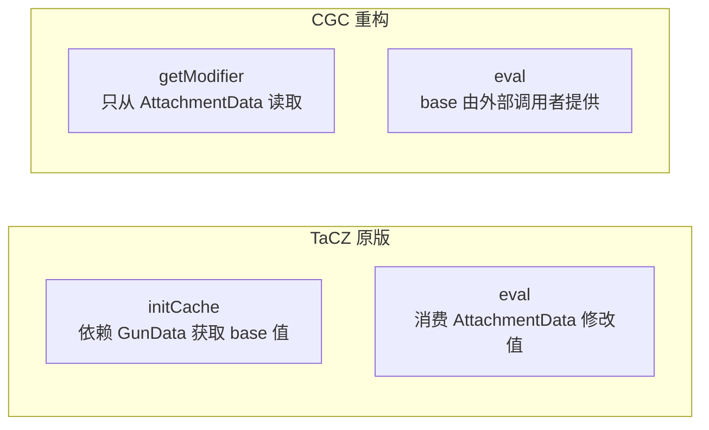
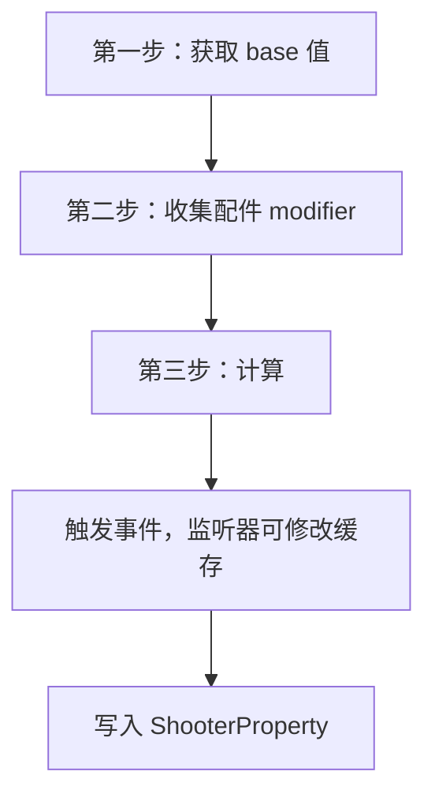

[English](#English)

# Modifier 计算流程

> CGC 重构后 `IItemModifier` → `IGunModifier` → `IAttachmentModifier` → `AttachmentModifier` 的计算管线设计。

## 设计原则

原版的 `initCache` 和 `eval` 依赖不同的数据源（`GunData` 与 `AttachmentData`），却耦合在同一个接口中。CGC 将其分离：

关键区别：
- `getModifier` 只依赖 `AttachmentData`，从配件定义中提取修改值
- `eval` 的 `base` 参数由外部调用者提供，管理器负责从 `GunData` 获取 base 值
- modifier 本身不再知道 `GunData` 的存在，成为无状态的纯计算单元

## 计算流程

- **第一步**：管理器从 `GunData` 读取各属性的 base 值（rpm、aimTime、weight 等）
- **第二步**：遍历枪上每个配件，调用对应的 `getModifier` 从 `AttachmentData` 提取修改数据
- **第三步**：对每个类型调用 `eval`，按 `(base + ΣsharedBaseAdd) × (1 + ΣsharedPercentAdd) × ΠuniqueMultiplier` 计算，再逐 modifier 执行 `scriptFunction`

base 值不再通过 modifier 接口从 `GunData` 获取。管理器负责提取 base 值并遍历所有类型编排计算，`eval` 的 `base` 由外部传入。同一个 modifier 实例可用于不同的 base 值（不同枪械、不同射击模式），modifier 本身无状态。

## 与 TaCZ 的关键差异

- **接口层次**
  - TaCZ：单个 `IAttachmentModifier<T, K>`，含 4 个方法
  - CGC：`IItemModifier` → `IGunModifier` → `IAttachmentModifier`，每层 1–2 个方法
- **JSON 解析**
  - TaCZ：`readJson(String)` 在 Modifier 上
  - CGC：`AttachmentData.fromJsonReader(JsonReader)`
- **Base 值获取**
  - TaCZ：`initCache(gunItem, gunData)` 在 Modifier 内部
  - CGC：`IGunModifier.getBase`，由 `I*Modifier` 子接口 default 实现
- **计算**
  - TaCZ：`eval(List<T>, CacheValue<K>)`，有副作用
  - CGC：`eval(Collection<K>, V base) → V`，纯函数
- **Lua 脚本**
  - TaCZ：全局 static ScriptEngine
  - CGC：`ThreadLocal<ScriptEngine>` 线程隔离
- **缓存读写**
  - TaCZ：`cacheProperty.getCache("ads")` 字符串键
  - CGC：`cache.getValue(type, IAdsModifier.class)` 泛型推断

# English
