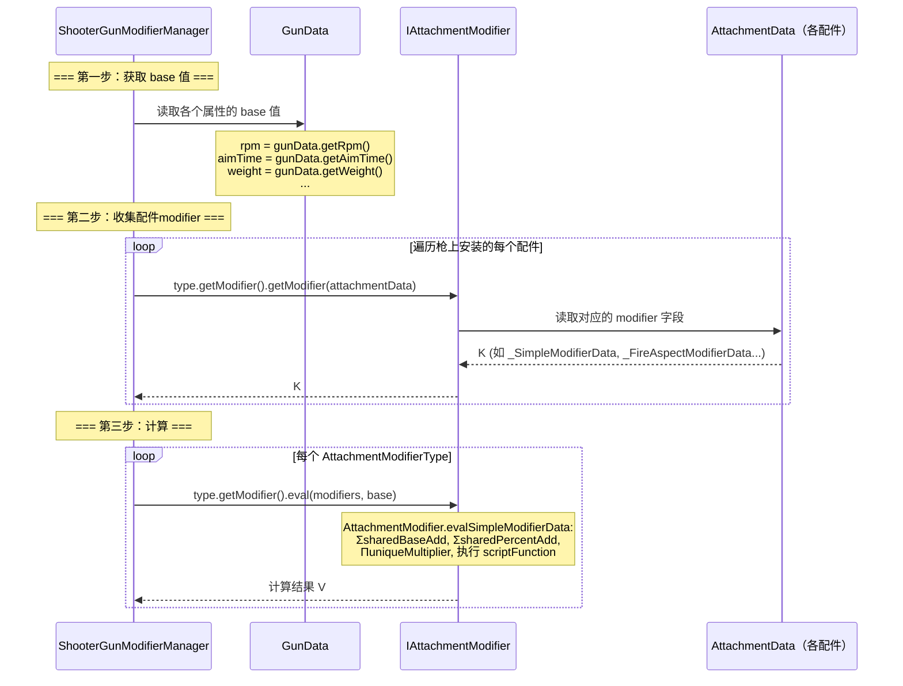

[English](#English)

# Modifier 计算流程

> 重构后 `IItemModifier<T, K, V>` → `IGunModifier<T, K, V>` → `IAttachmentModifier<K, V>` → `AttachmentModifier` 的计算管线设计。

### 设计原则

原版的 `IAttachmentModifier<T, K>` 接口有四个职责（JSON解析、base值读取、计算、UI），且方法签名混合了两个数据源：

```java
// 原版: initCache 依赖 GunData（base值来源）
CacheValue<K> initCache(ItemStack gunItem, GunData gunData);

// 原版: eval 消费 AttachmentData 中收集的修改值
void eval(List<T> modifiedValues, CacheValue<K> cache);
```

`initCache` 取 `GunData` 参数获取 base 值，但 base 值的获取实际上不属于 modifier 的职责——它是管理器的职责。

#### CGC 的分离

```java
// CGC: getModifier — 只从 AttachmentData 读修改数据
@Nullable K getModifier(@NotNull T pojo);

// CGC: eval — base 值由外部（管理器）传入
V eval(Collection<K> modifiers, V base);
```

**关键区别**：
- `getModifier` **只依赖** `AttachmentData`——从配件定义中提取修改值
- `eval` 的 `base` 参数由外部调用者提供——调用者（`ShooterGunModifierManager`）负责从 `GunData` 获取 base 值
- modifier 本身不再知道 `GunData` 的存在

### 计算流程设计



#### 关键变化：base 值的地位

在 CGC 重构中，base 值**不再通过 modifier 接口从 `GunData` 获取**，而是：

1. **管理器**（`ShooterGunModifierManager`）负责从 `GunData` 提取 base 值
2. **管理器**负责遍历 `AttachmentModifierType` 枚举来编排计算
3. `IAttachmentModifier.eval(Collection<K>, V base)` 的 `base` 是外部传入的——modifier 只是执行纯计算

这意味着同一个 modifier 实例**可以用于不同的 base 值**（例如不同的枪械、不同的射火模式），modifier 本身是个无状态的纯计算单元。

### 计算的完整路径

```
切枪事件触发
    → ShooterGunModifierManager.postChangeEvent(shooter, gunItem)
    → ShooterGunModifierCache.of(gunIndexInstance, iGun, gunItem)
        → 遍历 AttachmentModifierType.values():
            → modifier.getBase(iGun, gunItem, gunData)
            → 存入 Map<GunModifierType, Object>
    → 触发 ShooterGunModifierCacheEvent (事件可修改缓存)
    → 写入 ShooterProperty.shooterGunModifierCache
```

### 关键差异

| 维度 | TaCZ | CGC |
|---|---|---|
| 接口声明 | `IAttachmentModifier<T, K>`（4个方法） | `IItemModifier<T, K, V>` → `IGunModifier<T, K, V>` → `IAttachmentModifier<K, V>` |
| JSON 解析 | `readJson(String)` 在 Modifier 上 | `AttachmentData.fromJsonReader(JsonReader)` |
| Base 值获取 | `initCache(gunItem, gunData)` 在 Modifier 上 | `IGunModifier.getBase`（由 `I*Modifier` 子接口 default 实现） |
| 计算 | `eval(List<T>, CacheValue<K>)` | `eval(Collection<K>, V base) → V`（纯函数） |
| Lua 脚本 | 全局 static ScriptEngine | `ThreadLocal<ScriptEngine>`，通过 `IGunModifier.evalByScript` |
| 缓存读写 | `cacheProperty.getCache("ads")` | `cache.getValue(type, IAdsModifier.class)` + 泛型推断 |

# English
