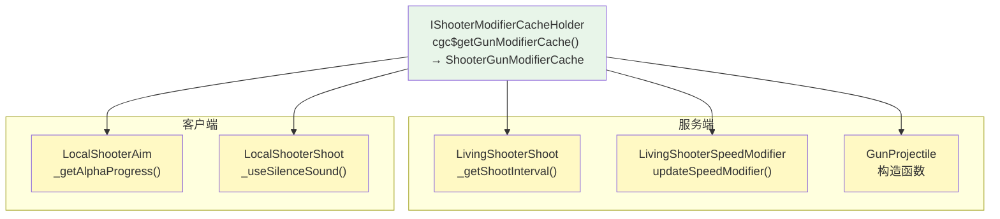

# 消费方汇总 — CGC 重构版

> 所有从 `ShooterGunModifierCache` 读取缓存值的位置，当前实现状态，以及每个消费方的 TODO 项。

## 关于 DamageCalculationModifier

`DamageCalculationModifier` 是目前唯一未匹配 `I*Modifier` 接口的 modifier。原因如下：

**TaCZ 中的 DamageModifier** 的缓存类型 `K` 是 `LinkedList<DistanceDamagePair>`——伤害不是一个简单浮点，而是一个**距离→伤害的衰减曲线**。枪械数据中 `BulletSkillData.damageCalculation` 是一个 `List<_DistanceDamageData>`（每个条目 = 距离 + 伤害值），配件修改器对这个列表中每个条目的伤害值分别应用修改。

**当前问题**：
- CGC 数据层已有 `_DistanceDamageData`（distance + damage 两个 float）
- `_BulletSkillData.getDamageCalculation()` 返回 `List<_DistanceDamageData>`
- 但当前 `AttachmentModifierType.DAMAGE_CALCULATION` 的数据类型是 `_SimpleModifierData`（单个数值），不匹配 TaCZ 的 `LinkedList<DistanceDamagePair>` 语义
- 现有的 `_SimpleModifierData` 只表达 "对一个浮点值的修改"（sharedBaseAdd/sharedPercentAdd/uniqueMultiplier），无法表达 "距离衰减曲线" 这个数据结构

**已解决**：`DamageCalculationModifier` 的 `V` 改为 `List<_DistanceDamageData>`。`IDamageCalculationModifier.getBase` 从 `_BulletSkillData.getDamageCalculation()` **拷贝**每个条目并应用 `FireModeAdjust` + `SyncConfig` 乘子。`eval` 对每个距离条目独立应用 `_SimpleModifierData` 修改并返回新列表。getBase 始终构建全新列表（不污染原始 POJO 数据）。

---

## 消费方总览



## 访问模式

所有消费方遵循统一的访问模式：

```java
// 1. 获取 ILivingShooter 实例
ILivingShooter iLivingShooter = ILivingShooterGetter.cgc$fromLivingEntity(livingEntity);

// 2. 获取缓存（可能为 null）
@Nullable ShooterGunModifierCache cache = iLivingShooter.cgc$getGunModifierCache();

// 3. 读取具体缓存值（当前为 TODO 存根）
if (cache != null) {
    // TODO: cache.get(modifierType) → 类型安全的值
}
```

**关键变更**：在 TaCZ 中消费者用字符串从缓存读取（`cacheProperty.getCache("ads")`）。在 CGC 中消费者将用 `AttachmentModifierType` 枚举从 `ShooterGunModifierCache` 读取——但目前 `ShooterGunModifierCache` 是空类，所有读取点为 TODO 存根。

## 服务端消费方

### 1. LivingShooterShoot._getShootInterval()

`xiao.customgun.core.entity.shooter.LivingShooterShoot`

```java
ShooterGunModifierCache shooterGunModifierCache =
    ILivingShooterGetter.cgc$fromLivingEntity(livingShooter).cgc$getGunModifierCache();
if (shooterGunModifierCache != null) {
    // TODO GunPropertyCache
}
```

**预期的 TaCZ 行为**：从缓存读取 `AttachmentModifierType.RPM` 的修改值来调整射速。

### 2. LivingShooterSpeedModifier.updateSpeedModifier()

`xiao.customgun.core.entity.shooter.LivingShooterSpeedModifier`

```java
@Nullable ShooterGunModifierCache shooterGunModifierCache =
    ILivingShooterGetter.cgc$fromLivingEntity(this.livingShooter).cgc$getGunModifierCache();
if (shooterGunModifierCache == null) return;

// TODO WeightModifier
float targetSpeed = 0;

// TODO ExtraMovementModifier
Object speed = null;
```

**预期的 TaCZ 行为**：
- 从缓存读取 `AttachmentModifierType.WEIGHT` → 重量修改值
- 从缓存读取移动速度修改值
- 按当前状态（换弹/瞄准/基础）选择正确的乘数

### 3. GunProjectile 构造函数

`xiao.customgun.core.entity.projectile.GunProjectile`

```java
@Nullable ShooterGunModifierCache shooterGunModifierCache =
    livingShooter != null
        ? ILivingShooterGetter.cgc$fromLivingEntity(livingShooter).cgc$getGunModifierCache()
        : null;
```

缓存被获取但未在构造函数主体中使用。**预期的 TaCZ 行为**：从缓存读取伤害、穿甲、爆头倍率、有效射程等属性写入子弹的状态缓存。

## 客户端消费方

### 4. LocalShooterAim._getAlphaProgress()

`xiao.customgun.client.entity.shooter.LocalShooterAim`

```java
if (iLivingShooter.cgc$getGunModifierCache() != null) {
    // TODO GunPropertyCache AdsModifier
}
```

**预期的 TaCZ 行为**：从缓存读取 `AttachmentModifierType.ADS` 修改值，影响瞄准动画速度。

### 5. LocalShooterShoot._useSilenceSound()

`xiao.customgun.client.entity.shooter.LocalShooterShoot`

```java
ShooterGunModifierCache shooterGunModifierCache =
    ILivingShooterGetter.cgc$fromLivingEntity(this.localShooter).cgc$getGunModifierCache();
if (shooterGunModifierCache == null) return false;
// TODO GunPropertyCache SilenceModifier.ID
return false;  // 当前硬编码 false
```

**预期的 TaCZ 行为**：从缓存读取 `AttachmentModifierType.MUZZLE` 值，决定消音音效。

### 6. LivingShooterAim.tickAimingProgress()（服务端）

`xiao.customgun.core.entity.shooter.LivingShooterAim`

```java
if (this.shooterProperty.shooterGunModifierCache != null) {
    // TODO GunPropertyCache
}
```

## 消费方实现清单

| 优先级 | 消费方 | 读取的 Modifier | 类型 | 状态 |
|---|---|---|---|---|
| P0 | `LivingShooterShoot` | `RPM` | int | TODO |
| P0 | `GunProjectile` 构造函数 | `DAMAGE_CALCULATION`, `PIERCE_COUNT`, `ARMOR_IGNORE_PERCENT`, `EFFECTIVE_RANGE`, `HEADSHOT_MULTIPLIER`, `KNOCKBACK_STRENGTH`, `BULLET_EXPLOSION`, `FIRE_ASPECT` | 混合 | TODO |
| P1 | `LivingShooterSpeedModifier` | `WEIGHT`, 移动速度 | float, MoveSpeed | TODO |
| P1 | `LocalShooterAim` | `ADS` | float | TODO |
| P1 | `LivingShooterAim` | `ADS` | float | TODO |
| P2 | `LocalShooterShoot` | `MUZZLE` | boolean | TODO |

## 消费模式总结

| 调用频率 | 消费方 | Modifier |
|---|---|---|
| 每 tick（服务端） | `LivingShooterSpeedModifier` | `WEIGHT`, 移动速度 |
| 每 tick（服务端） | `LivingShooterAim` | `ADS` |
| 每 tick（客户端） | `LocalShooterAim` | `ADS` |
| 每次射击（服务端） | `LivingShooterShoot` | `RPM` |
| 每次射击（客户端） | `LocalShooterShoot` | `MUZZLE` |
| 每颗子弹创建 | `GunProjectile` | `DAMAGE_CALCULATION`, `PIERCE_COUNT`, `ARMOR_IGNORE_PERCENT`, `EFFECTIVE_RANGE`, `HEADSHOT_MULTIPLIER`, `KNOCKBACK_STRENGTH`, `BULLET_EXPLOSION`, `FIRE_ASPECT` |

所有消费方都**已经连接好**——它们能正确获取 `ShooterGunModifierCache` 引用。阻塞点是 `ShooterGunModifierCache` 类本身为空，需要定义其字段和方法。
