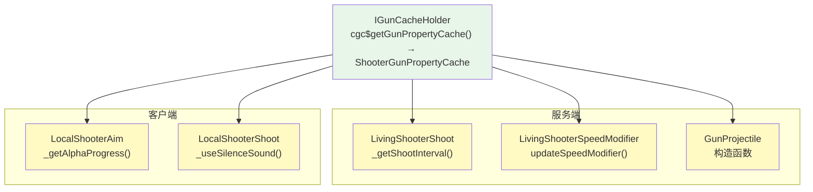

# 消费方汇总 — CGC 重构版

> 所有从 `ShooterGunPropertyCache` 读取缓存值的位置，当前实现状态，以及每个消费方的 TODO 项。

## 消费方总览



## 访问模式

所有消费方遵循统一的访问模式：

```java
// 1. 获取 ILivingShooter 实例
ILivingShooter iLivingShooter = ILivingShooterGetter.cgc$fromLivingEntity(livingEntity);

// 2. 获取缓存（可能为 null）
@Nullable ShooterGunPropertyCache cache = iLivingShooter.cgc$getGunPropertyCache();

// 3. 读取具体缓存值（当前为 TODO 存根）
if (cache != null) {
    // TODO: cache.get(modifierType) → 类型安全的值
}
```

**关键变更**：在 TaCZ 中，消费者用字符串从缓存读取（`cacheProperty.getCache("ads")`）。在 CGC 中，消费者将用 `AttachmentModifierType` 枚举从缓存读取——但目前 `ShooterGunPropertyCache` 是空类，所有读取点为 TODO 存根。

## 服务端消费方

### 1. LivingShooterShoot._getShootInterval()

`xiao.customgun.core.entity.shooter.LivingShooterShoot`（第 280-303 行）

**当前代码**：
```java
ShooterGunPropertyCache shooterGunModifierCache =
    ILivingShooterGetter.cgc$fromLivingEntity(livingShooter).cgc$getGunPropertyCache();
if (shooterGunModifierCache != null) {
    // TODO GunPropertyCache
}
```

**预期的 TaCZ 行为**：从缓存读取 `RpmModifier` 的修改值来调整射速。

**需要的动作**：
1. 在 `ShooterGunPropertyCache` 上提供获取 RPM 修改值的方法
2. 当前 RPM 计算已经硬编码（TODO 注释标注），需要改为从缓存读取

### 2. LivingShooterSpeedModifier.updateSpeedModifier()

`xiao.customgun.core.entity.shooter.LivingShooterSpeedModifier`（第 38-88 行）

**当前代码**：
```java
@Nullable ShooterGunPropertyCache shooterGunModifierCache =
    ILivingShooterGetter.cgc$fromLivingEntity(this.livingShooter).cgc$getGunPropertyCache();
if (shooterGunModifierCache == null) return;

// TODO WeightModifier: GunPropertyCache.getCache(WeightModifier.ID)
float targetSpeed = 0;

// TODO ExtraMovementModifier: GunPropertyCache.getCache(ExtraMovementModifier.ID)
Object speed = null;
```

**预期的 TaCZ 行为**：
- 从缓存读取 `WeightModifier` → `float`（重量）
- 从缓存读取 `ExtraMovementModifier` → `MoveSpeed`（移动速度乘数）
- 按当前状态（换弹/瞄准/基���）选择正确的乘数

**需要的动作**：
1. 在 `ShooterGunPropertyCache` 上提供获取重量和移动速度的方法
2. `_getTargetSpeed()` 方法（第 81 行）当前始终返回 0，需要实现状态选择逻辑

### 3. GunProjectile 构造函数

`xiao.customgun.core.entity.projectile.GunProjectile`（第 70 行）

**当前代码**：
```java
@Nullable ShooterGunPropertyCache shooterGunModifierCache =
    livingShooter != null
        ? ILivingShooterGetter.cgc$fromLivingEntity(livingShooter).cgc$getGunPropertyCache()
        : null;
```

缓存被获取但未在构造函数主体中使用。已废弃的方法 `distanceAmount`、`pierce`、`armorIgnore` 接受 `ShooterGunPropertyCache` 参数但都硬编码返回 0。

**预期的 TaCZ 行为**：从缓存读取 ~10 个属性（伤害、穿甲、爆头倍率、有效射程等）写入子弹的状态缓存。

## 客户端消费方

### 4. LocalShooterAim._getAlphaProgress()

`xiao.customgun.client.entity.shooter.LocalShooterAim`（第 84-86 行）

**当前代码**：
```java
if (iLivingShooter.cgc$getGunPropertyCache() != null) {
    // TODO GunPropertyCache AdsModifier
}
```

**预期的 TaCZ 行为**：从缓存读取 `AdsModifier` → `float`（瞄准时间修改值），用于计算瞄准动画的 alpha 进度，实现配件修改瞄准速度的效果。

### 5. LocalShooterShoot._useSilenceSound()

`xiao.customgun.client.entity.shooter.LocalShooterShoot`（第 337-341 行）

**当前代码**：
```java
ShooterGunPropertyCache shooterGunModifierCache =
    ILivingShooterGetter.cgc$fromLivingEntity(this.localShooter).cgc$getGunPropertyCache();
if (shooterGunModifierCache == null) return false;
// TODO GunPropertyCache SilenceModifier.ID
return false;  // 当前硬编码 false
```

**预期的 TaCZ 行为**：从缓存读取 `SilenceModifier` → 消音音效标志（boolean），决定开火时播放消音还是正常音效。

### 6. LivingShooterAim.tickAimingProgress()

`xiao.customgun.core.entity.shooter.LivingShooterAim`（服务端瞄准）

**当前代码**（第 93-95 行）：
```java
if (this.shooterProperty.shooterGunModifierCache != null) {
    // TODO GunPropertyCache
}
```

**预期的 TaCZ 行为**：服务端的瞄准进度计算也需要 ADS 修改值。

## 消费方实现清单

| 优先级 | 消费方 | 读取的 Modifier | 类型 | 状态 |
|---|---|---|---|---|
| P0 | `LivingShooterShoot` | RPM | `int` | TODO |
| P0 | `GunProjectile` 构造函数 | Damage, Pierce, ArmorIgnore, EffectiveRange, HeadShot, Knockback, Explosion, Ignite | 混合 | TODO（已废弃方法中有接口定义） |
| P1 | `LivingShooterSpeedModifier` | Weight, ExtraMovement | `float`, `MoveSpeed` | TODO |
| P1 | `LocalShooterAim` | ADS | `float` | TODO |
| P1 | `LivingShooterAim` | ADS | `float` | TODO |
| P2 | `LocalShooterShoot` | Silence | `boolean` | TODO |

## 消费模式总结

| 调用频率 | 消费方 | Modifier 端 |
|---|---|---|
| 每 tick（服务端） | `LivingShooterSpeedModifier` | Weight, MoveSpeed |
| 每 tick（服务端） | `LivingShooterAim` | ADS |
| 每 tick（客户端） | `LocalShooterAim` | ADS |
| 每次射击（服务端） | `LivingShooterShoot` | RPM |
| 每次射击（客户端） | `LocalShooterShoot` | Silence |
| 每颗子弹创建 | `GunProjectile` | Damage, Pierce, ArmorIgnore, EffectiveRange, HeadShot, Knockback, Explosion, Ignite |

所有消费方都**已经连接好**——它们能正确获取 `ShooterGunPropertyCache` 引用。阻塞点是 `ShooterGunPropertyCache` 类本身为空，需要定义其字段和方法。
